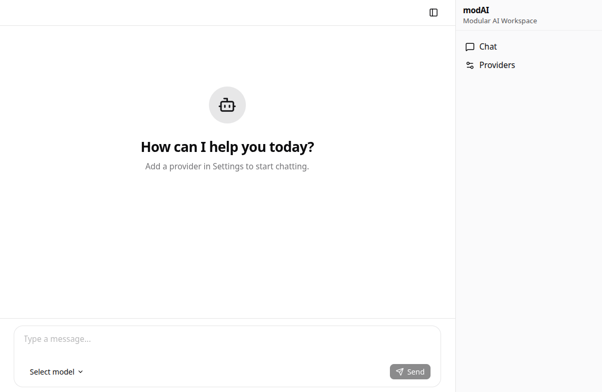

# modAI Chat (modular AI Chat)

Highly extendable AI Web Chat UI from the community for the community.



> ⚠️ **Early Development Stage**: This repository is in a very early stage of development. Features may be incomplete, APIs may change, and breaking changes are expected.

**🤝 We are looking for co-maintainers!**

## ✨ Features

* 🗨️ OpenAI Chat integration
* 🧩 Modular architecture for easy extensibility


## 🏗️ Repository Structure

We try to keep the root of the repo slim and add things like `package.json` file where it actually belongs to.

**Folder hierarchy:**

* **./backend**: Contains the Python Backend code
* **./frontend_omni**: Universal full fledged chat frontend

## 🖥️ modAI Frontends

In modAI there is not the one-and-only frontend but we (potentially) have more than one, or even transitioning from one to another (e.g. rewrite).
Why more than one frontend: because there are different use cases. e.g. one full fledged frontend containing all features the backend offers and a second one very small chat bubble frontend which can be used to be integrated in existing sites.

## 🚀 Quick Start

### Prerequisites
- Python 3.13+
- Node.js 24+
- UV package manager

### Backend Setup
```bash
cd backend
uv sync
uv run uvicorn modai.main:app --reload
```

### Frontend Setup
```bash
cd frontend_omni
pnpm install
pnpm dev
```

Browse to http://localhost:5173/

## 🤝 Contribution

Contributions are welcome in form of pull requests, issues or discussions. If you plan to implement something new or bigger, it is advisable to start a discussion first.

For details, see our [contribution guidelines](CONTRIBUTION.md)

## 👥 Shared Responsibility

There are plenty of successful repos out in the wild which are lead by single persons, but often this overwhelms and stresses
the maintainer and obviously leads to a very bad work-life balance.

We believe that a one-man-show is not the right way and therefore
are happy if you also want to take over responsibility. The whole
project is divided into different chunks with dedicated responsible
persons.

| Component | Overall responsibility |
|-----------|-------------------|
| frontend_omni  | @guenhter and maybe you? |
| backend   | @guenhter and maybe you? |
| CI/CD   | @guenhter and maybe you? |

The responsibilities for frontend and backend are defined more granular in the respective `README.md` files.

## 📄 License

This project is licensed under the terms specified in the [LICENSE](LICENSE) file.

## 🗺️ Roadmap

See [ROADMAP.md](ROADMAP.md) for planned features and development milestones.
