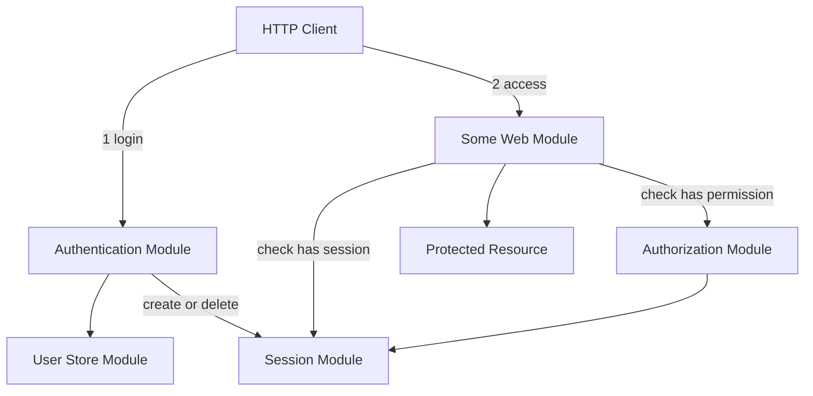
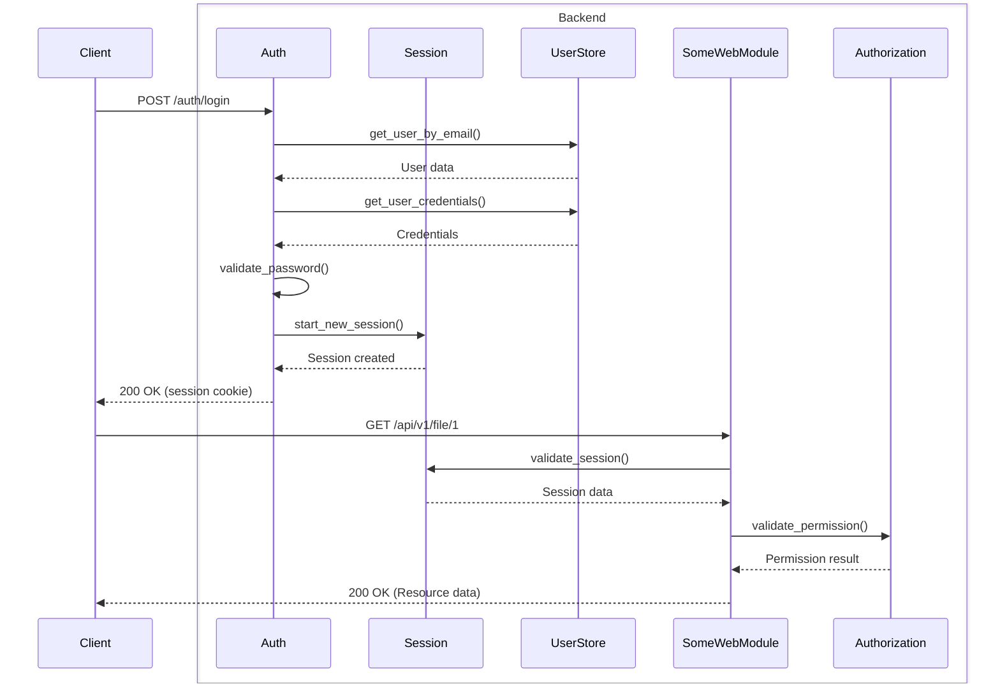

# Authentication and Authorization Architecture

## 1. Overview
- **Architecture Style**: Modular security framework with clear separation between authentication, session management, and authorization concerns
- **Design Principles**:
  - KISS (Keep It Simple, Stupid) - direct implementations without over-engineering
  - Security by design with clear module boundaries
  - Extensible authorization model supporting multiple permission strategies
- **Quality Attributes**: Secure, maintainable, extensible for different auth providers and permission models

## 2. System Context
- **System Boundary**: Auth modules operate within the modAI core framework as loadable modules
- **External Systems**: User stores, external auth providers (future), permission databases
- **Users and Stakeholders**: End users authenticating via REST API, admin users managing permissions
- **Data Flow**: Authentication → Session checks → Authorization checks → Resource access



## 3. Module Architecture

### 3.1 Authentication Module
**Purpose**: Handles user login/logout and credential validation.

**Key Responsibilities**:
- User credential validation
- Login/logout endpoint management
- Integration with session management

**API Endpoints**:
- `POST /api/v1/auth/login` - User authentication (200 OK / 401 Unauthorized / 422 Unprocessable Entity)
- `POST /api/v1/auth/logout` - Session termination (200 OK / 401 Unauthorized)

**Dependencies**:
- Session Module (for session creation/destruction)
- User Store Module (for credential verification)

**Data Models**:

Login:
```json
// Login Request
{
  "email": "user@example.com",
  "password": "password123"
}

// Login Response (200 OK)
{
  "message": "Successfully logged in"
}

// Login Error Response (401 Unauthorized)
{
  "message": "Invalid email or password"
}

// Login Error Response (422 Unprocessable Entity)
{
  "message": "Missing email or password"
}
```

Logout:
```json
// Logout Response (200 OK)
{
  "message": "Successfully logged out"
}

// Logout Error Response (401 Unauthorized)
{
  "message": "Invalid token"
}
```


### 3.2 Session Module
**Purpose**: Manages user sessions and session validation.

The session module has no web endpoints but is used by other modules.

**Key Functions**:

```python
async def start_new_session(
    self,
    request: Request,
    response: Response,
    user_id: str,
    **kwargs,
):
    """
    Creates a session for the given user and applies it to the response.

    Args:
        user_id: Unique identifier for the user
        **kwargs: Additional data to include in the session
    """

async def validate_session(
    self,
    request: Request,
) -> Session:
    """
    Validates and decodes a session.

    Returns:
        The active valid session

    Raises:
        HTTPException: If session is invalid or expired
    """

async def end_session(
    self,
    request: Request,
    response: Response,
):
    """
    Ends the session by invalidating the session.
    """
```

**Key Responsibilities**:
- Session creation and destruction
- Session validation

**Implementation Variations**:

There is no one-and-only session management type. Different implementations
of this module can use different session management techniques. Here some
points the implementations can work with:

- JWT-based
- HTTP Header based
- OIDC
- Cookie management

Each implementation should support at least the `validate_session` function.
Some implementation might not support `start_new_session` and `end_session`
(e.g. if the session is not managed by the module but externally)

Because of the variety of options, the session module interface is rather generic.


### 3.3 Authorization Module
**Purpose**: Determines user permissions for accessing specific protected resources, manages permission registry, and provides permission discovery API.

**Key Responsibilities**:
- Permission registration and discovery
- Resource permission validation
- User-based permissions
- Group-based permissions
- Permission caching for performance
- REST API for permission discovery

**API Endpoints**:
- `GET /api/v1/auth/permissions` - List all registered permissions for client discovery (200 OK / 401 Unauthorized if auth required)

**Key Functions**:
```python
async def register_permission(self, permission_def: PermissionDefinition) -> None:
    """
    Register a permission definition for discovery purposes.
    """

async def validate_permission(self, user_id: str, resource: str, action: str) -> None:
    """
    Validates if user has permission for specific resource and action.

    Raises:
        HTTPException: If access is not permitted
    """
```

**Dependencies**:
- Session Module (for validating requests to permission endpoints)

**Permission Model**:
```python
@dataclass
class PermissionDefinition:
    """Definition of a permission for registration purposes"""
    resource: str           # e.g., "/api/v1/documents", "/api/v1/user/*"
    actions: list[str]      # e.g., ["read", "write", "delete"]
    resource_name: str      # Human-readable name, e.g., "Document Library", "User Management"
    description: str | None = None  # Optional detailed description
```

**Data Models**:
```json
// List Permissions Response (200 OK)
{
  "permissions": [
    {
      "resource": "/api/v1/provider/*/models",
      "actions": ["read"],
      "resource_name": "Large Language Models",
      "description": "Models available through the AI provider"
    },
    {
      "resource": "/api/v1/file/*",
      "actions": ["read", "write", "delete"],
      "resource_name": "User Files",
      "description": "Access individual uploated files outside a document library"
    }
  ]
}

// List Permissions Error Response (401 Unauthorized) - if authentication required
{
  "message": "Not authenticated"
}
```

**Pseudo-Endpoint-based Resource Identifier**:

The `PermissionDefinition` has a field `resource` which should be unique across
the application to not conflict with permissions of other modules.

The resource identifier is a string, so arbitrary content can be put in, but it is
advisable to use a **pseudo endpoint notation** which reflects the endpoints
of the module exactly or at least to a certain extent.

If a module e.g. has an endpoint `/api/v1/files` then this is also a good candidate
for the resource identifier.

If a module has several endpoints like `/api/v1/file/{id}/title`,
`/api/v1/file/{id}/name`, ... then it is not advisable to create permissions for
each single endpoint, but instead use a more generic one like `/api/v1/file/*` as
resource name.

In some cases it can even be interesting to share resource identifiers across modules.
E.g. if there are several LLM Provider modules which should follow the endpoint pattern
`/api/v1/provider`, then usually we don't want to have permissions for each provider
individually. Here a resource identifier of `/api/v1/provider/` could be shared amongst
all provider modules.

Benefits of Pseudo-Endpoint-based Permissions:
- Clear relationship between API endpoints and permissions
- Easier for clients to understand permission structure


### 3.4 User Store Module
**Purpose**: Manages user and group data, credentials storage.

**Module Type**: Plain, (Persistence)*

\* It is likely that implementations will be also of type "persistence" in
order to perform data migration of persisted data

**Key Responsibilities**:
- User CRUD operations
- Credential storage and retrieval

## 4. Integration Patterns

### 4.1 Permission Registration Pattern
Web modules should register their permissions during initialization to enable permission discovery:

```python
class SomeWebModule(ModaiModule, ABC):
    def __init__(self, dependencies: ModuleDependencies, config: dict[str, Any]):
        super().__init__(dependencies, config)

        # Get required dependencies
        ...
        self.authorization_module: AuthorizationModule =
           dependencies.modules.get("authorization")

        # Register permissions used by this module
        self._register_permissions()

        # Add routes
        ...

    def _register_permissions(self):
        """Register all permissions used by this module"""
        self.authorization_module.register_permission(
            PermissionDefinition(
                resource="/api/v1/some",
                actions=["read", "write", "delete"],
                resource_name="Some Resources"
            )
        )
    ...
```

### 4.2 Web Module Auth Pattern
Most web modules will follow this pattern for protected endpoints:

```python
class SomeWebModule(ModaiModule):
    def __init__(self, dependencies: ModuleDependencies, config: dict[str, Any]):
        super().__init__(dependencies, config)

        # Get required dependencies
        self.session_module: SessionModule = dependencies.modules.get("session")
        self.authorization_module: AuthorizationModule =
           dependencies.modules.get("authorization")

        # Register permissions used by this module
        ...

        # Add routes
        self.router.add_api_route("/api/v1/some", self.get_some, methods=["GET"])
        ...

    async def get_some(self, request: Request):
        # 1. Validate session
        session = await self.session_module.validate_session(request)

        # 2. Validate endpoint permissions
        await self.authorization_module.check_permission(
            session.user_id, "/api/v1/some", "read"
        )

        # 3. Process request
        return {"data": "protected content"}
    ...
```

### 4.3 Session-based Authentication Flow


In order to keep the diagram slim and better readable, the error scenarios
are not fully contained. Auth errors can happen after each of the `validate_*` functions.
If the validation fails, a `401` or `403` HTTP error is returned to the client.

## 5. Security Considerations

### 5.1 Authentication Security
- Password hashing using secure algorithms (SHA-256 in demo, bcrypt recommended for production)
- JWT tokens with proper expiration and secret management
- HttpOnly cookies to prevent XSS attacks
- Secure cookie flags for HTTPS environments

### 5.2 Session Security
- JWT token validation with proper signature verification
- Session expiration and renewal mechanisms
- Secure cookie attributes (HttpOnly, Secure, SameSite)
- Session invalidation on logout

### 5.3 Authorization Security
- Principle of least privilege
- Permission validation on every protected resource access
- Proper error handling to prevent information leakage
- Permission caching with appropriate TTL to balance security and performance


## 6. Future Enhancements

### 6.1 Additional Authentication Methods
- OAuth 2.0 / OpenID Connect integration
- Multi-factor authentication (MFA)
- API key authentication
- Certificate-based authentication

### 6.2 Advanced Authorization Features
- Resource-level permissions with inheritance

### 6.3 Audit and Monitoring
- Authentication attempt logging
- Permission check auditing
- Failed access attempt monitoring
- Security event alerting
