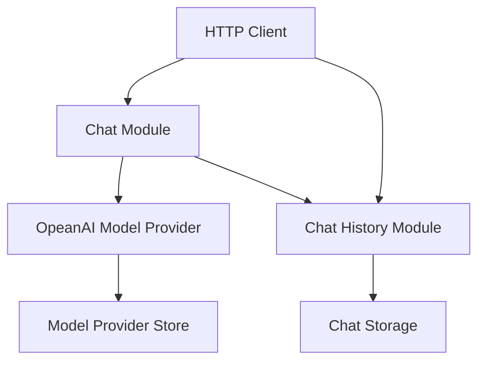

# Chat Module Architecture Document

## 1. Overview
- **Architecture Style**: Modular REST API with clean separation between web layer, business logic, and data persistence
- **Design Principles**:
  - KISS (Keep It Simple, Stupid) - minimal complexity, direct implementations
  - Raw JSON handling without over-engineered validation
  - Clear separation of concerns between HTTP handling, chat logic, and storage
- **Quality Attributes**: Simple, maintainable, extensible for different AI models

## 2. System Context
- **System Boundary**: Chat modules operates within the modAI core framework as a loadable web modules
- **External Systems**: AI model providers (OpenAI, Anthropic, local models)
- **Users and Stakeholders**: End users making chat requests via REST API
- **Data Flow**: HTTP requests → Chat processing → AI model calls → Response generation → Chat History → Storage



## 3. API Endpoints and Status Codes

- **3.1 Chat Completions**
  - `POST /api/v1/chat/completions` - Process chat completion requests
- **3.2 Chat History**
  - `GET /api/v1/chat/history/{conversation_id}` - Retrieve chat conversation history
  - `GET /api/v1/chat/histories` - List all chat conversations for user
- **3.3 LLM Providers**
  - `GET /api/v1/llm-provider/openai` - Retrieve configured OpenAI providers
  - `POST /api/v1/llm-provider/openai` - Create new OpenAI provider
  - `GET /api/v1/llm-provider/openai/{provider_id}` - Retrieve specific OpenAI provider
  - `PUT /api/v1/llm-provider/openai/{provider_id}` - Update existing OpenAI provider
  - `GET /api/v1/llm-provider/openai/{provider_id}/models` - Retrieve available models from provider
  - `DELETE /api/v1/llm-provider/openai/{provider_id}` - Delete OpenAI provider

### 3.1 Chat Completions

#### 3.1.1 Chat Completion Endpoint

**Endpoint**: `POST /api/v1/chat/completions`

**Purpose**: Process chat completion requests using configured AI model providers

**Request Format**:
```json
{
  "provider": "open-ai",
  "model": "gpt-4",
  "input": [
    {"role": "user", "content": "Hello, world"}
  ]
}
```

**Content Type Handling**:
To stream or not stream the response, this can be handled via the "Accept" HTTP Header. These two are supported:
* `application/json` - Non-streaming response
* `text/event-stream` - Streaming response via Server-Sent Events

If both are set, the response is streamed.

**Response Format (Non-streaming)**:
```json
{
  "output": [
    {
      "text": "Hi there!",
      "type": "text"
    }
  ],
  "id": "1",
  "model": "gpt-4",
  "role": "assistant",
  "usage": {
    "input_tokens": 2095,
    "output_tokens": 503
  }
}
```

**Response Format (Streaming via SSE)**:
```json
{
  "output": [
    {
      "text": "Hi ",
      "type": "text_chunk"
    }
  ],
  "id": "1",
  "model": "gpt-4",
  "role": "assistant"
}

{
  "output": [
    {
      "text": "there!",
      "type": "text_chunk"
    }
  ],
  "id": "1",
  "model": "gpt-4",
  "role": "assistant",
  "usage": {
    "input_tokens": 2095,
    "output_tokens": 503
  }
}
```

After the last chunk, the SSE connection is closed by the server.

**Error Response Format**:

```json
{
  "message": "Error description",
  "error_code": "SPECIFIC_ERROR_CODE",
  "details": {
    "provider": "openai",
    "model": "gpt-4"
  }
}
```

**Error Scenarios**:

*400 Bad Request*:
```json
{
  "message": "Missing required field: input",
  "error_code": "MISSING_FIELD"
}
```

*401 Unauthorized*:
```json
{
  "message": "Authentication required",
  "error_code": "AUTHENTICATION_REQUIRED"
}
```

*403 Forbidden*:
```json
{
  "message": "Insufficient permissions for chat access",
  "error_code": "INSUFFICIENT_PERMISSIONS"
}
```

*408 Request Timeout*:
```json
{
  "message": "Chat completion request timed out",
  "error_code": "REQUEST_TIMEOUT",
  "details": {
    "timeout_seconds": 120
  }
}
```

*413 Payload Too Large*:
```json
{
  "message": "Input content exceeds maximum size limit",
  "error_code": "PAYLOAD_TOO_LARGE",
  "details": {
    "max_tokens": 32000,
    "received_tokens": 50000
  }
}
```

*415 Unsupported Media Type*:
```json
{
  "message": "Content-Type must be application/json",
  "error_code": "UNSUPPORTED_MEDIA_TYPE"
}
```

*422 Unprocessable Entity*:
```json
{
  "message": "Invalid provider or model",
  "error_code": "INVALID_PROVIDER_MODEL",
  "details": {
    "provider": "invalid-provider",
    "model": "gpt-4"
  }
}
```

*429 Too Many Requests*:
```json
{
  "message": "Rate limit exceeded. Try again later",
  "error_code": "RATE_LIMIT_EXCEEDED"
}
```

*500 Internal Server Error*:
```json
{
  "message": "AI provider returned an error",
  "error_code": "PROVIDER_ERROR",
  "details": {
    "provider": "openai",
    "provider_error": "Model overloaded"
  }
}
```

*502 Bad Gateway*:
```json
{
  "message": "Invalid response from AI provider",
  "error_code": "INVALID_PROVIDER_RESPONSE",
  "details": {
    "provider": "openai",
    "model": "gpt-4"
  }
}
```

*503 Service Unavailable*:
```json
{
  "message": "AI provider temporarily unavailable",
  "error_code": "PROVIDER_UNAVAILABLE",
  "details": {
    "provider": "openai"
  }
}
```

*504 Gateway Timeout*:
```json
{
  "message": "AI provider did not respond in time",
  "error_code": "GATEWAY_TIMEOUT",
  "details": {
    "provider": "openai",
    "timeout_seconds": 300
  }
}
```

### 3.2 Chat History

#### 3.2.1 Chat History Endpoint

**Endpoint**: `GET /api/v1/chat/history/{conversation_id}`

**Purpose**: Retrieve chat conversation history for a specific conversation

**Path Parameters**:
- `conversation_id` (string): Unique identifier for the conversation

**Query Parameters**:
- `limit` (integer, optional): Maximum number of messages to return (default: 50, max: 100)
- `offset` (integer, optional): Number of messages to skip for pagination (default: 0)
- `order` (string, optional): Order of messages - "asc" or "desc" (default: "asc")

**Status Codes**:
- `200 OK`: Successfully retrieved chat history
- `400 Bad Request`: Invalid query parameters
- `401 Unauthorized`: Authentication required
- `403 Forbidden`: Insufficient permissions to access conversation
- `404 Not Found`: Conversation not found
- `429 Too Many Requests`: Rate limiting exceeded
- `500 Internal Server Error`: Internal system failure
- `503 Service Unavailable`: Chat history store temporarily unavailable

**Response Format (200 OK)**:
```json
{
  "conversation_id": "conv-123",
  "messages": [
    {
      "id": "msg-1",
      "role": "user",
      "content": "Hello, world",
      "timestamp": "2024-01-15T10:30:00Z"
    },
    {
      "id": "msg-2",
      "role": "assistant",
      "content": "Hi there! How can I help you today?",
      "model": "gpt-4",
      "timestamp": "2024-01-15T10:30:05Z",
      "usage": {
        "input_tokens": 2095,
        "output_tokens": 503
      }
    }
  ],
  "pagination": {
    "total_messages": 25,
    "limit": 50,
    "offset": 0,
    "has_more": false
  },
  "metadata": {
    "created_at": "2024-01-15T10:29:00Z",
    "updated_at": "2024-01-15T10:30:05Z",
    "message_count": 25
  }
}
```

**Error Response Format**:
```json
{
  "message": "Error description",
  "error_code": "SPECIFIC_ERROR_CODE",
  "details": {
    "conversation_id": "conv-123"
  }
}
```

**Error Scenarios**:

*400 Bad Request*:
```json
{
  "message": "Invalid limit parameter. Must be between 1 and 100",
  "error_code": "INVALID_PARAMETER",
  "details": {
    "parameter": "limit",
    "value": 150,
    "max_allowed": 100
  }
}
```

*401 Unauthorized*:
```json
{
  "message": "Authentication required",
  "error_code": "AUTHENTICATION_REQUIRED"
}
```

*403 Forbidden*:
```json
{
  "message": "Insufficient permissions to access this conversation",
  "error_code": "INSUFFICIENT_PERMISSIONS",
  "details": {
    "conversation_id": "conv-123"
  }
}
```

*404 Not Found*:
```json
{
  "message": "Conversation not found",
  "error_code": "CONVERSATION_NOT_FOUND",
  "details": {
    "conversation_id": "conv-invalid"
  }
}
```

*429 Too Many Requests*:
```json
{
  "message": "Rate limit exceeded. Try again later",
  "error_code": "RATE_LIMIT_EXCEEDED"
}
```

*500 Internal Server Error*:
```json
{
  "message": "Internal server error while retrieving chat history",
  "error_code": "INTERNAL_ERROR"
}
```

*503 Service Unavailable*:
```json
{
  "message": "Chat history store temporarily unavailable",
  "error_code": "STORE_UNAVAILABLE"
}
```

#### Chat History Data Structure

The chat history follows this data model for storage and retrieval:

```json
{
  "conversation_id": "conv-123",
  "user_id": "user-456",
  "messages": [
    {
      "id": "msg-1",
      "role": "user|assistant|system",
      "content": "Message content",
      "timestamp": "2024-01-15T10:30:00Z",
      "model": "gpt-4",
      "usage": {
        "input_tokens": 2095,
        "output_tokens": 503
      }
    }
  ],
  "metadata": {
    "created_at": "2024-01-15T10:29:00Z",
    "updated_at": "2024-01-15T10:30:05Z",
    "title": "Conversation about...",
    "tags": ["general", "help"]
  }
}
```

#### 3.2.2 List Chat Histories Endpoint

**Endpoint**: `GET /api/v1/chat/histories`

**Purpose**: Retrieve a list of all chat conversations for the authenticated user

**Query Parameters**:
- `limit` (integer, optional): Maximum number of conversations to return (default: 20, max: 100)
- `offset` (integer, optional): Number of conversations to skip for pagination (default: 0)
- `order` (string, optional): Order of conversations - "asc" or "desc" by updated_at (default: "desc")
- `search` (string, optional): Search term to filter conversations by title or content
- `tags` (string, optional): Comma-separated list of tags to filter by

**Status Codes**:
- `200 OK`: Successfully retrieved conversation list
- `400 Bad Request`: Invalid query parameters
- `401 Unauthorized`: Authentication required
- `403 Forbidden`: Insufficient permissions
- `429 Too Many Requests`: Rate limiting exceeded
- `500 Internal Server Error`: Internal system failure
- `503 Service Unavailable`: Chat history store temporarily unavailable

**Response Format (200 OK)**:
```json
{
  "conversations": [
    {
      "conversation_id": "conv-123",
      "title": "Discussion about AI models",
      "preview": "Hello, world...",
      "message_count": 25,
      "created_at": "2024-01-15T10:29:00Z",
      "updated_at": "2024-01-15T10:35:00Z",
      "tags": ["ai", "general"],
      "last_message": {
        "role": "assistant",
        "content": "I hope this helps! Let me know if you have any other questions.",
        "timestamp": "2024-01-15T10:35:00Z"
      }
    },
    {
      "conversation_id": "conv-456",
      "title": "Python programming help",
      "preview": "Can you help me with...",
      "message_count": 12,
      "created_at": "2024-01-14T14:20:00Z",
      "updated_at": "2024-01-14T15:10:00Z",
      "tags": ["programming", "python"],
      "last_message": {
        "role": "user",
        "content": "Thanks for the explanation!",
        "timestamp": "2024-01-14T15:10:00Z"
      }
    }
  ],
  "pagination": {
    "total_conversations": 15,
    "limit": 20,
    "offset": 0,
    "has_more": false
  }
}
```

**Error Response Format**:
```json
{
  "message": "Error description",
  "error_code": "SPECIFIC_ERROR_CODE",
  "details": {}
}
```

**Error Scenarios**:

*400 Bad Request*:
```json
{
  "message": "Invalid limit parameter. Must be between 1 and 100",
  "error_code": "INVALID_PARAMETER",
  "details": {
    "parameter": "limit",
    "value": 150,
    "max_allowed": 100
  }
}
```

*401 Unauthorized*:
```json
{
  "message": "Authentication required",
  "error_code": "AUTHENTICATION_REQUIRED"
}
```

*403 Forbidden*:
```json
{
  "message": "Insufficient permissions to access chat histories",
  "error_code": "INSUFFICIENT_PERMISSIONS"
}
```

*429 Too Many Requests*:
```json
{
  "message": "Rate limit exceeded. Try again later",
  "error_code": "RATE_LIMIT_EXCEEDED"
}
```

*500 Internal Server Error*:
```json
{
  "message": "Internal server error while retrieving conversations",
  "error_code": "INTERNAL_ERROR"
}
```

*503 Service Unavailable*:
```json
{
  "message": "Chat history store temporarily unavailable",
  "error_code": "STORE_UNAVAILABLE"
}
```

### 3.3 LLM Providers

The OpenAI model provider module provides endpoints for managing OpenAI providers and retrieving available models. This module utilizes a `model_provider_store` module for persistence of provider configurations.

**Module Dependencies**:
- `model_provider_store`: Handles persistence of OpenAI provider configurations, credentials, and metadata

#### 3.3.1 Get Providers Endpoint

**Endpoint**: `GET /api/v1/llm-provider/openai`

**Purpose**: Retrieve a list of all configured OpenAI providers

**Status Codes**:
- `200 OK`: Successfully retrieved providers list
- `401 Unauthorized`: Authentication required
- `403 Forbidden`: Insufficient permissions
- `404 Not Found`: No providers configured
- `429 Too Many Requests`: Rate limiting exceeded
- `500 Internal Server Error`: Internal system failure
- `503 Service Unavailable`: Provider store temporarily unavailable

**Response Format**:
```json
{
  "providers": [
    {
      "id": "550e8400-e29b-41d4-a716-446655440001",
      "name": "OpenAI Production",
      "base_url": "https://api.openai.com/v1",
      "api_key": "sk-...truncated",
      "description": "Primary OpenAI provider",
      "created_at": "2024-01-15T10:30:00Z",
      "updated_at": "2024-01-15T10:30:00Z"
    },
    {
      "id": "550e8400-e29b-41d4-a716-446655440002",
      "name": "OpenAI Compatible Local",
      "base_url": "http://localhost:11434/v1",
      "api_key": "local-key-...truncated",
      "description": "Local OpenAI-compatible server",
      "created_at": "2024-01-16T14:20:00Z",
      "updated_at": "2024-01-16T14:20:00Z"
    }
  ]
}
```

**Error Scenarios**:

*401 Unauthorized*:
```json
{
  "message": "Authentication required",
  "error_code": "AUTHENTICATION_REQUIRED"
}
```

*403 Forbidden*:
```json
{
  "message": "Insufficient permissions to view providers",
  "error_code": "INSUFFICIENT_PERMISSIONS"
}
```

*404 Not Found*:
```json
{
  "message": "No providers configured",
  "error_code": "NO_PROVIDERS_FOUND"
}
```

*429 Too Many Requests*:
```json
{
  "message": "Rate limit exceeded. Try again later",
  "error_code": "RATE_LIMIT_EXCEEDED"
}
```

*500 Internal Server Error*:
```json
{
  "message": "Internal server error while retrieving providers",
  "error_code": "INTERNAL_ERROR"
}
```

*503 Service Unavailable*:
```json
{
  "message": "Provider store temporarily unavailable",
  "error_code": "STORE_UNAVAILABLE"
}
```

#### 3.3.2 Create Provider Endpoint

**Endpoint**: `POST /api/v1/llm-provider/openai`

**Purpose**: Create a new OpenAI provider configuration

**Status Codes**:
- `201 Created`: Provider successfully created
- `400 Bad Request`: Invalid request format or missing required fields
- `401 Unauthorized`: Authentication required
- `403 Forbidden`: Insufficient permissions
- `409 Conflict`: Provider with same name already exists
- `413 Payload Too Large`: Request body exceeds size limits
- `415 Unsupported Media Type`: Invalid content type
- `422 Unprocessable Entity`: Valid format but invalid configuration values
- `429 Too Many Requests`: Rate limiting exceeded
- `500 Internal Server Error`: Internal system failure
- `503 Service Unavailable`: Provider store temporarily unavailable

**Request Format**:
```json
{
  "name": "OpenAI Production",
  "base_url": "https://api.openai.com/v1",
  "api_key": "sk-...",
  "description": "Primary OpenAI provider"
}
```

**Response Format (201 Created)**:
```json
{
  "id": "550e8400-e29b-41d4-a716-446655440001",
  "name": "OpenAI Production",
  "base_url": "https://api.openai.com/v1",
  "description": "Primary OpenAI provider",
  "created_at": "2024-01-15T10:30:00Z",
  "updated_at": "2024-01-15T10:30:00Z"
}
```

**Error Scenarios**:

*400 Bad Request*:
```json
{
  "message": "Missing required field: base_url",
  "error_code": "MISSING_FIELD"
}
```

*401 Unauthorized*:
```json
{
  "message": "Authentication required",
  "error_code": "AUTHENTICATION_REQUIRED"
}
```

*403 Forbidden*:
```json
{
  "message": "Insufficient permissions to create/update providers",
  "error_code": "INSUFFICIENT_PERMISSIONS"
}
```

*409 Conflict*:
```json
{
  "message": "Provider with this name already exists",
  "error_code": "PROVIDER_NAME_EXISTS",
  "details": {
    "existing_provider_id": "550e8400-e29b-41d4-a716-446655440002",
    "name": "OpenAI Production"
  }
}
```

*413 Payload Too Large*:
```json
{
  "message": "Request body exceeds maximum size limit",
  "error_code": "PAYLOAD_TOO_LARGE",
  "details": {
    "max_size_bytes": 1048576
  }
}
```

*415 Unsupported Media Type*:
```json
{
  "message": "Content-Type must be application/json",
  "error_code": "UNSUPPORTED_MEDIA_TYPE"
}
```

*422 Unprocessable Entity*:
```json
{
  "message": "Invalid base_url format",
  "error_code": "INVALID_URL",
  "details": {
    "field": "base_url",
    "value": "invalid-url"
  }
}
```

*429 Too Many Requests*:
```json
{
  "message": "Rate limit exceeded. Try again later",
  "error_code": "RATE_LIMIT_EXCEEDED"
}
```

*500 Internal Server Error*:
```json
{
  "message": "Internal server error while saving provider",
  "error_code": "INTERNAL_ERROR"
}
```

*503 Service Unavailable*:
```json
{
  "message": "Provider store temporarily unavailable",
  "error_code": "STORE_UNAVAILABLE"
}
```

#### 3.3.3 Update Provider Endpoint

**Endpoint**: `PUT /api/v1/llm-provider/openai/{provider_id}`

**Purpose**: Update an existing OpenAI provider configuration

**Status Codes**:
- `200 OK`: Provider successfully updated
- `400 Bad Request`: Invalid request format or missing required fields
- `401 Unauthorized`: Authentication required
- `403 Forbidden`: Insufficient permissions
- `404 Not Found`: Provider not found
- `409 Conflict`: Provider with same name already exists
- `413 Payload Too Large`: Request body exceeds size limits
- `415 Unsupported Media Type`: Invalid content type
- `422 Unprocessable Entity`: Valid format but invalid configuration values
- `429 Too Many Requests`: Rate limiting exceeded
- `500 Internal Server Error`: Internal system failure
- `503 Service Unavailable`: Provider store temporarily unavailable

**Request Format**:
```json
{
  "name": "OpenAI Production Updated",
  "base_url": "https://api.openai.com/v1",
  "api_key": "sk-...",
  "description": "Updated OpenAI provider"
}
```

**Response Format (200 OK)**:
```json
{
  "id": "550e8400-e29b-41d4-a716-446655440001",
  "name": "OpenAI Production Updated",
  "base_url": "https://api.openai.com/v1",
  "description": "Updated OpenAI provider",
  "created_at": "2024-01-15T10:30:00Z",
  "updated_at": "2024-01-15T14:45:00Z"
}
```

**Error Scenarios**:

*404 Not Found*:
```json
{
  "message": "Provider with ID '550e8400-e29b-41d4-a716-446655440001' not found",
  "error_code": "PROVIDER_NOT_FOUND"
}
```

*409 Conflict*:
```json
{
  "message": "Provider with this name already exists",
  "error_code": "PROVIDER_NAME_EXISTS",
  "details": {
    "existing_provider_id": "550e8400-e29b-41d4-a716-446655440002",
    "name": "OpenAI Production Updated"
  }
}
```

#### 3.3.4 Get Models Endpoint

**Endpoint**: `GET /api/v1/llm-provider/openai/{provider_id}/models`

**Purpose**: Retrieve available models from a specific OpenAI provider

**Status Codes**:
- `200 OK`: Successfully retrieved models list
- `401 Unauthorized`: Authentication required
- `403 Forbidden`: Insufficient permissions
- `404 Not Found`: Provider not found
- `408 Request Timeout`: Provider response timeout
- `422 Unprocessable Entity`: Provider configuration invalid
- `429 Too Many Requests`: Rate limiting exceeded
- `500 Internal Server Error`: Internal system failure
- `502 Bad Gateway`: Invalid response from provider
- `503 Service Unavailable`: Provider temporarily unavailable
- `504 Gateway Timeout`: Provider did not respond in time

**Response Format**:
```json
{
  "provider_id": "550e8400-e29b-41d4-a716-446655440001",
  "models": [
    {
      "id": "gpt-4",
      "name": "GPT-4",
      "description": "Most capable GPT-4 model",
      "context_length": 8192,
      "supports_streaming": true,
      "supports_functions": true
    },
    {
      "id": "gpt-3.5-turbo",
      "name": "GPT-3.5 Turbo",
      "description": "Fast and efficient model",
      "context_length": 4096,
      "supports_streaming": true,
      "supports_functions": true
    }
  ]
}
```

**Error Scenarios**:

*401 Unauthorized*:
```json
{
  "message": "Authentication required",
  "error_code": "AUTHENTICATION_REQUIRED"
}
```

*403 Forbidden*:
```json
{
  "message": "Insufficient permissions to access provider models",
  "error_code": "INSUFFICIENT_PERMISSIONS"
}
```

*404 Not Found*:
```json
{
  "message": "Provider not found",
  "error_code": "PROVIDER_NOT_FOUND",
  "details": {
    "provider_id": "non-existent-provider"
  }
}
```

*408 Request Timeout*:
```json
{
  "message": "Request to provider timed out",
  "error_code": "PROVIDER_TIMEOUT",
  "details": {
    "provider_id": "550e8400-e29b-41d4-a716-446655440001",
    "timeout_seconds": 30
  }
}
```

*422 Unprocessable Entity*:
```json
{
  "message": "Provider configuration invalid or API key expired",
  "error_code": "PROVIDER_CONFIG_INVALID",
  "details": {
    "provider_id": "550e8400-e29b-41d4-a716-446655440001"
  }
}
```

*429 Too Many Requests*:
```json
{
  "message": "Rate limit exceeded. Try again later",
  "error_code": "RATE_LIMIT_EXCEEDED"
}
```

*500 Internal Server Error*:
```json
{
  "message": "Internal server error while retrieving models",
  "error_code": "INTERNAL_ERROR"
}
```

*502 Bad Gateway*:
```json
{
  "message": "Invalid response from provider",
  "error_code": "INVALID_PROVIDER_RESPONSE",
  "details": {
    "provider_id": "550e8400-e29b-41d4-a716-446655440001",
    "provider_url": "https://api.openai.com/v1"
  }
}
```

*503 Service Unavailable*:
```json
{
  "message": "Provider temporarily unavailable",
  "error_code": "PROVIDER_UNAVAILABLE",
  "details": {
    "provider_id": "550e8400-e29b-41d4-a716-446655440001",
    "provider_url": "https://api.openai.com/v1"
  }
}
```

*504 Gateway Timeout*:
```json
{
  "message": "Provider did not respond in time",
  "error_code": "GATEWAY_TIMEOUT",
  "details": {
    "provider_id": "550e8400-e29b-41d4-a716-446655440001",
    "timeout_seconds": 60
  }
}
```

#### 3.3.5 Delete Provider Endpoint

**Endpoint**: `DELETE /api/v1/llm-provider/openai/{provider_id}`

**Purpose**: Delete an OpenAI provider configuration

**Path Parameters**:
- `provider_id` (string): Unique identifier for the provider to delete

**Status Codes**:
- `204 No Content`: Provider successfully deleted
- `401 Unauthorized`: Authentication required
- `403 Forbidden`: Insufficient permissions
- `404 Not Found`: Provider not found
- `409 Conflict`: Provider cannot be deleted (e.g., still in use)
- `429 Too Many Requests`: Rate limiting exceeded
- `500 Internal Server Error`: Internal system failure
- `503 Service Unavailable`: Provider store temporarily unavailable

**Response Format (204 No Content)**:
No response body is returned for successful deletion.

**Error Scenarios**:

*401 Unauthorized*:
```json
{
  "message": "Authentication required",
  "error_code": "AUTHENTICATION_REQUIRED"
}
```

*403 Forbidden*:
```json
{
  "message": "Insufficient permissions to delete providers",
  "error_code": "INSUFFICIENT_PERMISSIONS"
}
```

*404 Not Found*:
```json
{
  "message": "Provider not found",
  "error_code": "PROVIDER_NOT_FOUND",
  "details": {
    "provider_id": "non-existent-provider"
  }
}
```

*409 Conflict*:
```json
{
  "message": "Cannot delete provider: still in use by active conversations",
  "error_code": "PROVIDER_IN_USE",
  "details": {
    "provider_id": "550e8400-e29b-41d4-a716-446655440001",
    "active_conversations": 5
  }
}
```

*429 Too Many Requests*:
```json
{
  "message": "Rate limit exceeded. Try again later",
  "error_code": "RATE_LIMIT_EXCEEDED"
}
```

*500 Internal Server Error*:
```json
{
  "message": "Internal server error while deleting provider",
  "error_code": "INTERNAL_ERROR"
}
```

*503 Service Unavailable*:
```json
{
  "message": "Provider store temporarily unavailable",
  "error_code": "STORE_UNAVAILABLE"
}
```
