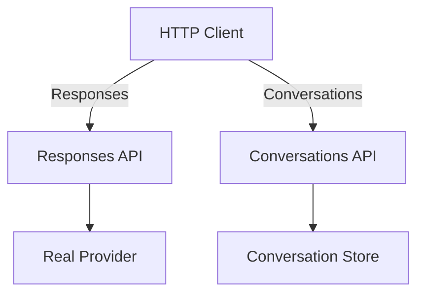

# Chat Module Architecture Document

## 1. Overview
- **Architecture Style**: Proxy-based REST API that provides OpenAI-compatible endpoints while routing requests to various AI model providers
- **Design Principles**:
  - KISS (Keep It Simple, Stupid) - minimal complexity, direct proxy implementations
  - API Compatibility - Full compatibility with OpenAI's Responses and Conversations APIs
  - Transparent Routing - Internal model routing is invisible to clients
  - Clear separation of concerns between HTTP proxying, model routing, and provider communication
- **Quality Attributes**: Simple, compatible, extensible for different AI providers (OpenAI, Anthropic, Ollama, etc.)

## 2. System Context
- **System Boundary**: Chat module operates as an OpenAI-compatible API proxy within the modAI core framework
- **External Systems**: Multiple AI model providers (OpenAI, Anthropic, Ollama, local models) via their respective APIs
- **Users and Stakeholders**: Clients that expect OpenAI's Responses and Conversations API format



## 3. API Endpoints and Status Codes

- **3.1 Responses API (Chat Functionality)**
  - `POST /responses` - Create a new response (chat completion)
  - `GET /responses/{response_id}` - Retrieve a response
  - `DELETE /responses/{response_id}` - Delete a response
  - `POST /responses/{response_id}/cancel` - Cancel a response
- **3.2 Conversations API (Chat Conversations)**
  - `POST /conversations` - Create a new conversation
  - `GET /conversations/{conversation_id}` - Retrieve a conversation
  - `POST /conversations/{conversation_id}/items` - Create conversation items
  - `GET /conversations/{conversation_id}/items` - List conversation items
  - `GET /conversations/{conversation_id}/items/{item_id}` - Get a conversation item
  - `DELETE /conversations/{conversation_id}/items/{item_id}` - Delete a conversation item
- **3.3 LLM Providers**
  - `GET /api/v1/llm-provider/openai` - Retrieve configured OpenAI providers
  - `POST /api/v1/llm-provider/openai` - Create new OpenAI provider
  - `GET /api/v1/llm-provider/openai/{provider_id}` - Retrieve specific OpenAI provider
  - `PUT /api/v1/llm-provider/openai/{provider_id}` - Update existing OpenAI provider
  - `GET /api/v1/llm-provider/openai/{provider_id}/models` - Retrieve available models from provider
  - `DELETE /api/v1/llm-provider/openai/{provider_id}` - Delete OpenAI provider

### 3.1 Responses API (Chat Functionality)

The Responses API provides OpenAI-compatible endpoints for chat completions. The backend acts as a proxy, accepting requests in OpenAI's format, determining the appropriate AI provider based on the requested model, translating the request to the provider's API format, and returning responses in OpenAI's format.

**Architecture Details**:
- **Model Resolution**: Extract model ID from request, query model_provider_store to find the corresponding provider
- **Request Translation**: Convert OpenAI Responses format to provider-specific API (e.g., chat/completions for OpenAI, or other formats for Anthropic/Ollama)
- **Provider Communication**: Route request to the selected provider's API
- **Response Translation**: Convert provider response back to OpenAI Responses format
- **Error Handling**: Map provider errors to OpenAI-compatible error codes

**Module Dependencies**:
- `model_provider_store`: For resolving models to providers
- Provider-specific modules: For API communication and translation

#### 3.1.1 Create Response Endpoint

**Endpoint**: `POST /responses`

**Purpose**: Create a new chat response (equivalent to chat completion)

**Status Codes**:
- `200 OK`: Response successfully created
- `400 Bad Request`: Invalid request format
- `401 Unauthorized`: Authentication required
- `403 Forbidden`: Insufficient permissions
- `404 Not Found`: Model not found
- `429 Too Many Requests`: Rate limiting exceeded
- `500 Internal Server Error`: Internal system failure
- `502 Bad Gateway`: Provider error
- `503 Service Unavailable`: Provider temporarily unavailable

**Request Format**:
```json
{
  "model": "gpt-4",
  "input": [
    {
      "content": [
        {
          "type": "input_text",
          "text": "Hello, how are you?"
        }
      ],
      "role": "user"
    }
  ],
  "instructions": "You are a helpful assistant.",
  "max_output_tokens": 100
}
```

**Response Format (200 OK)**:
```json
{
  "id": "resp_1234567890",
  "object": "response",
  "created_at": 1677652288,
  "status": "completed",
  "model": "gpt-4",
  "input": [
    {
      "content": [
        {
          "type": "input_text",
          "text": "Hello, how are you?"
        }
      ],
      "role": "user"
    }
  ],
  "output": [
    {
      "content": [
        {
          "type": "text",
          "text": "Hello! I'm doing well, thank you for asking. How can I help you today?"
        }
      ],
      "role": "assistant",
      "type": "message"
    }
  ],
  "usage": {
    "input_tokens": 10,
    "output_tokens": 20,
    "total_tokens": 30
  }
}
```

**Error Scenarios**:

*400 Bad Request*:
```json
{
  "error": {
    "message": "Invalid request: missing model parameter",
    "type": "invalid_request_error",
    "code": "missing_required_parameter"
  }
}
```

*404 Not Found*:
```json
{
  "error": {
    "message": "Model 'unknown-model' not found",
    "type": "invalid_request_error",
    "code": "model_not_found"
  }
}
```

#### 3.1.2 Get Response Endpoint

**Endpoint**: `GET /responses/{response_id}`

**Purpose**: Retrieve a previously created response

**Status Codes**:
- `200 OK`: Response retrieved successfully
- `401 Unauthorized`: Authentication required
- `403 Forbidden`: Insufficient permissions
- `404 Not Found`: Response not found
- `429 Too Many Requests`: Rate limiting exceeded
- `500 Internal Server Error`: Internal system failure

**Response Format (200 OK)**:
```json
{
  "id": "resp_1234567890",
  "object": "response",
  "created_at": 1677652288,
  "status": "completed",
  "model": "gpt-4",
  "input": [...],
  "output": [...],
  "usage": {...}
}
```

#### 3.1.3 Delete Response Endpoint

**Endpoint**: `DELETE /responses/{response_id}`

**Purpose**: Delete a response

**Status Codes**:
- `204 No Content`: Response deleted successfully
- `401 Unauthorized`: Authentication required
- `403 Forbidden`: Insufficient permissions
- `404 Not Found`: Response not found
- `429 Too Many Requests`: Rate limiting exceeded
- `500 Internal Server Error`: Internal system failure

#### 3.1.4 Cancel Response Endpoint

**Endpoint**: `POST /responses/{response_id}/cancel`

**Purpose**: Cancel an in-progress response

**Status Codes**:
- `200 OK`: Response cancelled successfully
- `401 Unauthorized`: Authentication required
- `403 Forbidden`: Insufficient permissions
- `404 Not Found`: Response not found
- `409 Conflict`: Response already completed
- `429 Too Many Requests`: Rate limiting exceeded
- `500 Internal Server Error`: Internal system failure

### 3.2 Conversations API (Chat Conversations)

The Conversations API provides OpenAI-compatible endpoints for managing chat conversations. The backend stores conversation data locally while routing individual chat requests through the Responses API flow.

**Architecture Details**:
- **Storage**: Conversations and items are stored in the local database
- **Integration**: Chat responses within conversations are created via the Responses API
- **Model Consistency**: Conversation items reference models, which are resolved to providers as needed

**Module Dependencies**:
- `chat_storage`: For persisting conversations and conversation items
- `responses_api`: For generating chat responses within conversations

#### 3.2.1 Create Conversation Endpoint

**Endpoint**: `POST /conversations`

**Purpose**: Create a new conversation

**Status Codes**:
- `201 Created`: Conversation created successfully
- `400 Bad Request`: Invalid request format
- `401 Unauthorized`: Authentication required
- `403 Forbidden`: Insufficient permissions
- `429 Too Many Requests`: Rate limiting exceeded
- `500 Internal Server Error`: Internal system failure

**Request Format**:
```json
{
  "model": "gpt-4",
  "messages": [
    {
      "role": "user",
      "content": "Hello!"
    }
  ]
}
```

**Response Format (201 Created)**:
```json
{
  "id": "conv_1234567890",
  "object": "conversation",
  "created_at": 1677652288,
  "model": "gpt-4",
  "messages": [
    {
      "id": "msg_1234567890",
      "role": "user",
      "content": "Hello!",
      "created_at": 1677652288
    }
  ]
}
```

#### 3.2.2 Get Conversation Endpoint

**Endpoint**: `GET /conversations/{conversation_id}`

**Purpose**: Retrieve a conversation

**Status Codes**:
- `200 OK`: Conversation retrieved successfully
- `401 Unauthorized`: Authentication required
- `403 Forbidden`: Insufficient permissions
- `404 Not Found`: Conversation not found
- `429 Too Many Requests`: Rate limiting exceeded
- `500 Internal Server Error`: Internal system failure

**Response Format (200 OK)**:
```json
{
  "id": "conv_1234567890",
  "object": "conversation",
  "created_at": 1677652288,
  "model": "gpt-4",
  "messages": [...]
}
```

#### 3.2.3 Create Conversation Item Endpoint

**Endpoint**: `POST /conversations/{conversation_id}/items`

**Purpose**: Add a new item (message) to a conversation, potentially generating a response

**Status Codes**:
- `201 Created`: Item created successfully
- `400 Bad Request`: Invalid request format
- `401 Unauthorized`: Authentication required
- `403 Forbidden`: Insufficient permissions
- `404 Not Found`: Conversation not found
- `429 Too Many Requests`: Rate limiting exceeded
- `500 Internal Server Error`: Internal system failure

**Request Format**:
```json
{
  "type": "message",
  "content": [
    {
      "type": "text",
      "text": "Tell me a joke."
    }
  ],
  "role": "user"
}
```

**Response Format (201 Created)**:
```json
{
  "id": "item_1234567890",
  "object": "conversation.item",
  "created_at": 1677652288,
  "type": "message",
  "content": [...],
  "role": "user"
}
```

#### 3.2.4 List Conversation Items Endpoint

**Endpoint**: `GET /conversations/{conversation_id}/items`

**Purpose**: List all items in a conversation

**Status Codes**:
- `200 OK`: Items retrieved successfully
- `401 Unauthorized`: Authentication required
- `403 Forbidden`: Insufficient permissions
- `404 Not Found`: Conversation not found
- `429 Too Many Requests`: Rate limiting exceeded
- `500 Internal Server Error`: Internal system failure

**Response Format (200 OK)**:
```json
{
  "object": "list",
  "data": [
    {
      "id": "item_1234567890",
      "object": "conversation.item",
      "created_at": 1677652288,
      "type": "message",
      "content": [...],
      "role": "user"
    }
  ]
}
```

#### 3.2.5 Get Conversation Item Endpoint

**Endpoint**: `GET /conversations/{conversation_id}/items/{item_id}`

**Purpose**: Retrieve a specific conversation item

**Status Codes**:
- `200 OK`: Item retrieved successfully
- `401 Unauthorized`: Authentication required
- `403 Forbidden`: Insufficient permissions
- `404 Not Found`: Conversation or item not found
- `429 Too Many Requests`: Rate limiting exceeded
- `500 Internal Server Error`: Internal system failure

#### 3.2.6 Delete Conversation Item Endpoint

**Endpoint**: `DELETE /conversations/{conversation_id}/items/{item_id}`

**Purpose**: Delete a conversation item

**Status Codes**:
- `204 No Content`: Item deleted successfully
- `401 Unauthorized`: Authentication required
- `403 Forbidden`: Insufficient permissions
- `404 Not Found`: Conversation or item not found
- `429 Too Many Requests`: Rate limiting exceeded
- `500 Internal Server Error`: Internal system failure

### 3.3 LLM Providers

The OpenAI model provider module provides endpoints for managing OpenAI providers and retrieving available models. This module utilizes a `model_provider_store` module for persistence of provider configurations.

**Module Dependencies**:
- `model_provider_store`: Handles persistence of OpenAI provider configurations, credentials, and metadata

#### 3.3.1 Get Providers Endpoint

**Endpoint**: `GET /api/v1/llm-provider/openai`

**Purpose**: Retrieve a list of all configured OpenAI providers

**Status Codes**:
- `200 OK`: Successfully retrieved providers list
- `401 Unauthorized`: Authentication required
- `403 Forbidden`: Insufficient permissions
- `404 Not Found`: No providers configured
- `429 Too Many Requests`: Rate limiting exceeded
- `500 Internal Server Error`: Internal system failure
- `503 Service Unavailable`: Provider store temporarily unavailable

**Response Format**:
```json
{
  "providers": [
    {
      "id": "550e8400-e29b-41d4-a716-446655440001",
      "name": "OpenAI Production",
      "base_url": "https://api.openai.com/v1",
      "api_key": "sk-...truncated",
      "description": "Primary OpenAI provider",
      "created_at": "2024-01-15T10:30:00Z",
      "updated_at": "2024-01-15T10:30:00Z"
    },
    {
      "id": "550e8400-e29b-41d4-a716-446655440002",
      "name": "OpenAI Compatible Local",
      "base_url": "http://localhost:11434/v1",
      "api_key": "local-key-...truncated",
      "description": "Local OpenAI-compatible server",
      "created_at": "2024-01-16T14:20:00Z",
      "updated_at": "2024-01-16T14:20:00Z"
    }
  ]
}
```

**Error Scenarios**:

*401 Unauthorized*:
```json
{
  "message": "Authentication required",
  "error_code": "AUTHENTICATION_REQUIRED"
}
```

*403 Forbidden*:
```json
{
  "message": "Insufficient permissions to view providers",
  "error_code": "INSUFFICIENT_PERMISSIONS"
}
```

*404 Not Found*:
```json
{
  "message": "No providers configured",
  "error_code": "NO_PROVIDERS_FOUND"
}
```

*429 Too Many Requests*:
```json
{
  "message": "Rate limit exceeded. Try again later",
  "error_code": "RATE_LIMIT_EXCEEDED"
}
```

*500 Internal Server Error*:
```json
{
  "message": "Internal server error while retrieving providers",
  "error_code": "INTERNAL_ERROR"
}
```

*503 Service Unavailable*:
```json
{
  "message": "Provider store temporarily unavailable",
  "error_code": "STORE_UNAVAILABLE"
}
```

#### 3.3.2 Create Provider Endpoint

**Endpoint**: `POST /api/v1/llm-provider/openai`

**Purpose**: Create a new OpenAI provider configuration

**Status Codes**:
- `201 Created`: Provider successfully created
- `400 Bad Request`: Invalid request format or missing required fields
- `401 Unauthorized`: Authentication required
- `403 Forbidden`: Insufficient permissions
- `409 Conflict`: Provider with same name already exists
- `413 Payload Too Large`: Request body exceeds size limits
- `415 Unsupported Media Type`: Invalid content type
- `422 Unprocessable Entity`: Valid format but invalid configuration values
- `429 Too Many Requests`: Rate limiting exceeded
- `500 Internal Server Error`: Internal system failure
- `503 Service Unavailable`: Provider store temporarily unavailable

**Request Format**:
```json
{
  "name": "OpenAI Production",
  "base_url": "https://api.openai.com/v1",
  "api_key": "sk-...",
  "description": "Primary OpenAI provider"
}
```

**Response Format (201 Created)**:
```json
{
  "id": "550e8400-e29b-41d4-a716-446655440001",
  "name": "OpenAI Production",
  "base_url": "https://api.openai.com/v1",
  "description": "Primary OpenAI provider",
  "created_at": "2024-01-15T10:30:00Z",
  "updated_at": "2024-01-15T10:30:00Z"
}
```

**Error Scenarios**:

*400 Bad Request*:
```json
{
  "message": "Missing required field: base_url",
  "error_code": "MISSING_FIELD"
}
```

*401 Unauthorized*:
```json
{
  "message": "Authentication required",
  "error_code": "AUTHENTICATION_REQUIRED"
}
```

*403 Forbidden*:
```json
{
  "message": "Insufficient permissions to create/update providers",
  "error_code": "INSUFFICIENT_PERMISSIONS"
}
```

*409 Conflict*:
```json
{
  "message": "Provider with this name already exists",
  "error_code": "PROVIDER_NAME_EXISTS",
  "details": {
    "existing_provider_id": "550e8400-e29b-41d4-a716-446655440002",
    "name": "OpenAI Production"
  }
}
```

*413 Payload Too Large*:
```json
{
  "message": "Request body exceeds maximum size limit",
  "error_code": "PAYLOAD_TOO_LARGE",
  "details": {
    "max_size_bytes": 1048576
  }
}
```

*415 Unsupported Media Type*:
```json
{
  "message": "Content-Type must be application/json",
  "error_code": "UNSUPPORTED_MEDIA_TYPE"
}
```

*422 Unprocessable Entity*:
```json
{
  "message": "Invalid base_url format",
  "error_code": "INVALID_URL",
  "details": {
    "field": "base_url",
    "value": "invalid-url"
  }
}
```

*429 Too Many Requests*:
```json
{
  "message": "Rate limit exceeded. Try again later",
  "error_code": "RATE_LIMIT_EXCEEDED"
}
```

*500 Internal Server Error*:
```json
{
  "message": "Internal server error while saving provider",
  "error_code": "INTERNAL_ERROR"
}
```

*503 Service Unavailable*:
```json
{
  "message": "Provider store temporarily unavailable",
  "error_code": "STORE_UNAVAILABLE"
}
```

#### 3.3.3 Update Provider Endpoint

**Endpoint**: `PUT /api/v1/llm-provider/openai/{provider_id}`

**Purpose**: Update an existing OpenAI provider configuration

**Status Codes**:
- `200 OK`: Provider successfully updated
- `400 Bad Request`: Invalid request format or missing required fields
- `401 Unauthorized`: Authentication required
- `403 Forbidden`: Insufficient permissions
- `404 Not Found`: Provider not found
- `409 Conflict`: Provider with same name already exists
- `413 Payload Too Large`: Request body exceeds size limits
- `415 Unsupported Media Type`: Invalid content type
- `422 Unprocessable Entity`: Valid format but invalid configuration values
- `429 Too Many Requests`: Rate limiting exceeded
- `500 Internal Server Error`: Internal system failure
- `503 Service Unavailable`: Provider store temporarily unavailable

**Request Format**:
```json
{
  "name": "OpenAI Production Updated",
  "base_url": "https://api.openai.com/v1",
  "api_key": "sk-...",
  "description": "Updated OpenAI provider"
}
```

**Response Format (200 OK)**:
```json
{
  "id": "550e8400-e29b-41d4-a716-446655440001",
  "name": "OpenAI Production Updated",
  "base_url": "https://api.openai.com/v1",
  "description": "Updated OpenAI provider",
  "created_at": "2024-01-15T10:30:00Z",
  "updated_at": "2024-01-15T14:45:00Z"
}
```

**Error Scenarios**:

*404 Not Found*:
```json
{
  "message": "Provider with ID '550e8400-e29b-41d4-a716-446655440001' not found",
  "error_code": "PROVIDER_NOT_FOUND"
}
```

*409 Conflict*:
```json
{
  "message": "Provider with this name already exists",
  "error_code": "PROVIDER_NAME_EXISTS",
  "details": {
    "existing_provider_id": "550e8400-e29b-41d4-a716-446655440002",
    "name": "OpenAI Production Updated"
  }
}
```

#### 3.3.4 Get Models Endpoint

**Endpoint**: `GET /api/v1/llm-provider/openai/{provider_id}/models`

**Purpose**: Retrieve available models from a specific OpenAI provider

**Status Codes**:
- `200 OK`: Successfully retrieved models list
- `401 Unauthorized`: Authentication required
- `403 Forbidden`: Insufficient permissions
- `404 Not Found`: Provider not found
- `408 Request Timeout`: Provider response timeout
- `422 Unprocessable Entity`: Provider configuration invalid
- `429 Too Many Requests`: Rate limiting exceeded
- `500 Internal Server Error`: Internal system failure
- `502 Bad Gateway`: Invalid response from provider
- `503 Service Unavailable`: Provider temporarily unavailable
- `504 Gateway Timeout`: Provider did not respond in time

**Response Format**:
```json
{
  "provider_id": "550e8400-e29b-41d4-a716-446655440001",
  "models": [
    {
      "id": "gpt-4",
      "name": "GPT-4",
      "description": "Most capable GPT-4 model",
      "context_length": 8192,
      "supports_streaming": true,
      "supports_functions": true
    },
    {
      "id": "gpt-3.5-turbo",
      "name": "GPT-3.5 Turbo",
      "description": "Fast and efficient model",
      "context_length": 4096,
      "supports_streaming": true,
      "supports_functions": true
    }
  ]
}
```

**Error Scenarios**:

*401 Unauthorized*:
```json
{
  "message": "Authentication required",
  "error_code": "AUTHENTICATION_REQUIRED"
}
```

*403 Forbidden*:
```json
{
  "message": "Insufficient permissions to access provider models",
  "error_code": "INSUFFICIENT_PERMISSIONS"
}
```

*404 Not Found*:
```json
{
  "message": "Provider not found",
  "error_code": "PROVIDER_NOT_FOUND",
  "details": {
    "provider_id": "non-existent-provider"
  }
}
```

*408 Request Timeout*:
```json
{
  "message": "Request to provider timed out",
  "error_code": "PROVIDER_TIMEOUT",
  "details": {
    "provider_id": "550e8400-e29b-41d4-a716-446655440001",
    "timeout_seconds": 30
  }
}
```

*422 Unprocessable Entity*:
```json
{
  "message": "Provider configuration invalid or API key expired",
  "error_code": "PROVIDER_CONFIG_INVALID",
  "details": {
    "provider_id": "550e8400-e29b-41d4-a716-446655440001"
  }
}
```

*429 Too Many Requests*:
```json
{
  "message": "Rate limit exceeded. Try again later",
  "error_code": "RATE_LIMIT_EXCEEDED"
}
```

*500 Internal Server Error*:
```json
{
  "message": "Internal server error while retrieving models",
  "error_code": "INTERNAL_ERROR"
}
```

*502 Bad Gateway*:
```json
{
  "message": "Invalid response from provider",
  "error_code": "INVALID_PROVIDER_RESPONSE",
  "details": {
    "provider_id": "550e8400-e29b-41d4-a716-446655440001",
    "provider_url": "https://api.openai.com/v1"
  }
}
```

*503 Service Unavailable*:
```json
{
  "message": "Provider temporarily unavailable",
  "error_code": "PROVIDER_UNAVAILABLE",
  "details": {
    "provider_id": "550e8400-e29b-41d4-a716-446655440001",
    "provider_url": "https://api.openai.com/v1"
  }
}
```

*504 Gateway Timeout*:
```json
{
  "message": "Provider did not respond in time",
  "error_code": "GATEWAY_TIMEOUT",
  "details": {
    "provider_id": "550e8400-e29b-41d4-a716-446655440001",
    "timeout_seconds": 60
  }
}
```

#### 3.3.5 Delete Provider Endpoint

**Endpoint**: `DELETE /api/v1/llm-provider/openai/{provider_id}`

**Purpose**: Delete an OpenAI provider configuration

**Path Parameters**:
- `provider_id` (string): Unique identifier for the provider to delete

**Status Codes**:
- `204 No Content`: Provider successfully deleted
- `401 Unauthorized`: Authentication required
- `403 Forbidden`: Insufficient permissions
- `404 Not Found`: Provider not found
- `409 Conflict`: Provider cannot be deleted (e.g., still in use)
- `429 Too Many Requests`: Rate limiting exceeded
- `500 Internal Server Error`: Internal system failure
- `503 Service Unavailable`: Provider store temporarily unavailable

**Response Format (204 No Content)**:
No response body is returned for successful deletion.

**Error Scenarios**:

*401 Unauthorized*:
```json
{
  "message": "Authentication required",
  "error_code": "AUTHENTICATION_REQUIRED"
}
```

*403 Forbidden*:
```json
{
  "message": "Insufficient permissions to delete providers",
  "error_code": "INSUFFICIENT_PERMISSIONS"
}
```

*404 Not Found*:
```json
{
  "message": "Provider not found",
  "error_code": "PROVIDER_NOT_FOUND",
  "details": {
    "provider_id": "non-existent-provider"
  }
}
```

*409 Conflict*:
```json
{
  "message": "Cannot delete provider: still in use by active conversations",
  "error_code": "PROVIDER_IN_USE",
  "details": {
    "provider_id": "550e8400-e29b-41d4-a716-446655440001",
    "active_conversations": 5
  }
}
```

*429 Too Many Requests*:
```json
{
  "message": "Rate limit exceeded. Try again later",
  "error_code": "RATE_LIMIT_EXCEEDED"
}
```

*500 Internal Server Error*:
```json
{
  "message": "Internal server error while deleting provider",
  "error_code": "INTERNAL_ERROR"
}
```

*503 Service Unavailable*:
```json
{
  "message": "Provider store temporarily unavailable",
  "error_code": "STORE_UNAVAILABLE"
}
```
