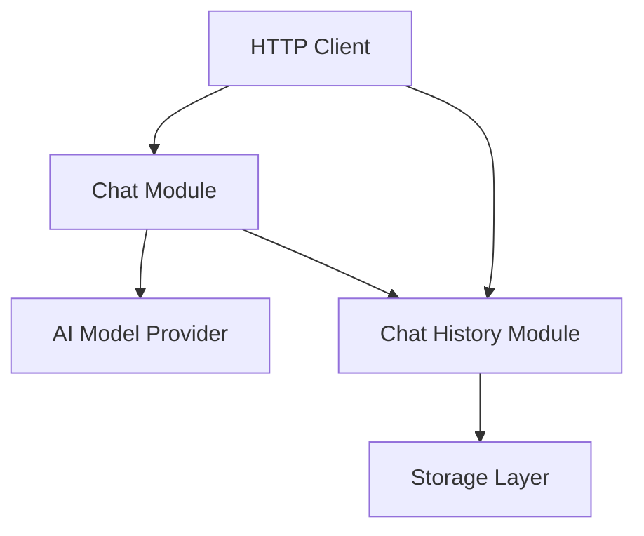

# Chat Module Architecture Document

## 1. Overview
- **Architecture Style**: Modular REST API with clean separation between web layer, business logic, and data persistence
- **Design Principles**:
  - KISS (Keep It Simple, Stupid) - minimal complexity, direct implementations
  - Raw JSON handling without over-engineered validation
  - Clear separation of concerns between HTTP handling, chat logic, and storage
- **Quality Attributes**: Simple, maintainable, extensible for different AI models

## 2. System Context
- **System Boundary**: Chat modules operates within the modAI core framework as a loadable web modules
- **External Systems**: AI model providers (OpenAI, Anthropic, local models)
- **Users and Stakeholders**: End users making chat requests via REST API
- **Data Flow**: HTTP requests → Chat processing → AI model calls → Response generation → Chat History → Storage



## 3. Data Models

### Chat Module Request/Response Format

Request:

```json
{
  "provider": "open-ai",
  "model": "gpt-4",
  "input": [
    {"role": "user", "content": "Hello, world"}
  ]
}
```

To stream or not stream the response, this can be handled via the "Accept" HTTP Header. These two are supported:
* application/json
* text/event-stream

If both are set, the response is streamed.

Response (non streaming):

```json
{
  "output": [
    {
      "text": "Hi there!",
      "type": "text"
    }
  ],
  "id": "1",
  "model": "gpt-4",
  "role": "assistant",
  "usage": {
    "input_tokens": 2095,
    "output_tokens": 503
  }
}
```

Response (streaming via SSE):

```json
{
  "output": [
    {
      "text": "Hi ",
      "type": "text_chunk"
    }
  ],
  "id": "1",
  "model": "gpt-4",
  "role": "assistant"
}

{
  "output": [
    {
      "text": "there!",
      "type": "text_chunk"
    },
  ],
  "id": "1",
  "model": "gpt-4",
  "role": "assistant",
  "usage": {
    "input_tokens": 2095,
    "output_tokens": 503
  }
}
```

After the last chunk, the SSE connection is closed by the server.


### Chat History Structure
```json
{
  "id": "1",
  "messages": [
    {
      "role": "user",
      "content": "Hello, world",
    },
    {
      "role": "assistant",
      "content": "Hi there!",
      "model": "gpt-4",
      "usage": {
        "input_tokens": 2095,
        "output_tokens": 503
      }
    }
  ]
}
```

### Model Configuration
```json
{
  [
    "openai": {
      "models": {
        "gpt-4": {},
        "gpt-3.5-turbo": {}
      }
    },
    "anthropic": {
      "models": {
        "claude-3": {},
        "claude-3-haiku": {}
      }
    }
  ]
}
```
