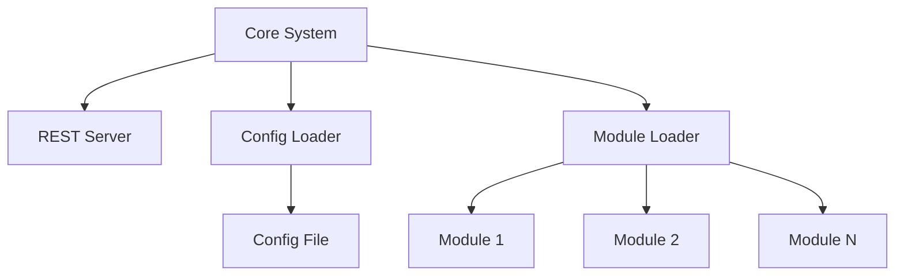

# Core Backend Architecture

## 1. Principles
- **Architecture Style**: Simple modular monolith with plugin-based modules
- **Design Principles**: KISS (Keep It Simple, Stupid), clear separation of concerns, fail-safe module loading
- **Quality Attributes**: Reliability through graceful failure handling, modularity for independent development, testability through clear interfaces

## 2. Technology Stack
- **Programming Language**: Python 3.12+
- **Dependency Management**: [UV](https://docs.astral.sh/uv/)
- **Configuration**: YAML format with flexible parsing
- **REST Framework**: [FastAPI](https://fastapi.tiangolo.com/)
- **Development Tools**: [pytest](https://docs.pytest.org/en/stable/)

## 3. Architecture
- **System Boundary**: Core server handles configuration, module loading, and REST server management
- **External Systems**: Modules (loaded as plugins), configuration file




### Startup Flow
1. **Program Start**: Core system initialization begins
2. **Config Loading**: Reading the config file
3. **Module Loading**: All modules specified in the config are instantiated
4. **Register Web Modules**: All loaded web modules are registered in the REST Server
5. **Server Ready**: All REST endpoints from web modules are registered and server is ready to accept requests


## 4. Module Organization
- **Base Module**: Each module has `modai.module.ModaiModule` as base class
- **Abstract Modules**: Located in `modai/modules/[module]/module.py`
- **Module Structure**: Each abstract module defines the interface and contract
- **Module Contract Documentation**: The abstract module contains the documentation how the module must behave
- **Module Implementations**: The implementation can be stored in the same folder as the `module.py`
- **Constructor Signature**: All module constructors must use the signature `def __init__(self, dependencies: ModuleDependencies, config: dict[str, Any]):` to be createable by the `ModuleLoader`
- **Configuration Access**: Modules receive their configuration through the constructor parameter
- **Dependencies**: Modules can be dependent on other modules. Those dependencies are configured via the config file and passed through the constructor parameter

### Module Types

A module has one or more types. Each type has certain conditions and if a module fulfills the condition it is automatiaclly of that type(s)

- **Plain Modules**: All modules are automatically plain modules by default
- **Web Modules**: Modules that provide a `router` attribute (APIRouter) after instantiation
- **Persistence Modules**: Modules that inherit from the core `PersistenceModule` interface and implement `migrate_data()` method

That means if a module has e.g. a `router` attribute, it will be of the type `plain module` and `web module`.

### Bootstrap Modules

Some modules are so called "bootstrap modules" because they are involved in the startup process before the actual module handling is available. For that reason, they are not configurable via the config as normal modules are.

The following modules are boostrap modules
* startup config module


## 5. Sample Abstract Web Module

Abstract modules are defined in the `modai.modules.[module]` package. This example shows a **web module** that provides a `router` attribute (file `modai/modules/health/module.py`):

```python
from abc import ABC, abstractmethod
from fastapi import APIRouter
from typing import Any

from modai.module import ModaiModule, ModuleDependencies


class HealthModule(ModaiModule, ABC):
    """
    Module Declaration for: Health (Web Module)
    """

    def __init__(self, dependencies: ModuleDependencies, config: dict[str, Any]):
        super().__init__(dependencies, config)
        self.router = APIRouter()  # This makes it a web module
        self.router.add_api_route("/api/v1/health", self.get_health, methods=["GET"])

    @abstractmethod
    def get_health(self) -> dict[str, Any]:
        """
        Returns the health status of the application in form of a json
        {
            "status": "<STATUS>"
        }

        The STATUS can be
        * healthy if the application is up and running

        Other statuses are currently not supported.
        """
        pass

```

## 6. Sample Module Implementation

The module implementation is contained in the same package as the abstract module ((file `modai/modules/health/simple_health_module.py`):

```python
from typing import Any
from modai.module import ModuleDependencies
from modai.modules.health.module import HealthModule


class SimpleHealthModule(HealthModule):
    """Default implementation of the Health module."""

    def __init__(self, dependencies: ModuleDependencies, config: dict[str, Any]):
        super().__init__(dependencies, config)

    def get_health(self) -> dict[str, Any]:
        return {"status": "healthy"}
```

## 6.1. Sample Plain Module

Here's an example of a **plain module** that doesn't provide REST endpoints:

```python
from abc import ABC, abstractmethod
from typing import Any

from modai.module import ModaiModule, ModuleDependencies

class SomeModule(ModaiModule, ABC):
    """
    Module Declaration for: Some (Plain Module)
    """

    def __init__(self, dependencies: ModuleDependencies, config: dict[str, Any]):
        super().__init__(dependencies, config)
        # No router attribute - this is a plain module

    @abstractmethod
    def do_something(self, message: str) -> None:
        """
        Do something with the message
        """
        pass

```

And the implementation
```python
class SomeModuleImplementation(SomeModule):
    def __init__(self, config: dict[str, Any]):
        super().__init__(config)

    def do_something(self, message: str) -> None:
        print(f"[LOG] {message}")
```

## 7. Configuration Structure Example

```yaml
modules:
  health:
    class: modai.modules.health.simple_health_module.SimpleHealthModule
    enabled: false
  jwt_session:
    class: modai.modules.session.jwt_session_module.JwtSessionModule
    config:
      jwt_secret: ${JWT_SECRET}
      jwt_algorithm: "HS256"
      jwt_expiration_hours: 24
  authentication:
    class: modai.modules.authentication.password_authentication_module.PasswordAuthenticationModule
    module_dependencies:
      session: "jwt_session"
```

This sample config defines three modules

1. health module: set to "disabled"
1. jwt_session module: with some configs and one config using an envirnoment variable as value
1. authentication module: with a requirement "session" module set to the module "jwt_session"

The names ("health", "jwt_session", "authentication") have no deeper meaning within the application and can be freely named. It is advisable to give them understandable names for better readability.


## 58 Design Decisions and Trade-offs
- **Decision 1**: Dependent modules are passed to the module instead of modules accessing the module loader directly.
   - **Trade-offs**: More isolated development of modules possible. Testing is easier.
   - **Risks and Mitigation**: If dependent modules are replaced or shutdown at runtime, modules they depend on it must also be updated.
