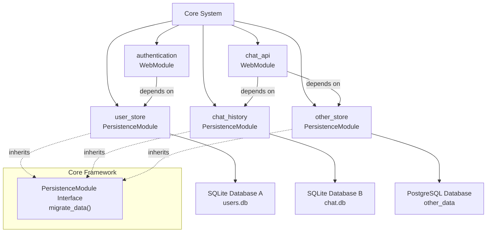

# Persistence Architecture

## 1. Overview
- **Architecture Style**: Modular SQL persistence with SQLModel/SQLAlchemy integration following modAI module patterns
- **Design Principles**:
  - KISS (Keep It Simple, Stupid) - minimal complexity in persistence layer
  - Module independence - each module manages its own data models
  - Multiple persistence backends support - modules can use different databases
  - Migration-aware startup - controlled data migration during application startup
- **Quality Attributes**: Reliable, modular, extensible for different storage backends

## 2. System Context
- **System Boundary**: Persistence modules operate within the modAI core framework providing completely independent data storage
- **External Systems**: SQL databases (SQLite, PostgreSQL, MySQL, etc.) - each module connects independently
- **Data Flow**: Module initialization → Independent engine creation → Independent table creation → Independent session management → Data operations



## 3. Module Architecture

### 3.1 Core Persistence Interface (Framework Level)
**Purpose**: Defines the base contract for any module that performs data persistence and needs migration capabilities.

**Location**: Core modAI framework (`modai.module`)

**Interface Definition**:
```python
from abc import ABC, abstractmethod

class PersistenceModule(ModaiModule, ABC):
    """
    Core interface for modules that perform data persistence.
    This interface is defined in the modAI core framework.
    Each persistence module is completely self-contained and manages
    its own database connections, tables, and data.
    """

    @abstractmethod
    def migrate_data(self, software_version: str, previous_version: str | None) -> None:
        """
        Performs data migration for this module

        Args:
            software_version: Current software version
            previous_version: Previous version (None for fresh install)
        """
        pass
```

**Key Characteristics**:
- Framework-level interface, not a concrete module
- All persistence modules must inherit from this interface (sql or vector db)
- Only defines migration contract, no specific persistence technology
- Each module is completely independent - no shared infrastructure
- Modules manage their own database connections, tables, and data models

### 3.2 Self-Contained Persistence Module Implementation
**Purpose**: Modules that store data (like user_store, chat_history) inherit from core PersistenceModule and are completely self-responsible for all database aspects.

**Key Responsibilities**:
- Database engine creation and configuration (own connection)
- Session management (own sessions)
- Table creation and schema management (own tables/database)
- Data migration (own migration logic)
- SQLModel class definitions (own data models)

## 4. Module Types Extension

### 4.1 Persistence Module Type (Core Framework)
Modules that inherit from the core `PersistenceModule` interface are automatically classified as **persistence modules**.

**Detection Criteria**: Module inherits from `modai.module.PersistenceModule` interface.

**Behavior**:
- Persistence modules participate in the migration process during startup
- Called after all regular modules are initialized but before web server starts
- Migration is coordinated by the core system
- Each module operates completely independently with its own database connections

## 5. Startup Integration

### 5.1 Migration Flow
The migration flow ensures that all data migrations are completed before the REST API becomes available:

1. **Core System Startup**: The modAI core system initializes
2. **Module Initialization**: All modules (persistence, web, and others) are initialized and configured
3. **Migration Phase**: For all persistence modules, the `migrate_data()` method is called to handle any necessary data migrations
4. **REST Endpoint Registration**: After all migrations are complete, web modules register their REST endpoints
5. **Server Ready**: The web server starts and becomes ready to accept HTTP requests

## 6. Data Model Organization

### 7.1 Shared Column Standards
While persistence modules are completely independent, some columns should follow consistent standards across modules to enable logical relationships without database-level foreign keys:

**Standard Column Definitions**:
- **`user_id`**: String field for referencing users across modules
  - Type: `str` (no fixed length restriction)
  - If length needs to be defined: UUID-length string (36 characters)
  - Purpose: Links entities to users across different persistence modules

- **`group_id`**: String field for referencing groups across modules
  - Type: `str` (no fixed length restriction)
  - If length needs to be defined: UUID-length string (36 characters)
  - Purpose: Links entities to groups/teams across different persistence modules

- **`tenant_id`**: String field for future multi-tenancy support
  - Type: `str` (no fixed length restriction)
  - If length needs to be defined: UUID-length string (36 characters)
  - Purpose: Enables multi-tenant data separation across modules
  - Status: Reserved for future use, not required currently

## 7. Configuration

### 7.1 Independent Module Configuration
```yaml
user_store:
  class: modai.modules.user_store.user_store_module.UserStoreModule
  config:
    database_url: "sqlite:///user_store.db"

chat_history:
  class: modai.modules.chat_history.chat_history_module.ChatHistoryModule
  config:
    database_url: "postgresql:///chat_history.db"
    username: some_user
    password: ${POSTGRESQL_PASSWORD}

document_store:
  class: modai.modules.document_store.document_store_module.DocumentStoreModule
  config:
    database_url: "qdrant://localhost:6333"
```

Each persistence module is independent and can use its own database.

## 8. Security Considerations

### 8.1 Database Security
- Connection string security via environment variables
- Connection pooling limits to prevent resource exhaustion
- SQL injection prevention through SQLModel/SQLAlchemy parameterized queries
- Database user permissions (least privilege principle)

### 8.2 Migration Security
- Migration validation before execution
- Backup recommendations before major version updates
- No built in rollback strategy
- Transaction-based migrations where possible

## 9. Benefits and Trade-offs

### 9.1 Benefits
- **Complete Module Independence**: Each module is entirely self-contained with its own database connections and data
- **Simple Architecture**: No shared infrastructure layers or complex dependencies
- **Technology Flexibility**: Each module can choose any database technology independently
- **Easy Testing**: Each module can be tested in complete isolation
- **Clear Ownership**: Each module owns and controls its own data completely
- **No Cross-Dependencies**: Modules cannot accidentally interfere with each other's data
- **Easy Deployment**: Each module's data can be deployed, backed up, and managed independently

### 9.2 Trade-offs
- **Resource Usage**: Each module creates its own database connections (more connections overall)
- **Data Isolation**: Strict separation means no database-level relationships across modules
- **Cross-Module Queries**: Requires application-level coordination for cross-module data access
- **Duplicate Infrastructure**: Each module implements its own database setup code
- **Transaction Boundaries**: Cannot use database transactions across modules
- **Consistency**: No automatic referential integrity across modules

## 10. Future Enhancements

### 10.1 Advanced Features
- Independent backup and restore per module
- Module-specific database monitoring and health checks
- Individual database scaling strategies per module
- Per-module database security configurations

### 10.2 Additional Persistence Types
- NoSQL database modules (MongoDB, Redis) - completely independent
- File-based persistence modules (JSON, XML, binary files)
- Remote storage integration (S3, cloud databases) - per module
- In-memory persistence for testing - per module
- Hybrid approaches (SQL + NoSQL) within individual modules
