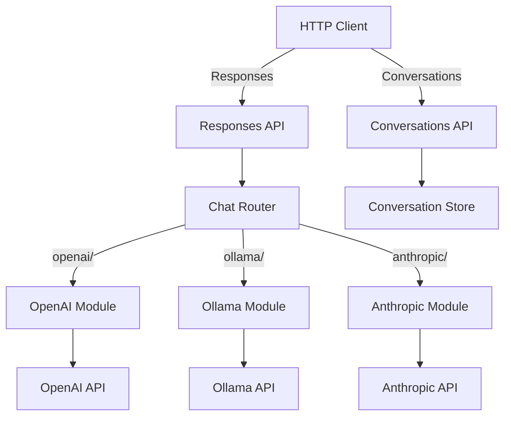

# Chat Module Architecture Document

## 1. Overview
- **Architecture Style**: Layered REST API with OpenAI-compatible endpoints while routing requests to various AI model providers based on model prefixes
- **Design Principles**:
  - KISS (Keep It Simple, Stupid) - minimal complexity, direct proxy implementations
  - API Compatibility - Full compatibility with OpenAI's Responses and Conversations APIs
  - Transparent Routing - Internal model routing based on prefixes (e.g., "openai/", "ollama/") is invisible to clients
  - Clear separation of concerns between HTTP proxying, model routing, provider communication, and conversation management
- **Quality Attributes**: Simple, compatible, extensible for different AI providers (OpenAI, Anthropic, Ollama, etc.)

## 2. System Context
- **System Boundary**: Chat module operates as an OpenAI-compatible API proxy within the modAI core framework with an internal routing layer
- **External Systems**: Multiple AI model providers (OpenAI, Anthropic, Ollama, etc.) via their respective APIs
- **Users and Stakeholders**: Clients that expect OpenAI's Responses and Conversations API format



## 3. API Endpoints and Status Codes

- **3.1 Responses API (Chat Functionality)**
  - `POST /responses` - Create a new response (chat completion)
  - `GET /responses/{response_id}` - Retrieve a response
  - `DELETE /responses/{response_id}` - Delete a response
  - `POST /responses/{response_id}/cancel` - Cancel a response
- **3.2 Conversations API (Chat Conversations)**
  - `POST /conversations` - Create a new conversation
  - `GET /conversations/{conversation_id}` - Retrieve a conversation
  - `POST /conversations/{conversation_id}/items` - Create conversation items
  - `GET /conversations/{conversation_id}/items` - List conversation items
  - `GET /conversations/{conversation_id}/items/{item_id}` - Get a conversation item
  - `DELETE /conversations/{conversation_id}/items/{item_id}` - Delete a conversation item
- **3.3 Models**
  - `GET /models` - list all models for all api endpoints (OpenAI-compatible format)
- **3.4 LLM Providers**
  - `GET /models/providers` - Retrieve all configured providers of all types
  - `GET /models/providers/{type}` - Retrieve configured providers for type
  - `POST /models/providers/{type}` - Create new provider
  - `GET /models/providers/{type}/{provider_id}` - Retrieve specific provider
  - `PUT /models/providers/{type}/{provider_id}` - Update existing provider
  - `GET /models/providers/{type}/{provider_id}/models` - Retrieve available models from provider
  - `DELETE /models/providers/{type}/{provider_id}` - Delete provider

### 3.1 Responses API (Chat Functionality)

For details of the `/responses`, `/conversation` and `/models` endpoints, look up the offizial documenation under
* https://platform.openai.com/docs/api-reference/responses
* https://platform.openai.com/docs/api-reference/conversations

### 3.4 LLM Providers

The LLM Providers module provides endpoints for managing AI model providers and retrieving available models. This module utilizes a provider store for persistence of provider configurations.

**Module Dependencies**:
- Provider store: Handles persistence of provider configurations, credentials, and metadata

#### 3.4.1 Get All Providers Endpoint

**Endpoint**: `GET /models/providers`

**Purpose**: Retrieve a list of all configured providers across all types

**Response Format (200 OK)**:
```json
{
  "providers": [
    {
      "type": "openai",
      "id": "550e8400-e29b-41d4-a716-446655440001",
      "name": "OpenAI Production",
      "base_url": "https://api.openai.com/v1",
      "api_key": "sk-...truncated",
      "description": "Primary OpenAI provider",
      "created_at": "2024-01-15T10:30:00Z",
      "updated_at": "2024-01-15T10:30:00Z"
    },
    {
      "type": "ollama",
      "id": "550e8400-e29b-41d4-a716-446655440002",
      "name": "Local Ollama",
      "base_url": "http://localhost:11434",
      "description": "Local Ollama server",
      "created_at": "2024-01-16T14:20:00Z",
      "updated_at": "2024-01-16T14:20:00Z"
    }
  ]
}
```

#### 3.4.2 Get Providers for Type Endpoint

**Endpoint**: `GET /models/providers/{type}`

**Purpose**: Retrieve a list of all configured providers for the specified type

**Response Format (200 OK)**:
```json
{
  "providers": [
    {
      "id": "550e8400-e29b-41d4-a716-446655440001",
      "name": "OpenAI Production",
      "base_url": "https://api.openai.com/v1",
      "api_key": "sk-...truncated",
      "description": "Primary OpenAI provider",
      "created_at": "2024-01-15T10:30:00Z",
      "updated_at": "2024-01-15T10:30:00Z"
    },
    {
      "id": "550e8400-e29b-41d4-a716-446655440002",
      "name": "OpenAI Compatible Local",
      "base_url": "http://localhost:11434/v1",
      "api_key": "local-key-...truncated",
      "description": "Local OpenAI-compatible server",
      "created_at": "2024-01-16T14:20:00Z",
      "updated_at": "2024-01-16T14:20:00Z"
    }
  ]
}
```

#### 3.4.3 Create Provider Endpoint

**Endpoint**: `POST /models/providers/{type}`

**Purpose**: Create a new provider configuration

**Request Format**:
```json
{
  "name": "OpenAI Production",
  "base_url": "https://api.openai.com/v1",
  "api_key": "sk-...",
  "description": "Primary OpenAI provider"
}
```

**Response Format (201 Created)**:
```json
{
  "id": "550e8400-e29b-41d4-a716-446655440001",
  "name": "OpenAI Production",
  "base_url": "https://api.openai.com/v1",
  "description": "Primary OpenAI provider",
  "created_at": "2024-01-15T10:30:00Z",
  "updated_at": "2024-01-15T10:30:00Z"
}
```

#### 3.4.4 Get Provider Endpoint

**Endpoint**: `GET /models/providers/{type}/{provider_id}`

**Purpose**: Retrieve a specific provider configuration

**Response Format (200 OK)**:
```json
{
  "id": "550e8400-e29b-41d4-a716-446655440001",
  "name": "OpenAI Production",
  "base_url": "https://api.openai.com/v1",
  "description": "Primary OpenAI provider",
  "created_at": "2024-01-15T10:30:00Z",
  "updated_at": "2024-01-15T10:30:00Z"
}
```

#### 3.4.5 Update Provider Endpoint

**Endpoint**: `PUT /models/providers/{type}/{provider_id}`

**Purpose**: Update an existing provider configuration

**Request Format**:
```json
{
  "name": "OpenAI Production Updated",
  "base_url": "https://api.openai.com/v1",
  "api_key": "sk-...",
  "description": "Updated OpenAI provider"
}
```

**Response Format (200 OK)**:
```json
{
  "id": "550e8400-e29b-41d4-a716-446655440001",
  "name": "OpenAI Production Updated",
  "base_url": "https://api.openai.com/v1",
  "description": "Updated OpenAI provider",
  "created_at": "2024-01-15T10:30:00Z",
  "updated_at": "2024-01-15T14:45:00Z"
}
```

#### 3.4.6 Get Models Endpoint

**Endpoint**: `GET /models/providers/{type}/{provider_id}/models`

**Purpose**: Retrieve available models from a specific provider

**Response Format (200 OK)**:
```json
{
  "provider_id": "550e8400-e29b-41d4-a716-446655440001",
  "models": [
    {
      "id": "gpt-4",
      "name": "GPT-4",
      "description": "Most capable GPT-4 model",
      "context_length": 8192,
      "supports_streaming": true,
      "supports_functions": true
    },
    {
      "id": "gpt-3.5-turbo",
      "name": "GPT-3.5 Turbo",
      "description": "Fast and efficient model",
      "context_length": 4096,
      "supports_streaming": true,
      "supports_functions": true
    }
  ]
}
```

#### 3.4.7 Delete Provider Endpoint

**Endpoint**: `DELETE /models/providers/{type}/{provider_id}`

**Purpose**: Delete a provider configuration

**Response Format (204 No Content)**:
No response body is returned for successful deletion.

