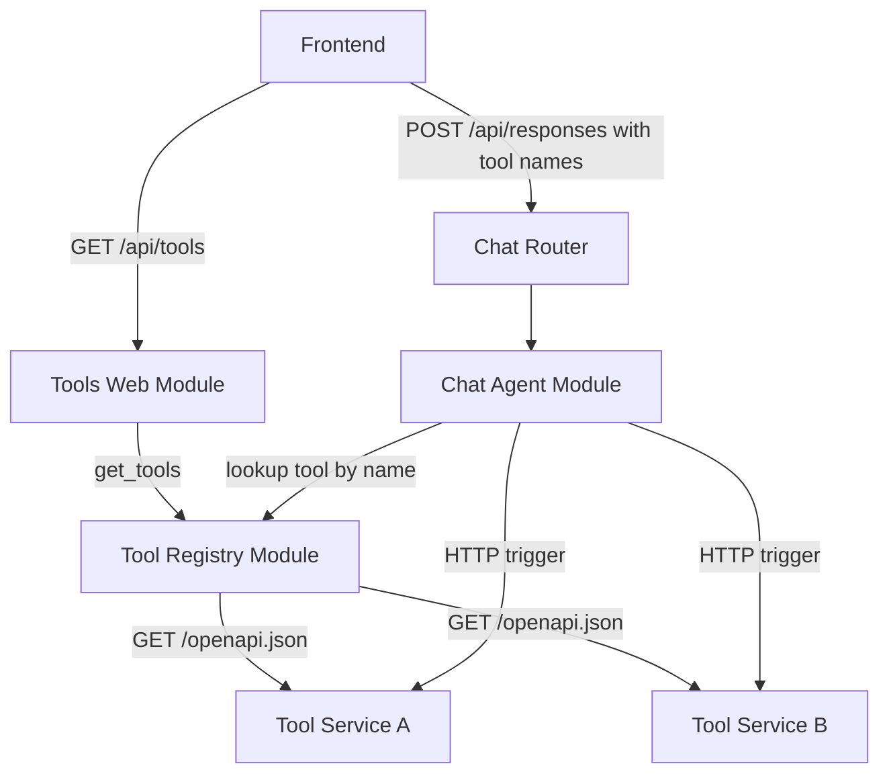

# Tools Architecture

## 1. Overview
- **Architecture Style**: Microservice-based tool system with a registry and a web layer that serves tools in OpenAI format
- **Design Principles**:
  - Tools are independent microservices — each tool is a standalone service with its own OpenAPI spec
  - OpenAPI as contract — the tool's definition (parameters, description, endpoints) is read from its OpenAPI spec
  - Registry as aggregator — the Tool Registry fetches and holds OpenAPI specs + invocation metadata (url, method) without transformation
  - Web layer transforms — the Tools Web Module converts OpenAPI specs into OpenAI function-calling format for the frontend
  - Chat Agent resolves via registry — when the LLM emits a tool call, the Chat Agent looks up the tool's url and method from the registry to make the HTTP call
- **Quality Attributes**: Decoupled, language-agnostic, independently deployable, discoverable

## 2. Tool Microservice Convention

Each tool is a standalone microservice that follows these conventions:

1. **HTTP endpoint**: The tool is triggered via an HTTP request. Each tool chooses the HTTP method (PUT, POST, GET, etc.) that is most idiomatic for its use case. The method is configured in the tool registry.
2. **OpenAPI spec**: The microservice exposes its OpenAPI specification (typically at `/openapi.json`). This spec documents all endpoints, including the trigger endpoint with its parameters, description, and response schema.
3. **Independence**: Tools have no dependency on modAI. They are plain HTTP microservices that can be developed, deployed, and tested independently in any language/framework.

### Example Tool Microservice (OpenAPI spec)
```json
{
  "openapi": "3.1.0",
  "info": {
    "title": "Calculator Tool",
    "version": "1.0.0",
    "description": "Evaluate mathematical expressions"
  },
  "paths": {
    "/calculate": {
      "post": {
        "summary": "Evaluate a math expression",
        "operationId": "calculate",
        "requestBody": {
          "required": true,
          "content": {
            "application/json": {
              "schema": {
                "type": "object",
                "properties": {
                  "expression": {
                    "type": "string",
                    "description": "Math expression to evaluate"
                  }
                },
                "required": ["expression"]
              }
            }
          }
        },
        "responses": {
          "200": {
            "description": "Calculation result",
            "content": {
              "application/json": {
                "schema": {
                  "type": "object",
                  "properties": {
                    "result": { "type": "number" }
                  }
                }
              }
            }
          }
        }
      }
    }
  }
}
```

## 3. System Context



**Flow**:
1. Frontend calls `GET /api/tools` to discover all available tools
2. Tools Web Module asks the Tool Registry for all tools (OpenAPI specs + url + method)
3. Tools Web Module transforms the OpenAPI specs into **OpenAI function-calling format** and returns them to the frontend
4. User selects which tools to enable for a chat session
5. Frontend sends `POST /api/responses` with tool names (as received from `GET /api/tools`)
6. When the LLM emits a `tool_call` with a function name, the Chat Agent **looks up** that name in the Tool Registry to get the tool's url and method
7. The Chat Agent sends an HTTP request to the tool's microservice endpoint and returns the result to the LLM

## 4. Module Architecture

### 4.1 Tool Registry Module (Plain Module)

**Purpose**: Aggregates OpenAPI specs from all configured tool microservices and provides tool lookup for invocation.

**Responsibilities**:
- Maintain a list of configured tool microservice URLs and their HTTP methods
- Fetch the OpenAPI spec from each tool microservice
- Return all tools with their OpenAPI specs, urls, and methods (unmodified)
- Provide lookup by tool name — given a function name (derived from `operationId`), return the tool's url, method, and parameters
- Handle unavailable tool services gracefully (skip with warning, don't fail the whole request)

**No module dependencies**: The registry does not depend on other modAI modules. Tool microservices are external HTTP services configured via the module's config.

### 4.2 Tools Web Module (Web Module)

**Purpose**: Exposes `GET /api/tools` endpoint. Transforms tool definitions from OpenAPI format into OpenAI function-calling format so the frontend can use them directly.

**Dependencies**: Tool Registry Module (injected via `module_dependencies`)

**Responsibilities**:
- Expose `GET /api/tools` endpoint
- Call the Tool Registry to get all available tools with their OpenAPI specs
- Transform each tool's OpenAPI spec into OpenAI function-calling format (see section 5.1)
- Return the transformed tools to the frontend

### 4.3 Chat Agent Module (existing, updated dependency)

The Chat Agent Module receives a `tool_registry` dependency. When the LLM emits a `tool_call`:
1. Extract the function name from the tool call
2. Look up the function name in the Tool Registry to get url + method
3. Send the HTTP request with the tool call arguments to the tool's endpoint
4. Return the response to the LLM

## 5. API Endpoints

- `GET /api/tools` — List all available tools in OpenAI function-calling format

### 5.1 List Available Tools

**Endpoint**: `GET /api/tools`

**Purpose**: Returns all available tools in OpenAI function-calling format. The frontend can pass these tool definitions directly when calling `/api/responses`.

The Tools Web Module fetches tool data from the registry (OpenAPI specs + metadata) and transforms each tool into OpenAI format.

**OpenAPI → OpenAI Transformation**:
- `operationId` → `function.name`
- `summary` (or `description`) → `function.description`
- Request body `schema` → `function.parameters`

**Response Format (200 OK)**:
```json
{
  "tools": [
    {
      "type": "function",
      "function": {
        "name": "calculate",
        "description": "Evaluate a math expression",
        "parameters": {
          "type": "object",
          "properties": {
            "expression": {
              "type": "string",
              "description": "Math expression to evaluate"
            }
          },
          "required": ["expression"]
        }
      }
    },
    {
      "type": "function",
      "function": {
        "name": "web_search",
        "description": "Search the web for current information",
        "parameters": {
          "type": "object",
          "properties": {
            "query": {
              "type": "string",
              "description": "Search query"
            }
          },
          "required": ["query"]
        }
      }
    }
  ]
}
```

If a tool service is unreachable, it is omitted from the response and a warning is logged. The endpoint never fails due to a single unavailable tool.

## 6. Configuration

```yaml
modules:
  tool_registry:
    class: modai.modules.tools.tool_registry.HttpToolRegistryModule
    config:
      tools:
        - url: http://calculator-service:8000/calculate
          method: POST
        - url: http://web-search-service:8000/search
          method: PUT

  tools_web:
    class: modai.modules.tools.tools_web_module.ToolsWebModule
    module_dependencies:
      tool_registry: tool_registry

  chat_openai:
    class: modai.modules.chat.openai_agent_chat.StrandsAgentChatModule
    module_dependencies:
      llm_provider_module: openai_model_provider
      tool_registry: tool_registry
```

Each entry in `tools` (on the registry) has:
- `url`: The full trigger endpoint URL of the tool microservice
- `method`: The HTTP method used to invoke the tool (e.g. PUT, POST, GET)

The registry derives the base URL from `url` to fetch the OpenAPI spec (appending `/openapi.json` to the base).

## 7. Design Decisions

- **Decision 1**: Tools are independent microservices, not modAI modules.
  - **Rationale**: Maximum decoupling — tools can be written in any language, deployed independently, and reused across systems.
  - **Trade-off**: Network overhead for spec fetching and tool invocation vs. in-process calls.

- **Decision 2**: OpenAPI spec is fetched at request time, not cached.
  - **Rationale**: Simplicity — no cache invalidation needed. Tool services can update their specs and changes are immediately visible.
  - **Trade-off**: Higher latency on `GET /api/tools`. Can be optimized with caching later if needed.

- **Decision 3**: The Tool Registry stores OpenAPI specs unmodified. The Tools Web Module transforms them.
  - **Rationale**: Separation of concerns — the registry is a pure aggregator, the web module handles format conversion. This keeps each module focused on one job.

- **Decision 4**: Tool name for lookup is derived from `operationId` in the OpenAPI spec.
  - **Rationale**: `operationId` is a standard OpenAPI field designed to uniquely identify an operation, making it a natural tool name.
