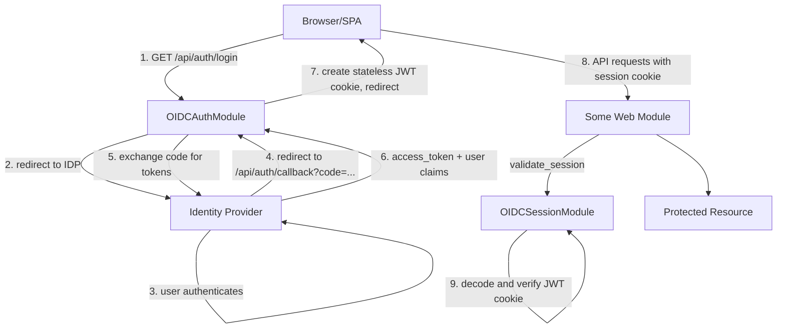
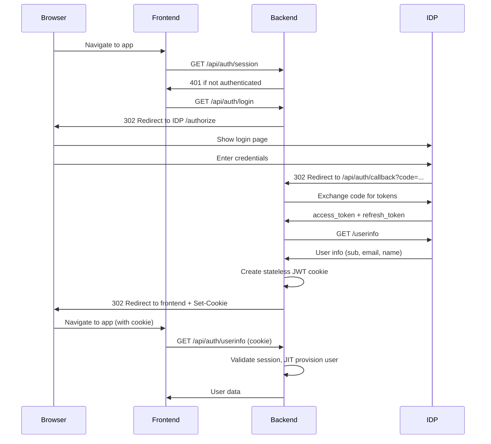

# Authentication and Authorization Architecture

## 1. Overview
- **Architecture Style**: OIDC-based authentication with an external identity provider, stateless cookie-based session management, and extensible authorization
- **Design Principles**:
  - KISS (Keep It Simple, Stupid) - delegate authentication to a dedicated IDP
  - Security by design with clear module boundaries
  - Provider-agnostic OIDC integration (works with any OIDC-compliant IDP)
  - Backend handles the full OIDC flow (no frontend OIDC client needed)
  - **Stateless sessions**: all session state is carried in a signed JWT cookie — no server-side session store
  - Clear separation between auth flow (OIDCAuthModule) and session validation (OIDCSessionModule)
  - Extensible authorization model supporting multiple permission strategies
- **Quality Attributes**: Secure, maintainable, extensible for different auth providers and permission models

## 2. System Context
- **System Boundary**: Auth modules operate within the modAI core framework as loadable modules
- **External Systems**: Any OIDC-compliant identity provider, user stores for local JIT provisioning
- **Users and Stakeholders**: End users authenticating via OIDC redirect flow, admin users managing permissions
- **Data Flow**: Browser → Backend login redirect → IDP authorization → Backend callback (code exchange) → Stateless JWT cookie set → API requests validated by decoding cookie



## 3. Authentication Flow

### 3.1 OIDC Authorization Code Flow (Backend)
The backend handles the full OIDC flow. Both PKCE and client_secret authentication methods are supported:

1. User navigates to app → no session cookie → frontend redirects to `GET /api/auth/login`
2. Backend redirects to the IDP authorize endpoint
3. User authenticates at the IDP's hosted login UI
4. IDP redirects back to `GET /api/auth/callback` with authorization code
5. Backend exchanges code for tokens at the token endpoint
6. Backend fetches user claims from the IDP userinfo endpoint
7. Stateless JWT session cookie is created (user claims, signed with session_secret)
8. Cookie set on the response, browser redirected to the frontend

### 3.2 Session Validation (Backend)
The backend validates sessions by decoding the signed JWT cookie — no server-side lookup required:

1. Extract session cookie from request
2. Decode and verify JWT signature using session_secret
3. Check JWT expiry (`exp` claim)
4. Return a `Session` object with the user's identity from the JWT claims

### 3.3 Stateless Cookie Structure
The session cookie is a HS256-signed JWT with the following claims:

| Claim           | Description                                  |
|-----------------|----------------------------------------------|
| `sub`           | OIDC sub (user identity)                     |
| `email`         | User email address                           |
| `iat`           | Issued-at timestamp                          |
| `exp`           | Expiry timestamp (`iat + session_duration`)  |
| `name`          | (optional) Full name from IDP                |
| `email_verified`| (optional) Email verification status         |

### 3.4 JIT User Provisioning
When a user authenticates for the first time, they are automatically provisioned in the local user store:

1. Session cookie is validated and user identity (`sub`) is extracted
2. User looked up in local store by OIDC `sub` claim
3. If not found, looked up by email
4. If still not found, created from cookie claims (email, name)

## 4. Module Architecture

### 4.1 Auth OIDC Module (`OIDCAuthModule`)
**Purpose**: Handles the OIDC Authorization Code flow with PKCE. **Responsible only for the authentication lifecycle** (login, callback, logout). Creates the stateless session cookie on successful authentication.

**Module Type**: Web Module

**Key Responsibilities**:
- OIDC Authorization Code flow with PKCE
- Creating and deleting the stateless JWT session cookie
- Logout with IDP end_session_endpoint redirect

**API Endpoints**:
- `GET /api/auth/login` - Initiates OIDC login flow, redirects to IDP
- `GET /api/auth/callback` - Handles authorization code exchange, sets stateless JWT cookie
- `POST /api/auth/logout` - Clears session cookie, redirects to IDP end_session_endpoint

**Configuration**:
```yaml
auth_oidc:
  class: modai.modules.authentication.oidc_auth_module.OIDCAuthModule
  config:
    issuer: ${OIDC_ISSUER}              # e.g., http://localhost:9000
    client_id: ${OIDC_CLIENT_ID}        # OIDC client ID
    client_secret: ${OIDC_CLIENT_SECRET} # OIDC client secret (optional, for IDPs that don't support PKCE)
    redirect_uri: ${OIDC_REDIRECT_URI}  # e.g., http://localhost:8000/api/auth/callback
    post_login_uri: ${OIDC_POST_LOGIN_URI}   # e.g., http://localhost:5173/
    post_logout_uri: ${OIDC_POST_LOGOUT_URI} # e.g., http://localhost:5173/
    session_secret: ${SESSION_SECRET}    # Secret for signing session cookies
    scopes: "openid profile email offline_access"
    # Optional:
    # session_duration: 86400   # seconds, default 24 h (must match session module)
    # cookie_secure: false      # Set true in production (HTTPS)
    # cookie_samesite: "lax"    # Cookie SameSite attribute
```

**Dependencies**: None (standalone auth flow module)


### 4.2 OIDC Session Module (`OIDCSessionModule`)
**Purpose**: Validates stateless JWT session cookies on every API request. Implements the `SessionModule` interface used by all other modules.

**Module Type**: Web Module + Session Module

**Key Responsibilities**:
- Decoding and verifying the JWT session cookie on every request
- Providing the `Session` object (user_id + claims) to other modules
- User info retrieval with JIT provisioning

**API Endpoints**:
- `GET /api/auth/session` - Returns the active session (200 OK) or 401 if missing/invalid/expired
- `GET /api/auth/userinfo` - Returns user info with JIT provisioning (200 OK / 401 / 404)

**Configuration**:
```yaml
session:
  class: modai.modules.session.oidc_session.OIDCSessionModule
  config:
    session_secret: ${SESSION_SECRET}   # Secret for verifying session cookies
    # Optional:
    # session_duration: 86400            # seconds, default 24 h
  module_dependencies:
    user_store: "user_store"            # optional, for JIT provisioning
```

**Dependencies**:
- User Store Module (optional, for JIT provisioning)

**Session Interface**:
```python
def validate_session(self, request: Request) -> Session:
    """
    Decodes the JWT session cookie and returns a Session.

    Returns:
        Session with user_id (from OIDC sub claim) and additional claims
        (email, name, email_verified)

    Raises:
        HTTPException(401) if no cookie, invalid signature, or JWT expired
    """
```

**Data Models**:

Session endpoint:
```json
// GET /api/auth/session (200 OK)
{"user_id": "user-id", "additional": {"email": "user@example.com", "name": "John Doe"}}
```

Userinfo:
```json
// GET /api/auth/userinfo (200 OK)
{"id": "user-id", "email": "user@example.com", "full_name": "John Doe"}
```


### 4.3 Authorization Module
**Purpose**: Determines user permissions for accessing specific protected resources, manages permission registry, and provides permission discovery API.

**Key Responsibilities**:
- Permission registration and discovery
- Resource permission validation
- User-based permissions
- Group-based permissions
- Permission caching for performance
- REST API for permission discovery

**API Endpoints**:
- `GET /api/auth/permissions` - List all registered permissions for client discovery (200 OK / 401 Unauthorized if auth required)

**Key Functions**:
```python
async def register_permission(self, permission_def: PermissionDefinition) -> None:
    """Register a permission definition for discovery purposes."""

async def validate_permission(self, user_id: str, resource: str, action: str) -> None:
    """
    Validates if user has permission for specific resource and action.
    Raises:
        HTTPException: If access is not permitted
    """
```

**Dependencies**:
- Session Module (for validating requests to permission endpoints)


### 4.4 User Store Module
**Purpose**: Manages user and group data. Supports JIT provisioning from OIDC claims.

**Module Type**: Plain, (Persistence)*

\* It is likely that implementations will be also of type "persistence" in
order to perform data migration of persisted data

**Key Responsibilities**:
- User CRUD operations
- JIT user creation from OIDC claims (id, email, name)

## 5. Integration Patterns

### 5.1 Web Module Auth Pattern
Most web modules follow this pattern for protected endpoints:

```python
class SomeWebModule(ModaiModule):
    def __init__(self, dependencies: ModuleDependencies, config: dict[str, Any]):
        super().__init__(dependencies, config)
        self.session_module: SessionModule = dependencies.modules.get("session")
        self.router.add_api_route("/api/some", self.get_some, methods=["GET"])

    async def get_some(self, request: Request):
        # 1. Validate session (raises 401 if cookie session is missing/invalid)
        session = self.session_module.validate_session(request)

        # 2. Process request (session.user_id contains the OIDC sub claim)
        return {"data": "protected content", "user": session.user_id}
```

### 5.2 OIDC Authentication Flow


## 6. Security Considerations

### 6.1 Authentication Security
- PKCE (Proof Key for Code Exchange) or client_secret used for token exchange depending on the IDP
- `offline_access` scope enables refresh tokens for long-lived sessions
- OIDC state parameter prevents CSRF on the authorization flow
- No credentials stored in the application — all authentication delegated to IDP

### 6.2 Session Security
- Session cookie is signed (JWT with HS256) so it cannot be tampered with
- HTTP-only cookie prevents JavaScript access (XSS protection)
- SameSite attribute set to "lax" by default (CSRF protection)
- When the access token in the session cookie expires, the user must re-authenticate (planned future enhancement: refresh-token-based automatic renewal)
- Session cleared on logout (cookie cleared + IDP end_session redirect)

### 6.3 Authorization Security
- Principle of least privilege
- Permission validation on every protected resource access
- Proper error handling to prevent information leakage

## 7. Development Setup

### 7.1 NanoIDP (Identity Provider for development)
[NanoIDP](https://github.com/cdelmonte-zg/nanoidp) is a lightweight OIDC identity provider used for local development and e2e tests. It runs as a Docker container with no external dependencies.

```bash
docker run --rm -p 9000:9000 ghcr.io/cdelmonte-zg/nanoidp:latest \
  sh -c "sed -i 's/port: 8000/port: 9000/g' /app/config/settings.yaml && \
         sed -i 's|http://localhost:8000|http://localhost:9000|g' /app/config/settings.yaml && \
         nanoidp --host 0.0.0.0 --port 9000"
```

Default client: `test-client` / `test-secret`
Default user: `admin` / `admin` (email: `admin@example.org`)

### 7.2 Environment Variables
Backend (`backend/omni/.env` or exported in shell):
```
OIDC_ISSUER=http://localhost:9000
OIDC_CLIENT_ID=test-client
OIDC_CLIENT_SECRET=test-secret
OIDC_REDIRECT_URI=http://localhost:8000/api/auth/callback
OIDC_POST_LOGIN_URI=http://localhost:4173/
OIDC_POST_LOGOUT_URI=http://localhost:4173/
SESSION_SECRET=dev-session-secret-32-chars!!!!!
```


## 8. Future Enhancements

### 8.1 Additional Authentication Methods
- Multi-factor authentication (MFA) via an external IDP
- Social login providers (Google, GitHub) via IDP federation
- API key authentication for machine-to-machine communication

### 8.2 Advanced Authorization Features
- Resource-level permissions with inheritance
- Role-based access control (RBAC) using IDP roles

### 8.3 Audit and Monitoring
- Authentication attempt logging
- Permission check auditing
- Failed access attempt monitoring
