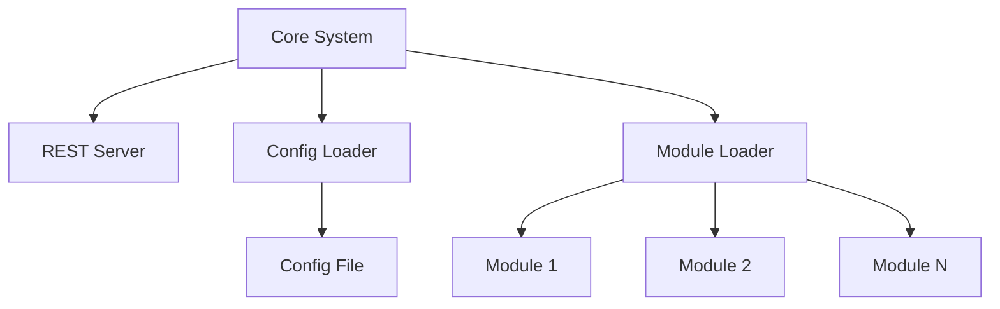

# Core Backend Architecture

## 1. Principles
- **Architecture Style**: Simple modular monolith with plugin-based modules
- **Design Principles**: KISS (Keep It Simple, Stupid), clear separation of concerns, fail-safe module loading
- **Quality Attributes**: Reliability through graceful failure handling, modularity for independent development, testability through clear interfaces

## 2. Technology Stack
- **Programming Language**: Python 3.13+
- **Dependency Management**: [UV](https://docs.astral.sh/uv/)
- **Configuration**: YAML format with flexible parsing
- **REST Framework**: [FastAPI](https://fastapi.tiangolo.com/)
- **Development Tools**: [pytest](https://docs.pytest.org/en/stable/)

## 3. Architecture
- **System Boundary**: Core server handles configuration, module loading, and REST server management
- **External Systems**: Modules (loaded as plugins), configuration file




### Startup Flow
1. **Program Start**: Core system initialization begins
2. **Config Loading**: Reading the config file (see *Config File Format* below)
3. **Module Loading**: All modules specified in the config are instantiated
4. **Register Web Modules**: All loaded web modules are registered in the REST Server
5. **Server Ready**: All REST endpoints from web modules are registered and server is ready to accept requests


### Config File Format

The config file is a YAML file with a `modules` key and an optional `includes` key.

By default the server uses the built-in `default_config.yaml`. To point to a custom file, set the `CONFIG_PATH` environment variable:

```bash
CONFIG_PATH=/path/to/my-config.yaml uv run uvicorn modai.main:app
```

```yaml
includes:
  - path: ./extra-modules.yaml   # relative to this config file
  - path: ./another.yaml

modules:
  health:
    class: modai.modules.health.simple_health_module.SimpleHealthModule
  my_module:
    class: modai.modules.example.ExampleModule
    collision_strategy: merge   # optional, see below
    config:
      some_key: some_value
```

#### `includes` — multi-file configs

Only the **root config file** may contain `includes`. Included files must not contain
`includes` themselves — nested includes are intentionally not supported.

> **Why no nesting?** Nested includes create transitive dependency chains and
> non-obvious load orders that are hard to debug.

Paths are resolved relative to the root config file. Includes are processed
top-to-bottom.

##### Load order

Includes are processed top-to-bottom first, then the root config itself is applied
last. **Root modules always win** because they are the final incoming value.

1. The first include's modules are loaded.
2. Each subsequent include is applied top-to-bottom. Later includes overwrite earlier ones on collision.
3. The root config's own modules are applied last — highest priority.

Example: root → [A, B]

```
A modules     (loaded 1st)
B modules     (loaded 2nd — overwrites A on collision)
root modules  (loaded last — highest precedence, always wins)
```

##### `collision_strategy` — handling duplicate module names

When the same module name appears in multiple config files, the
`collision_strategy` field on the **incoming** (later-loaded) module decides what
happens. Because root modules are always applied last as incoming, setting
`collision_strategy` on a **root module** controls how it interacts with a module
already loaded from an include.

| Value | Behaviour |
|---|---|
| `merge` *(default)* | Deep-merges the incoming module into the existing one. Keys present only in the base (earlier-loaded) module are preserved. When the same key exists in both, the **incoming value wins**. Nested dicts are merged recursively with the same rule. |
| `replace` | The incoming module definition **completely replaces** the existing one. |
| `drop` | The incoming module is **not added**, and any existing module with the same name is **removed**. Modules with different names are unaffected. |


## 4. Module Organization
- **Base Module**: Each module has `modai.module.ModaiModule` as base class
- **Abstract Modules**: Located in `modai/modules/[module]/module.py`
- **Module Structure**: Each abstract module defines the interface and contract
- **Module Contract Documentation**: The abstract module contains the documentation how the module must behave
- **Module Implementations**: The implementation can be stored in the same folder as the `module.py`
- **Constructor Signature**: All module constructors must use the signature `def __init__(self, dependencies: ModuleDependencies, config: dict[str, Any]):` to be createable by the `ModuleLoader`
- **Configuration Access**: Modules receive their configuration through the constructor parameter
- **Dependencies**: Modules can be dependent on other modules. Those dependencies are configured via the config file and passed through the constructor parameter

### MANDATORY: module.py / implementation split

**Every module folder MUST follow this two-file structure.**

| File | Purpose | Rule |
|---|---|---|
| `module.py` | Abstract class | Inherits `ModaiModule` (and `ABC`). Registers all routes in `__init__`. Declares every endpoint as an `@abstractmethod`. No business logic. |
| `<impl_name>.py` (e.g. `reset_web_module.py`) | Concrete class | Inherits the abstract class from `module.py`. Implements the abstract methods only. Contains the actual logic. This is the class referenced in `config.yaml`. |

**Rules:**
- `module.py` must **never** be concrete — it must always be `ABC`.
- Route registration (`self.router.add_api_route(...)`) belongs in `module.py`, not in the impl.
- The `config.yaml` entry **always** points to the implementation file, not to `module.py`.
- Mixin interfaces (e.g. `Resettable`) that are not standalone modules may live in a separate file inside the module folder (e.g. `resettable.py`).

### Module Types

A module has one or more types. Each type has certain conditions and if a module fulfills the condition it is automatiaclly of that type(s)

- **Plain Modules**: All modules are automatically plain modules by default
- **Web Modules**: Modules that provide a `router` attribute (APIRouter) after instantiation
- **Persistence Modules**: Modules that inherit from the core `PersistenceModule` interface and implement `migrate_data()` method

That means if a module has e.g. a `router` attribute, it will be of the type `plain module` and `web module`.

### Web Module Hooks

Web modules can optionally implement additional hooks that the framework calls during startup:

- **`configure_app(app: FastAPI)`**: Called *before* the module's router is registered. Use this to add Starlette/FastAPI middleware or any other app-level configuration that must be in place before routes are active. Example: `OIDCAuthModule` uses this to register `SessionMiddleware`.

### Bootstrap Modules

Some modules are so called "bootstrap modules" because they are involved in the startup process before the actual module handling is available. For that reason, they are not configurable via the config as normal modules are.

The following modules are boostrap modules
* startup config module


## 5. Sample Abstract Web Module

Abstract modules are defined in the `modai.modules.[module]` package. This example shows a **web module** that provides a `router` attribute (file `modai/modules/health/module.py`):

```python
from abc import ABC, abstractmethod
from fastapi import APIRouter
from typing import Any

from modai.module import ModaiModule, ModuleDependencies


class HealthModule(ModaiModule, ABC):
    """
    Module Declaration for: Health (Web Module)
    """

    def __init__(self, dependencies: ModuleDependencies, config: dict[str, Any]):
        super().__init__(dependencies, config)
        self.router = APIRouter()  # This makes it a web module
        self.router.add_api_route("/api/health", self.get_health, methods=["GET"])

    @abstractmethod
    def get_health(self) -> dict[str, Any]:
        """
        Returns the health status of the application in form of a json
        {
            "status": "<STATUS>"
        }

        The STATUS can be
        * healthy if the application is up and running

        Other statuses are currently not supported.
        """
        pass

```

## 6. Sample Module Implementation

The module implementation is contained in the same package as the abstract module ((file `modai/modules/health/simple_health_module.py`):

```python
from typing import Any
from modai.module import ModuleDependencies
from modai.modules.health.module import HealthModule


class SimpleHealthModule(HealthModule):
    """Default implementation of the Health module."""

    def __init__(self, dependencies: ModuleDependencies, config: dict[str, Any]):
        super().__init__(dependencies, config)

    def get_health(self) -> dict[str, Any]:
        return {"status": "healthy"}
```

## 6.1. Sample Plain Module

Here's an example of a **plain module** that doesn't provide REST endpoints:

```python
from abc import ABC, abstractmethod
from typing import Any

from modai.module import ModaiModule, ModuleDependencies

class SomeModule(ModaiModule, ABC):
    """
    Module Declaration for: Some (Plain Module)
    """

    def __init__(self, dependencies: ModuleDependencies, config: dict[str, Any]):
        super().__init__(dependencies, config)
        # No router attribute - this is a plain module

    @abstractmethod
    def do_something(self, message: str) -> None:
        """
        Do something with the message
        """
        pass

```

And the implementation
```python
class SomeModuleImplementation(SomeModule):
    def __init__(self, config: dict[str, Any]):
        super().__init__(config)

    def do_something(self, message: str) -> None:
        print(f"[LOG] {message}")
```

## 7. Configuration Structure Example

```yaml
modules:
  health:
    class: modai.modules.health.simple_health_module.SimpleHealthModule
    enabled: false
  session:
    class: modai.modules.session.oidc_session.OIDCSessionModule
    config:
      session_secret: ${SESSION_SECRET}
    module_dependencies:
      user_store: "user_store"
  user:
    class: modai.modules.user.simple_user_module.SimpleUserModule
    module_dependencies:
      session: "session"
      user_store: "user_store"
```

This sample config defines three modules

1. health module: set to "disabled"
1. session module: with a config using an environment variable as value and a dependency on `user_store`
1. user module: with two module dependencies, both referencing other named modules

The names ("health", "session", "user") have no deeper meaning within the application and can be freely named. They are used as keys when referencing modules via `module_dependencies`. It is advisable to give them understandable names for better readability.


## 58 Design Decisions and Trade-offs
- **Decision 1**: Dependent modules are passed to the module instead of modules accessing the module loader directly.
   - **Trade-offs**: More isolated development of modules possible. Testing is easier.
   - **Risks and Mitigation**: If dependent modules are replaced or shutdown at runtime, modules they depend on it must also be updated.

## 9. Development Modules (`dev-` prefix)

Module implementation files whose name starts with the prefix `dev_` are **development-only modules**. They are available during local development to simplify the setup (e.g., skipping an external identity provider), but are intentionally stripped from production Docker images at build time.

### Rules
- Any module implementation file named `dev_<something>.py` is a development module.
- Development modules **must never** be used in production; they typically bypass security controls.
- The Docker build process removes all `dev_*.py` files and `__tests__` directories from the final image (see `Dockerfile`).
- When adding a new `dev_*` module, add a prominent `WARNING` comment in the class docstring stating that it must not be used in production.

### Available Development Modules

| Module file | Config class | Purpose |
|---|---|---|
| `modai/modules/session/dev_mock_session.py` | `DevMockSessionModule` | Bypasses authentication — every request is treated as the configured user |

