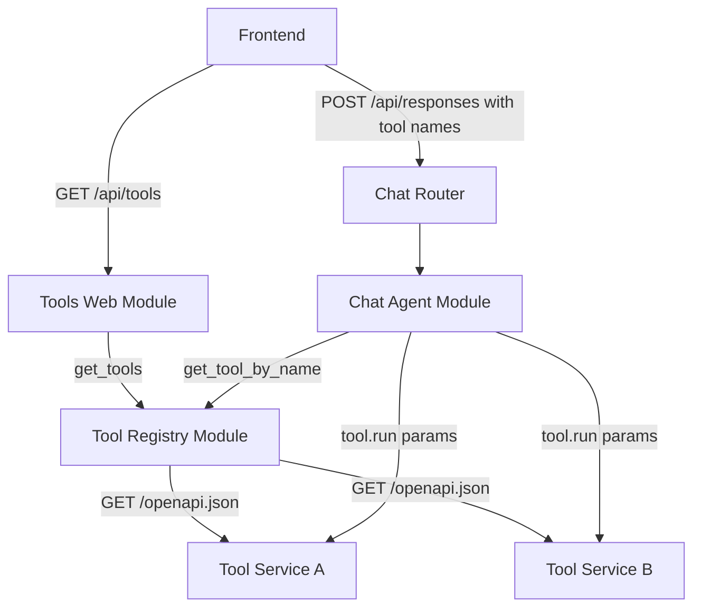

# Tools Architecture

## 1. Overview
- **Architecture Style**: Microservice-based tool system with a generic tool abstraction and a web layer that serves tools in OpenAI format
- **Design Principles**:
  - Tools are LLM-agnostic — a tool has a definition (name, description, parameters) and a run capability; neither is tied to any LLM API
  - OpenAPI as one registry implementation — the OpenAPI registry fetches specs from microservices and creates tool instances that handle HTTP invocation internally
  - Registry encapsulates invocation — callers do not need to know about URLs, methods, or HTTP; they just run a tool with parameters
  - Web layer transforms definitions — the Tools Web Module converts tool definitions to OpenAI function-calling format
  - Extensible — new registry implementations can plug in any tool backend (HTTP, gRPC, in-process functions, etc.) without changing callers
- **Quality Attributes**: Decoupled, language-agnostic, independently deployable, discoverable

## 2. Tool Microservice Convention

Each tool is a standalone microservice that follows these conventions:

1. **HTTP endpoint**: The tool is triggered via an HTTP request. Each tool chooses the HTTP method (PUT, POST, GET, etc.) that is most idiomatic for its use case. The method is configured in the tool registry.
2. **OpenAPI spec**: The microservice exposes its OpenAPI specification (typically at `/openapi.json`). This spec documents all endpoints, including the trigger endpoint with its parameters, description, and response schema.
3. **Independence**: Tools have no dependency on modAI. They are plain HTTP microservices that can be developed, deployed, and tested independently in any language/framework.

### Example Tool Microservice (OpenAPI spec)
```json
{
  "openapi": "3.1.0",
  "info": {
    "title": "Calculator Tool",
    "version": "1.0.0",
    "description": "Evaluate mathematical expressions"
  },
  "paths": {
    "/calculate": {
      "post": {
        "summary": "Evaluate a math expression",
        "operationId": "calculate",
        "requestBody": {
          "required": true,
          "content": {
            "application/json": {
              "schema": {
                "type": "object",
                "properties": {
                  "expression": {
                    "type": "string",
                    "description": "Math expression to evaluate"
                  }
                },
                "required": ["expression"]
              }
            }
          }
        },
        "responses": {
          "200": {
            "description": "Calculation result",
            "content": {
              "application/json": {
                "schema": {
                  "type": "object",
                  "properties": {
                    "result": { "type": "number" }
                  }
                }
              }
            }
          }
        }
      }
    }
  }
}
```

## 3. System Context



**Flow**:
1. Frontend calls `GET /api/tools` to discover all available tools
2. Tools Web Module asks the Tool Registry for all tools and converts their definitions to OpenAI format
3. User selects which tools to enable for a chat session
4. Frontend sends `POST /api/responses` with tool names (as received from `GET /api/tools`)
5. When the LLM emits a `tool_call`, the Chat Agent looks up the tool by name in the registry
6. The Chat Agent runs the tool with the LLM-supplied parameters — the tool directly invokes the microservice; no registry involvement at invocation time

## 4. Module Architecture

### 4.1 Core Abstractions

**Tool Definition** — a value object with three fields:
- `name` — unique identifier derived from the OpenAPI `operationId`
- `description` — human-readable text describing what the tool does
- `parameters` — a fully-resolved JSON Schema (all `$ref` pointers inlined) describing the input

A tool definition contains enough information to construct an LLM tool call but is not tied to any specific LLM API.

**Tool** — pairs a definition with execution capability:
- Exposes its `definition` (read-only)
- Provides a `run(params)` operation that executes the tool with the given parameters and returns the result

#### Reserved `_`-prefixed keys in `params`

Callers may inject caller-supplied metadata into the `params` dict using keys prefixed with `_`. These keys are **never** forwarded to the tool microservice's JSON body — tool implementations must extract and consume them before sending the request.

Currently defined reserved keys:

| Key | Type | Description |
|---|---|---|
| `_bearer_token` | `str \| None` | Forwarded as `Authorization: Bearer <token>` HTTP header |

This convention keeps the `Tool.run` interface stable while allowing callers to pass through transport-level concerns (auth, tracing, etc.) without requiring interface changes.

### 4.2 Tool Registry Module (Plain Module)

**Purpose**: Aggregates tools from all configured sources and provides lookup by name.

**Responsibilities**:
- Return all available tools via `get_tools`
- Look up a tool by name via `get_tool_by_name`
- Handle unavailable tool services gracefully (skip with warning, don't fail)

**No module dependencies**: The registry does not depend on other modAI modules.

### 4.3 OpenAPI Tool Registry (concrete implementation)

**Purpose**: Concrete registry implementation that harvests OpenAPI specs from configured HTTP microservices.

**How it works**:
- On each call to `get_tools`, fetches `/openapi.json` from each configured service
- Extracts the tool definition from the spec: `operationId` → name, `summary`/`description` → description, request body schema → parameters (all `$ref` resolved inline)
- Each resulting tool's run operation makes an HTTP call to the configured trigger endpoint with the supplied parameters

**Configuration** — each tool entry specifies:
- `url`: The full trigger endpoint URL of the tool microservice
- `method`: The HTTP method to use when invoking the tool (e.g. POST, PUT, GET)

### 4.4 Tools Web Module (Web Module)

**Purpose**: Exposes `GET /api/tools` endpoint. Transforms tool definitions into OpenAI function-calling format.

**Dependencies**: Tool Registry Module

**Responsibilities**:
- Expose `GET /api/tools` endpoint
- Call the Tool Registry to get all available tools
- Convert each tool definition to OpenAI function-calling format
- Return the transformed tool definitions to the frontend

### 4.5 Chat Agent Module

The Chat Agent Module receives a tool registry dependency. When the LLM emits a `tool_call`:
1. Extract the function name from the tool call
2. Look up the tool by name in the registry
3. Run the tool with the LLM-supplied parameters — no HTTP knowledge needed in the chat module
4. Return the result to the LLM

## 5. API Endpoints

- `GET /api/tools` — List all available tools in OpenAI function-calling format

### 5.1 List Available Tools

**Endpoint**: `GET /api/tools`

**Purpose**: Returns all available tools in OpenAI function-calling format.

**Tool Definition → OpenAI Transformation**:
- `name` → `function.name`
- `description` → `function.description`
- `parameters` → `function.parameters` (already resolved, no `$ref`)

**Response Format (200 OK)**:
```json
{
  "tools": [
    {
      "type": "function",
      "function": {
        "name": "calculate",
        "description": "Evaluate a math expression",
        "parameters": {
          "type": "object",
          "properties": {
            "expression": {
              "type": "string",
              "description": "Math expression to evaluate"
            }
          },
          "required": ["expression"]
        }
      }
    }
  ]
}
```

If a tool service is unreachable, it is omitted from the response and a warning is logged.

## 6. Configuration

The tool registry is configured with a list of tool microservice endpoints. Each entry has:
- `url`: The full trigger endpoint URL of the tool microservice
- `method`: The HTTP method used to invoke the tool (e.g. PUT, POST, GET)

The registry derives the base URL from `url` (strips the path) and appends `/openapi.json` to fetch the spec.

See `config.yaml` and `default_config.yaml` for concrete configuration examples.
