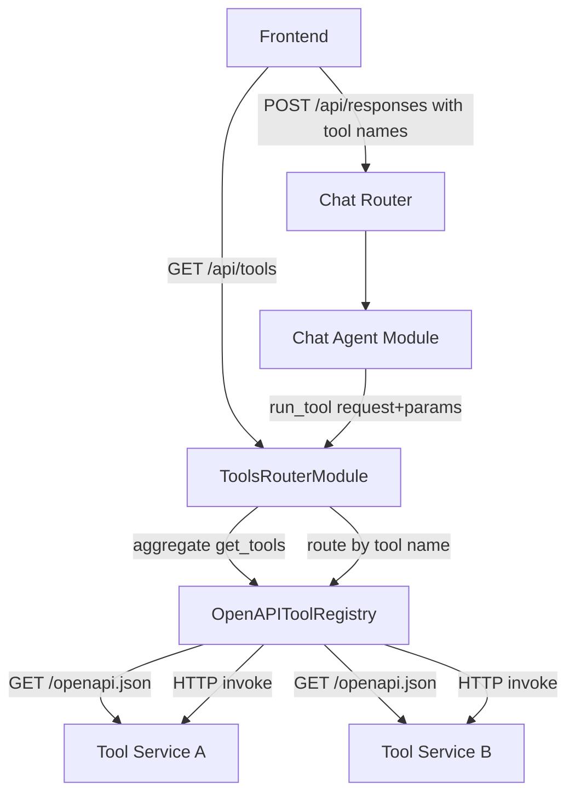

# Tools Architecture

## 1. Overview
- **Architecture Style**: Microservice-based tool system with OpenAI-formatted tool definitions
- **Design Principles**:
  - Tool definitions are OpenAI-compatible at the registry boundary (`FunctionToolParam`)
  - OpenAPI as one registry implementation — the OpenAPI registry fetches specs from microservices and executes operations over HTTP
  - Registry encapsulates invocation — callers do not need to know about URLs, methods, or HTTP; they call `run_tool(request, params)`
  - `ToolRegistryModule` is a plain interface (non-web)
  - Central aggregation — `ToolsRouterModule` exposes `GET /api/tools`, returns tools without renaming, and dispatches `run_tool` by tool name
  - Extensible — new registry implementations can plug in any tool backend (HTTP, gRPC, in-process functions, etc.) without changing callers
- **Quality Attributes**: Decoupled, language-agnostic, independently deployable, discoverable

## 2. Tool Microservice Convention

Each tool is a standalone microservice that follows these conventions:

1. **HTTP endpoint**: The tool is triggered via an HTTP request. Each tool chooses the HTTP method (PUT, POST, GET, etc.) that is most idiomatic for its use case. The method is configured in the tool registry.
2. **OpenAPI spec**: The microservice exposes its OpenAPI specification (typically at `/openapi.json`). This spec documents all endpoints, including the trigger endpoint with its parameters, description, and response schema.
3. **Path parameters**: If the trigger URL contains path parameters (e.g. `/users/{user_id}/orders/{order_id}`), they must be declared in the OpenAPI spec as `parameters` with `"in": "path"`. The registry includes them in the tool definition so the LLM knows to supply them; at invocation time they are substituted into the URL and are not forwarded in the request body.
4. **Independence**: Tools have no dependency on modAI. They are plain HTTP microservices that can be developed, deployed, and tested independently in any language/framework.

### Example Tool Microservice (OpenAPI spec)
```json
{
  "openapi": "3.1.0",
  "info": {
    "title": "Calculator Tool",
    "version": "1.0.0",
    "description": "Evaluate mathematical expressions"
  },
  "paths": {
    "/calculate": {
      "post": {
        "summary": "Evaluate a math expression",
        "operationId": "calculate",
        "requestBody": {
          "required": true,
          "content": {
            "application/json": {
              "schema": {
                "type": "object",
                "properties": {
                  "expression": {
                    "type": "string",
                    "description": "Math expression to evaluate"
                  }
                },
                "required": ["expression"]
              }
            }
          }
        },
        "responses": {
          "200": {
            "description": "Calculation result",
            "content": {
              "application/json": {
                "schema": {
                  "type": "object",
                  "properties": {
                    "result": { "type": "number" }
                  }
                }
              }
            }
          }
        }
      }
    }
  }
}
```

### Example Tool Microservice with Path Parameters (OpenAPI spec)
```json
{
  "openapi": "3.1.0",
  "info": {
    "title": "Order Tool",
    "version": "1.0.0",
    "description": "Retrieve a specific user order"
  },
  "paths": {
    "/users/{user_id}/orders/{order_id}": {
      "get": {
        "summary": "Get a user order",
        "operationId": "get_user_order",
        "parameters": [
          {
            "name": "user_id",
            "in": "path",
            "required": true,
            "description": "The user's ID",
            "schema": { "type": "string" }
          },
          {
            "name": "order_id",
            "in": "path",
            "required": true,
            "description": "The order's ID",
            "schema": { "type": "integer" }
          }
        ],
        "responses": {
          "200": {
            "description": "Order details"
          }
        }
      }
    }
  }
}
```

The registry will build a tool definition that includes `user_id` and `order_id` as required parameters. When the LLM calls the tool with `{"user_id": "alice", "order_id": 42}`, the registry substitutes those values into the URL (`/users/alice/orders/42`) and sends an empty JSON body.

## 3. System Context



**Flow**:
1. Frontend calls `GET /api/tools` to discover all available tools
2. Tool Registry returns tools as-is (already OpenAI format)
3. User selects which tools to enable for a chat session
4. Frontend sends `POST /api/responses` with tool names (as received from `GET /api/tools`)
5. When the LLM emits a `tool_call`, the Chat Agent calls `run_tool` in the central router with the tool name
6. The central router resolves the registry by matching the tool name and delegates to the selected registry
7. The target registry resolves and invokes the operation and returns the result to the Chat Agent

## 4. API Endpoints

- `GET /api/tools` — List all available tools across registries (tool names are returned unchanged)

### 4.1 List Available Tools

**Endpoint**: `GET /api/tools`

**Purpose**: Returns all available tools in OpenAI function-calling format aggregated from all configured registries.

The endpoint returns tool definitions in OpenAI function-tool format directly as a JSON list.

**Response Format (200 OK)**:
```json
[
  {
    "type": "function",
    "name": "calculate",
    "description": "Evaluate a math expression",
    "parameters": {
      "type": "object",
      "properties": {
        "expression": {
          "type": "string",
          "description": "Math expression to evaluate"
        }
      },
      "required": ["expression"]
    },
    "strict": true
  }
]
```

If a tool service is unreachable, it is omitted from the response and a warning is logged.
