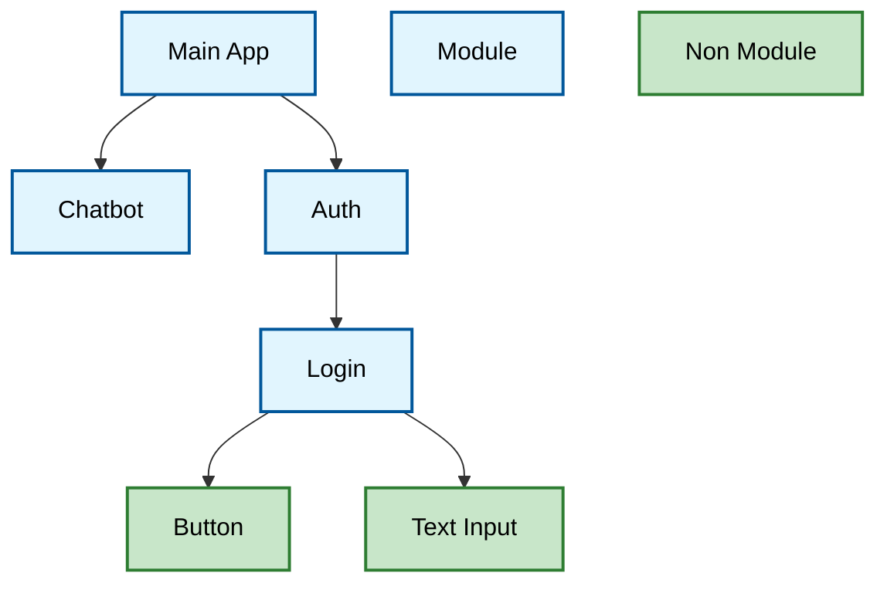

# Core Frontend Architecture

## 1. Principles

- **Architecture Style**: Modular component-based frontend with dynamic module composition
- **Design Principles**: KISS (Keep It Simple, Stupid), clear separation of concerns, dynamic component discovery
- **Quality Attributes**: Modularity for independent development, extensibility through well-defined component contracts, maintainability through standardized module structure

## 2. Technology Stack

- **Programming Language**: TypeScript
- **UI Framework**: Svelte 5
- **UI Components**: Shadcn/ui
- **Build Tool**: Vite
- **State Management**: Svelte 5 runes (`$state`, `$derived`, `$effect`) and Svelte context API

## 3. Architecture Overview

All major components of the user interface are treated as modules. The main idea about modules is that a module can be replaced without touching its parent or child components.

The term "module" in modAI can be a regular Svelte component, but it is not limited to it. Modules can be anything including functions, regular components, classes, primitive types, ...

Atomic components like buttons, text input, etc. are not treated as modules and therefore cannot be exchanged at will.



Without any modules, the frontend would be completely empty just containing an empty sidebar and an empty main area.

## 4. Module System

The heart of the frontend is its modular system. The central interfaces are:

```typescript
// Scoped dependency accessor — returned per module
interface ModuleDependencies {
    getOne<T>(name: string): T;
    getAll<T>(name: string): T[];
}

// Top-level module registry
interface Modules {
    getModuleDependencies(path: string): ModuleDependencies;
}
```

### 4.1 Accessing Module Dependencies

Each module knows its own path (the `path` value in its `modules*.json` entry) and obtains its declared dependencies via `getModuleDeps(path)`:

```typescript
const deps = getModuleDeps("@/modules/chatbot/ChatbotComponent");

const chatService = deps.getOne<ChatService>("chatService");
const widgets     = deps.getAll<Component>("widgets");
```

`getModuleDeps(path)` is a convenience wrapper around `getModules().getModuleDependencies(path)`. Both use Svelte's `getContext` internally and **must be called at component initialisation time** (top level of a `<script>` block), not inside event handlers or `$effect`.

### 4.2 Dependency Names Are Local Aliases

`getOne` and `getAll` accept the **local alias** declared in the `dependencies` map of that module's `modules*.json` entry — not a global type string. The `modules*.json` maps the alias to the actual module ID:

```json
{
  "id": "chatbot",
  ...
  "dependencies": {
    "module:chatService":      "chat-service",
    "module:llmProviderService": "llm-provider-service"
  }
}
```

```typescript
// Inside the chatbot component:
const deps = getModuleDeps("@/modules/chatbot/ChatbotComponent");
const chatService = deps.getOne<ChatService>("chatService");
//                                            ^^^^^^^^^^^^ local alias from the JSON
```

This means a module cannot reach anything outside its declared dependencies, and the wiring is entirely controlled by the manifest — not by the component code.

### 4.3 Module ID vs Module Type

Each registered module has a unique **ID** and a **type**:

- **ID**: unique identifier used _internally_ by the registry to resolve `dependencies` values. Never exposed to or used by the module itself.
- **type**: semantic group label (e.g. `"ChatService"`) — currently informational; used for tooling and documentation

Both are set in `modules*.json`.

### 4.4 Registering Modules

To activate a module, add it to `modules*.json`.

> **Auto-discovery**: The module registry automatically discovers all `.svelte` and `.svelte.ts` files under `src/modules/**` via Vite's `import.meta.glob`. No manual TypeScript registry entry is required.

#### `modules*.json` — regular module entry

```json
{
    "id": "chatbot",
    "type": "ChatbotComponent",
    "path": "@/modules/chatbot/ChatbotComponent",
    "dependencies": {
        "module:chatService":        "chat-service",
        "module:llmProviderService": "llm-provider-service"
    }
}
```

- **id**: unique module identifier
- **type**: semantic group label
- **path**: import path used as the module's lookup key for `getModuleDeps()` and, when found in the auto-discovery registry, for loading its component. Always required.
- **dependencies**: object mapping local alias keys to module IDs. Keys use a prefix:
  - `module:<alias>` — declares another module as a dependency; alias is the name used in `getOne`/`getAll`
  - `flag:<name>` — module only activates if this runtime flag is present
  - `flag:!<name>` — module only activates if this runtime flag is absent
- **creationType** _(optional)_: `"raw"` (default) or `"serviceFactory"` — see section 4.6
- **config** _(optional)_: static config object passed to `serviceFactory` modules

#### Entries without a loadable component

If the `path` is not found in the module registry (e.g. it points outside `src/modules/`, such as a core infrastructure file), the module is still registered with the path as its lookup key — it just has no component. No special flag is needed: this happens automatically:

```json
{
    "id": "app-root",
    "type": "AppRoot",
    "path": "@/modules/app-layout/AppRoot",
    "dependencies": {
        "module:layout": "app-layout"
    }
}
```

#### Flag Dependencies

- `"flag:beta": "description"` — activates only if flag `beta` is present
- `"flag:!legacy": "description"` — activates only if flag `legacy` is absent
- Multiple flag keys can be combined; all must be satisfied

This enables feature toggling and environment-specific module loading.

### 4.5 Exporting a Module Component

```svelte
<!-- MyModule.svelte -->
<script lang="ts">
  // component logic using Svelte 5 runes
</script>

<!-- template -->
```

Modules must be the **default export** of a `.svelte` file. Svelte components are default-exported automatically.

### 4.6 Service Factory Modules

When `creationType` is `"serviceFactory"`, the module file exports a named `create` function instead of a default instance. The module system calls it during activation, passing the module's already-resolved `ModuleDependencies` and the `config` object from the manifest:

```typescript
// src/modules/my-service/myServiceImpl.svelte.ts
import type { MyService } from "./index.svelte.js";
import type { ModuleDependencies } from "@/core/module-system/index.js";

export function create(
    deps: ModuleDependencies,
    config: Record<string, unknown>,
): MyService {
    const db = deps.getOne<Database>("database");
    return new MyServiceImpl(db, config.endpoint as string);
}
```

```json
{
    "id": "my-service",
    "type": "MyService",
    "path": "@/modules/my-service/myServiceImpl",
    "creationType": "serviceFactory",
    "dependencies": { "module:database": "db" },
    "config": { "endpoint": "/api/data" }
}
```

No default export is needed. The created instance becomes the module's component value, accessible to consumers via `deps.getOne("myService")`.

## 5. Root Application

The root application itself only defines a main layout looking like this:


No actual components like Login, Chat, Authentication or the like are used in the root application directly. This is all done by modules. Instead, the root application uses the module system to allow other modules very flexible integration within the main layout. The root app supports (via the module system):

- **Routing**: Define module specific routes. Routed components are displayed in the main area.
- **Sidebar**: Integrate into the main application sidebar
- **Context**: Allow other modules to register context providers which will be installed at a global level and therefore making state available throughout the whole application

## 6. Best Practices and Patterns

### 6.1 Module Organization

As "modules" in modAI can be anything including regular compoments, it often happens that several modules belong together, like a sidebar module usually comes together with a router module. In such cases, it is a good practice to group related modules inside a `src/[GROUP]/`.

Module groups should stay lean and should not grow to big. Splitting a module group is up to the author and should be reasonable.

Also sub-groups like `src/[GROUP]/[GROUP]` can be done if needed.

### 6.2 Services

As module groups should stay lean (see previous section), it is a good practice to put services into their own module group named after their purpose + `-service`, e.g. `src/modules/chat-service`.

A service module group has the following structure:

```
src/modules/my-service/
  index.svelte.ts      ← public interface
  openai.svelte.ts     ← default implementation (export default new ... OR export function create)
  README.md            ← usage documentation
  index.test.ts        ← tests for the implementation
```

#### `index.svelte.ts` — interface definition

Defines the TypeScript interface:

```typescript
// src/modules/chat-service/index.svelte.ts

export interface ChatService {
    streamChat(deps: ModuleDependencies, model: ProviderModel, messages: UIMessage[]): AsyncGenerator<string>;
}
```

#### `*.svelte.ts` — implementation (`raw`, default)

For simple services without constructor-time dependencies, export a default instance:

```typescript
// src/modules/chat-service/openai.svelte.ts
import type { ChatService } from "./index.svelte.js";

class OpenAIChatService implements ChatService { ... }

export default new OpenAIChatService();
```

#### `*.svelte.ts` — implementation (`serviceFactory`)

For services that need other modules or config at construction time, export a `create` function:

```typescript
// src/modules/my-service/myServiceImpl.svelte.ts
import type { ModuleDependencies } from "@/core/module-system/index.js";

export function create(deps: ModuleDependencies, config: Record<string, unknown>): MyService {
    return new MyServiceImpl(deps.getOne("database"), config.endpoint as string);
}
```

#### Registration in `modules*.json`

```json
{
  "id": "chat-service",
  "type": "ChatService",
  "path": "@/modules/chat-service/openai",
  "dependencies": {}
}
```

#### Consuming a service

A consumer module declares the service as a `module:` dependency in the manifest and retrieves it by its local alias at initialisation time:

```json
{
  "id": "chatbot",
  "dependencies": {
    "module:chatService": "chat-service"
  }
}
```

```svelte
<script lang="ts">
  import { getModuleDeps } from "@/core/module-system/index.js";
  import type { ChatService } from "@/modules/chat-service/index.svelte.js";

  const chatService = getModuleDeps("@/modules/chatbot/ChatbotComponent").getOne<ChatService>("chatService");
</script>
```

The chatbot is only activated once `chat-service` is present, and it can only see what it has declared — nothing more.

### 6.3 Separate Interface from Implementation (aka `index.svelte.ts`)

Some modules are meant to be used by others via a defined interface, such as services. In such cases, put the interface in `index.svelte.ts` inside the module group. This keeps imports clean for consumers.

The interface file should contain good API documentation to make usage easier for others to understand. It does **not** need to export a type-constant string (the `"ChatService"` / `CHAT_SERVICE_TYPE` pattern is obsolete — consumers use their local alias from the manifest instead).

### 6.4 Module Group Documentation

Each module group should have a `README.md` file describing what the module group is about.

Template for the documentation

````markdown
# Authentication Service

Provides OIDC-based authentication via `oidc-client-ts`. Handles login (redirect to IDP),
callback (PKCE code exchange), logout, and token management.
No UI components available in this module group.

## Intended Usage

[Describes how this module group should be used by other modules. Skip this section if not applicable to the module group]

Example:

Other modules can access authentication functionality through the `getAuthService()` function or `authenticatedFetch` for API calls with Bearer tokens.

```typescript
import { getAuthService } from "@/modules/authentication-service";

const authService = getAuthService();
...
await authService.logout(); // Redirects to IDP logout
...
```

## Intended Integration

[Describes how this module is instantiated. Skip this section if not applicable to the module group or if the instantiation is not special and completely done by the module sytem]

Example:

```svelte
<ModuleContextProvider name="GlobalContextProvider">
  <!-- All context providers with type "GlobalContextProvider" are now accessible -->
</ModuleContextProvider>
```

## Sub-Module Integration

[Describes how other modules can integrate into this module group. This is usually the case if a module loads sub modules via the module system and require them to have a certain structure. Skip this section if not applicable to the module group]]

Example:

### Sidebar Integration

To integrate into the sidebar as top item, modules have to export a Svelte component of the following structure:

```svelte
<script lang="ts">
  import { Plus } from "lucide-svelte";
  // get current route from context if needed
</script>

<a href="/myroute" class="sidebar-menu-button" class:active={$page.url.pathname === '/myroute'}>
  <Plus class="size-4" />
  <span>Awesome</span>
</a>
```

This will create a new sidebar top item navigating to `/myroute` when clicked.
It is important to always have an icon + text in the sidebar item because when the sidebar is collapsed, only the icon will be displayed.
````

### 6.5 Translations

No i18n library is currently in use in this frontend. All user-facing text is written directly in English as the application's sole language. If internationalisation is added in the future, update this section.
