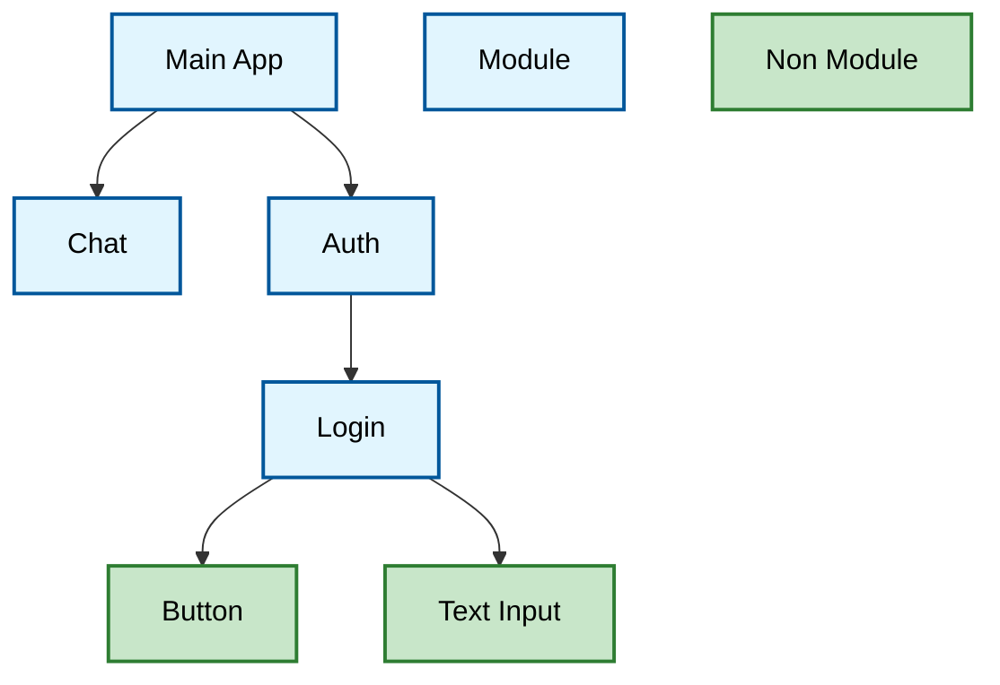

# Core Frontend Architecture

## 1. Principles

- **Architecture Style**: Modular component-based frontend with dynamic module composition
- **Design Principles**: KISS (Keep It Simple, Stupid), clear separation of concerns, dynamic component discovery
- **Quality Attributes**: Modularity for independent development, extensibility through well-defined component contracts, maintainability through standardized module structure

## 2. Technology Stack

- **Programming Language**: TypeScript
- **UI Framework**: Svelte 5
- **UI Components**: shadcn-svelte component library
- **Build Tool**: Vite
- **State Management**: Svelte Context API (`setContext`/`getContext`) and Svelte 5 runes (`$state`, `$derived`, `$effect`)

## 3. Architecture Overview

All major components of the user interface are treated as modules. The main idea about modules is that a module can be replaced without touching its parent or child components.

The term "module" in modAI can be a regular Svelte component, but it is not limited to it. Modules can be anything including functions, regular components, classes, primitive types, ...

Atomic components like buttons, text input, etc. are not treated as modules and therefore cannot be exchanged at will.



Without any modules, the frontend would be completely empty just containing an empty sidebar and an empty main area.

## 4. Module System

The heart of the frontend is its modular system. It is defined in the `Modules` interface as:

```typescript
getOne<T>(type: string): T | null;
getAll<T>(type: string): T[];
```

### 4.1 Getting the `Modules`

In order to use the functions of the modules, it must be somehow received first. This is done with `getModules()` from any child component inside a `ModulesProvider`:

```typescript
const modules = getModules();

modules.getAll<SomeComponent>(...)
```

`getModules()` uses Svelte's `getContext` internally. It must be called at component initialisation time (i.e. at the top level of a `<script>` block), not inside event handlers or `$effect`.

### 4.2 Using the `Modules`

The most important functionality of the module system is to receive other modules by their type. This is needed if a parent module wants to receive its child modules for rendering or if a user component needs to get the user service for backend interaction.

There are two ways to get a module:

- `getOne`: receives a singleton module where only one of its kind should be registered (e.g. like a user service which should only be available once)
- `getAll`: receives all modules registered for the given kind, like all registered sidebar items, or all registered routes.

### 4.3 Module ID vs Module Type

Each registered module has a unique ID and is also registered as a certain type. e.g. each component for the sidebar will have a different ID, but they all have the same type.

The ID of a module is usually defined in the `modules.json` (see next chapter).

The type of a module is also set in the `modules.json` but is usually defined somewhere else: TBD

### 4.4 Registering Modules

To register and activate a module, it only needs to be added to the `modules*.json`. There is **no manual registration step** in TypeScript — modules are auto-discovered at build time via Vite's `import.meta.glob` scanning all `src/modules/**/*.svelte` files.

#### `modules*.json`

To activate a module, it needs to be added to the `modules*.json`:

The registration of modules in the Modules is not defined by the `Modules` interface. The default implementation handles module registration with a `modules*.json` file (`modules_with_backend.json` and `modules_browser_only.json`; the two files are used to startup different versions — a full and a lite version) loaded at startup of the application. The json has the following structure:

```json
{
    "version": "1.0.0",
    "modules": [
        {
            "id": "chat",
            "type": "Chat",
            "path": "@/modules/chat/Chat",
            "dependencies": [
                "module:session"
            ]
        },
        ...
    ]
}
```

- **id** and **type**: see section _Module ID vs Module Type_
- **path**: the component include path, relative to `src/modules/`, without the `.svelte` extension. The component to be used must be the default export of that file.
- **dependencies**: a list of dependencies required for the module to operate. Dependencies starting with "module:" indicate module dependencies. If a module dependency is not available, the dependent module will not be loaded.

#### Flag Dependencies

Modules can also depend on runtime flags using the "flag:" prefix:

- `"flag:foo"`: Module activates only if flag "foo" is present
- `"flag:!foo"`: Module activates only if flag "foo" is absent
- Multiple flags can be combined: `["flag:foo", "flag:bar"]` requires both flags
- Mixed flags: `["flag:foo", "flag:!bar"]` requires foo present and bar absent

This enables feature toggling and environment-specific module loading.

### 4.5 Exporting a Module

```svelte
<!-- MyModule.svelte -->
<script lang="ts">
  // component logic
</script>

<!-- template -->
```

Modules are standard Svelte components. Because the module registry uses the default export of each `.svelte` file, every module file must contain exactly one component (Svelte's default). No extra export statement is needed.

## 5. Root Application

The root application itself only defines a main layout looking like this:


No actual components like Login, Chat, Authentication or the like are used in the root application directly. This is all done by modules. Instead, the root application uses the module system to allow other modules very flexible integration within the main layout. The root app supports (via the module system):

- **Routing**: Define module specific routes. Routed components are displayed in the main area.
- **Sidebar**: Integrate into the main application sidebar
- **Context**: Allow other modules to register context providers which will be installed at a global level and therefore making state available throughout the whole application

## 6. Best Practices and Patterns

### 6.1 Module Organization

As "modules" in modAI can be anything including regular compoments, it often happens that several modules belong together, like a sidebar module usually comes together with a router module. In such cases, it is a good practice to group related modules inside a `src/[GROUP]/`.

Module groups should stay lean and should not grow to big. Splitting a module group is up to the author and should be reasonable.

Also sub-groups like `src/[GROUP]/[GROUP]` can be done if needed.

### 6.2 Services

As module groups should stay lean (see previous section), it is a good practice to put services into their own module group named after their purpose + `-service`, e.g. `src/modules/chat-service`.

A service module group has the following structure:

```
src/modules/my-service/
  index.svelte.ts      ← public interface + getMyService() convenience hook
  openai.svelte.ts     ← default implementation (export default new ...)
  README.md            ← usage documentation
  index.test.ts        ← tests for the implementation
```

#### `index.svelte.ts` — interface & consumer hook

Defines the TypeScript interface and a `get*()` function that looks the service up from the module system:

```typescript
// src/modules/chat-service/index.svelte.ts
import { getModules } from "@/core/module-system/index.js";

export interface ChatService {
  streamChat(
    model: ProviderModel,
    messages: UIMessage[],
  ): AsyncGenerator<string>;
}

export function getChatService(): ChatService {
  const service = getModules().getOne<ChatService>("ChatService");
  if (!service) throw new Error("ChatService module not registered");
  return service;
}
```

#### `*.svelte.ts` — implementation

Contains the concrete implementation. The file **must use `export default`** to expose the service instance — that is what the module registry stores as the module's value:

```typescript
// src/modules/chat-service/openai.svelte.ts
import type { ChatService } from "./index.svelte.js";

class OpenAIChatService implements ChatService { ... }

export default new OpenAIChatService();
```

#### Registration in `modules*.json`

```json
{
  "id": "chat-service",
  "type": "ChatService",
  "path": "@/modules/chat-service/openai",
  "dependencies": []
}
```

The type string (`"ChatService"`) maps exactly to the string passed to `getOne<ChatService>("ChatService")`.

#### Consuming a service

Any module that depends on the service declares it as a `module:` dependency and retrieves it at initialisation time:

```svelte
<script lang="ts">
  import { getChatService } from "@/modules/chat-service/index.svelte.js";

  const chatService = getChatService();  // called at component init, not inside handlers
</script>
```

The corresponding `modules*.json` entry adds the dependency:

```json
{ "id": "chat", "dependencies": ["module:chat-service"] }
```

This ensures the chatbot is only activated when a chat service is present.

### 6.3 Separate Interface from Implementation (aka `index.svelte.ts`)

Some modules are meant to be used by others via a defined interface, like services. In such cases, it is a good practice to put the interface inside the module group in the `index.svelte.ts` file. This eases the import handling for dependent modules.

Additionally, the interface should have good API documentation to make usage easier for others to understand.

### 6.4 Module Group Documentation

Each module group should have a `README.md` file describing what the module group is about.

Template for the documentation

````markdown
# Authentication Service

Provides authentication backend communication for user management, including login, signup, and logout operations.
No UI components availabe in this module group.

## Intended Usage

[Describes how this module group should be used by other modules. Skip this section if not applicable to the module group]

Example:

Other modules can access authentication functionality through the `getAuthService` context function to perform user authentication operations.

```svelte
<script lang="ts">
  import { getAuthService } from "@/modules/authentication-service";

  const authService = getAuthService();

  async function login() {
    const response = await authService.login({ email, password });
  }
</script>
```

## Intended Integration

[Describes how this module is instantiated. Skip this section if not applicable to the module group or if the instantiation is not special and completely done by the module sytem]

Example:

```svelte
<ModuleContextProvider name="GlobalContextProvider">
  <!-- All context providers with type "GlobalContextProvider" are now accessible -->
</ModuleContextProvider>
```

## Sub-Module Integration

[Describes how other modules can integrate into this module group. This is usually the case if a module loads sub modules via the module system and require them to have a certain structure. Skip this section if not applicable to the module group]]

Example:

### Sidebar Integration

The sidebar renders Svelte component modules registered with type `"SidebarContentItem"`. Each content item is a Svelte component rendered directly inside the sidebar content area.

For example, the `sidebar-settings` module registers as a `SidebarContentItem` and provides the settings navigation group. To add an entry to the settings group, modules export a default object satisfying the `SidebarSettingItem` interface (`{ title, url, icon? }`) and register it with type `"SidebarSettingItem"`:

```typescript
// myModule/sidebarSettingItem.svelte.ts
import Settings2Icon from "@lucide/svelte/icons/settings-2";
import type { SidebarSettingItem } from "@/modules/sidebar-settings/sidebarSettingItem";

export default {
  title: "My Feature",
  url: "/my-feature",
  icon: Settings2Icon,
} satisfies SidebarSettingItem;
```

The sidebar also supports a single **footer item** displayed in the footer. To provide it, export a default object satisfying the `SidebarFooterItem` interface (`{ name, email, avatar }`) and register it with type `"SidebarFooterItem"`. Only one module should register this type (retrieved via `getOne`).
````

### 6.5 Translations

No i18n library is currently in use in this frontend. All user-facing text is written directly in English as the application's sole language. If internationalisation is added in the future, update this section.
