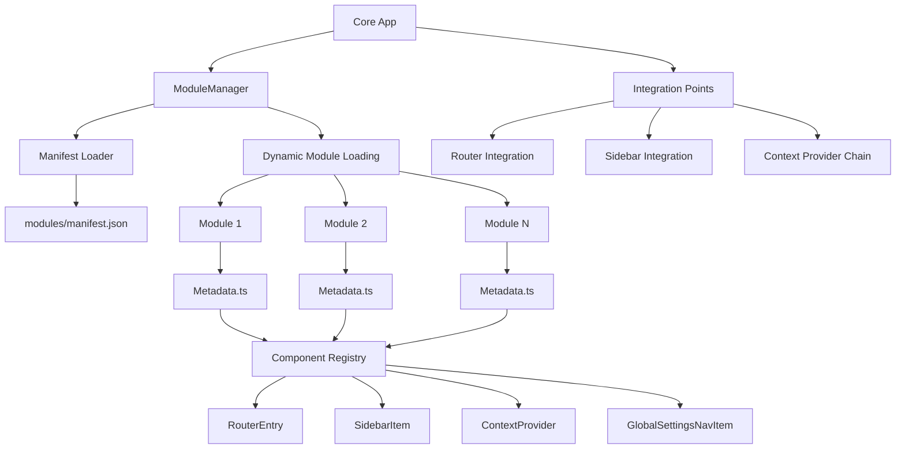

# Core Frontend Architecture

## 1. Principles
- **Architecture Style**: Modular component-based frontend with dynamic module composition
- **Design Principles**: KISS (Keep It Simple, Stupid), clear separation of concerns, dynamic component discovery
- **Quality Attributes**: Modularity for independent development, extensibility through well-defined component contracts, maintainability through standardized module structure

## 2. Technology Stack
- **Programming Language**: TypeScript
- **UI Framework**: React 19+ with React Router
- **UI Components**: Shadcn/ui component library
- **Build Tool**: Vite
- **State Management**: React Context API
- **Module Loading**: Dynamic ESM imports with manifest-driven discovery

## 3. Architecture Overview

The frontend is built as a composable system where modules dynamically contribute components to form the complete user interface. The core application provides the infrastructure for module loading, component registration, and integration points.



## 4. Module System

### 4.1 Module Organization

The frontend uses a hierarchical module system with clear separation between interfaces and implementations:

- **Module Interfaces**: Located in `src/moduleif/[module-name].ts` - Single file defining contracts and data structures
- **Module Implementations**: Located in `src/modules/[module-name]/` - Concrete implementations of module interfaces
- **Module Manifest**: Global registry at `public/modules/manifest.json`
- **Module Metadata**: Each module contains `Metadata.ts` defining its contract

### 4.2 Module Architecture Pattern

The system follows a strict interface-implementation separation:

```
src/
├── moduleif/               # Module interfaces and contracts
│   ├── [module-name].ts    # Single file containing all interfaces, types, and contracts
│   └── [another-module].ts
└── modules/                # Module implementations
    └── [module-name]/
        ├── Metadata.ts     # Required: Module definition and component registry
        ├── [ComponentName].tsx # Module components
        └── ...             # Additional implementation files
```

### 4.3 Interface-Implementation Principles

- **Interface Dependency**: Modules only import from `moduleif/` files, never directly from other `modules/` folders
- **Contract Definition**: All data structures, types, and service contracts are defined in `moduleif/`
- **Implementation Isolation**: Concrete implementations in `modules/` can be swapped without affecting dependent modules
- **Multiple Implementations**: One interface can have multiple implementations (e.g., different chat providers)

### 4.4 Module Structure

Each module interface is defined in a single file:

```
src/moduleif/[module-name].ts    # Single file containing:
                                 # - Data structures and interfaces
                                 # - Service contracts and abstractions
                                 # - Type definitions and enums
                                 # - Hook declarations
```

Each module implementation must follow this standardized structure:

```
src/modules/[module-name]/
├── Metadata.ts          # Required: Module definition and component registry
├── [ComponentName].tsx  # Module components
└── ...                 # Additional implementation files
```

### 4.5 Import Guidelines

**Correct Import Patterns:**
```typescript
// ✅ Import interfaces from moduleif
import { SessionData, SessionService } from "@/moduleif/session";
import { ChatMessage, ChatProvider } from "@/moduleif/chat";

// ✅ Import hooks and utilities from same module
import { useLocalState } from "./hooks";
```

**Incorrect Import Patterns:**
```typescript
// ❌ Never import directly from other modules
import { SessionProvider } from "@/modules/session/SessionProvider";
import { ChatComponent } from "@/modules/chat/ChatComponent";

// ❌ Never import implementation details
import { SQLiteSessionStore } from "@/modules/session/stores/SQLiteSessionStore";
```

### 4.6 Module Metadata Contract

Every module must export a `Metadata` object conforming to the `ModuleMetadata` interface:

```typescript
export interface ModuleMetadata {
    id: string                    // Unique module identifier
    version: string               // Semantic version
    description?: string          // Human-readable description
    author?: string              // Module author
    dependentModules: string[]   // Array of required module IDs
    components: any[]            // Array of component functions/classes
}
```

### 4.7 Component Registration

Modules register components that can be discovered and used by other modules or the core application:

```typescript
// Example: global-settings/Metadata.ts
import { SidebarFooterItem } from "./SidebarFooterItem";
import { RouterEntry } from "./RouterEntry";

export const Metadata: ModuleMetadata = {
    id: 'global-settings',
    version: '1.0.0',
    description: 'Global settings management module',
    author: 'ModAI Team',
    dependentModules: ["session"],
    components: [SidebarFooterItem, RouterEntry]
}
```

## 5. Component Discovery and Usage

### 5.1 The useModules Hook

Modules and the core application access components from other modules using the `useModules()` hook:

```typescript
const modules = useModules()
const routerEntryFunctions = modules.getComponentsByName("RouterEntry")
```

### 5.2 Component Naming Convention

Component names are critical as they serve as the discovery mechanism. Components with identical names from different modules are collected together:

- **Exact Match**: Component name must match exactly
- **Cross-Module**: Same-named components from all modules are returned as an array
- **Dynamic Discovery**: New modules can add components without core application changes

## 6. Core Integration Points

The core application defines specific component contracts that modules can implement to integrate with the main UI. **Important**: All integration components must be registered in the module's `Metadata.ts` file to be discoverable by the core application.

```typescript
// Example: Registering integration components in Metadata.ts
export const Metadata: ModuleMetadata = {
    id: 'example-module',
    version: '1.0.0',
    description: 'Example module with multiple integration points',
    author: 'ModAI Team',
    dependentModules: [],
    components: [RouterEntry, SidebarItem, SidebarFooterItem, ContextProvider]
}
```

### 6.1 Router Integration
- **Component Name**: `RouterEntry`
- **Purpose**: Modules can extend the application routing
- **Usage**: Each `RouterEntry` component returns React Router `<Route>` elements
- **Integration**: Core app renders all `RouterEntry` components within the main `<Routes>`
- **When to create**: Create this component and register it in the Metadata if the module needs a new route to be created. This is required for any module that wants to render pages or components at specific URLs.

```typescript
// Example: Module router entry
export function RouterEntry() {
    return (
        <Route path="/module-path" element={<ModulePage />} />
    );
}
```

### 6.2 Sidebar Integration
- **Component Name**: `SidebarItem`
- **Purpose**: Modules can add items to the main navigation sidebar
- **Usage**: Components return `<SidebarMenuItem>` elements
- **Integration**: Core sidebar renders all `SidebarItem` components
- **When to create**: Create this component and register it in the Metadata if the module needs to add a navigation item to the main sidebar. This is typically used for primary module features that users access frequently.

```typescript
// Example: Module sidebar item
export function SidebarItem() {
    return (
        <SidebarMenuItem>
            <SidebarMenuButton asChild>
                <Link to="/module-path">
                    <Icon />
                    <span>Module Name</span>
                </Link>
            </SidebarMenuButton>
        </SidebarMenuItem>
    );
}
```

### 6.3 Sidebar Footer Integration
- **Component Name**: `SidebarFooterItem`
- **Purpose**: Modules can add items to the sidebar footer (typically settings/profile)
- **Usage**: Components return footer-appropriate UI elements
- **Integration**: Core sidebar footer renders all `SidebarFooterItem` components
- **When to create**: Create this component and register it in the Metadata if the module needs to add an item to the sidebar footer. This is typically used for settings, user profile actions, or other secondary navigation items that should remain accessible but not clutter the main sidebar.

```typescript
// Example: Module sidebar footer item
export function SidebarFooterItem() {
    return (
        <SidebarMenuItem>
            <SidebarMenuButton asChild>
                <Link to="/settings">
                    <Settings />
                    <span>Settings</span>
                </Link>
            </SidebarMenuButton>
        </SidebarMenuItem>
    );
}
```

### 6.4 Context Provider Chain
- **Component Name**: `ContextProvider`
- **Purpose**: Modules can provide application-wide state/context
- **Usage**: Components wrap children with their context providers
- **Integration**: Core app chains all `ContextProvider` components around the main app
- **When to create**: Create this component and register it in the Metadata if the module needs to make state or services available throughout the entire application. This is essential for modules that provide shared services like authentication, session management, or global configuration that other modules depend on.

#### 6.4.1 Provider Module

The provider module wants to make some state available throughout the application.It creates and exports the context provider and associated hooks:

```typescript
// Example: Session Module context provider

const SessionContext = createContext<SessionContextType | undefined>(undefined)

export function ContextProvider({ children }: { children: React.ReactNode }) {
    const [session, setSession] = useState<Session | null>(null)
    ...
    const contextValue: SessionContextType = {
        session,
        isLoading,
        refreshSession,
        clearSession,
    }

    return (
        <SessionContext value={contextValue}>
            {children}
        </SessionContext>
    );
}

// Provider module exports hooks for consumption
export function useSession() {
    const context = useContext(SessionContext);
    if (!context) {
        throw new Error('useSession must be used within SessionProvider');
    }
    return context;
}
```

#### 6.4.2 Consumer Module

Consumer modules import and use the interfaces and types from the provider module's interface definition, not the implementation. This creates a dependency on the interface, allowing for flexible implementations.

```typescript
// Consuming module imports from moduleif
import { SessionData, useSession } from "@/moduleif/session";

export function SomeComponent() {
    const { session } = useSession();

    if (!session) {
        return <div>Please log in</div>;
    }

    return <div>Welcome, {session.user.name}!</div>;
}
```

**Interface-Based Dependencies**: Consuming modules depend on interface definitions, not implementations:

```typescript
// src/moduleif/session.ts
...
// Hook interface - implementation provided by module
export declare function useSession(): SessionContextType;
```

**Dependency Management**: Consuming modules must declare their dependency on provider modules in their metadata:

```typescript
export const Metadata: ModuleMetadata = {
    id: 'consuming-module',
    // ...
    dependentModules: ["session"], // Must include provider module
    components: [SidebarItem]
}
```

## 7. Module Hierarchy and Extension Pattern

### 7.1 Extension Modules

The system supports modules that extend other modules. For example, the global settings module provides extension points:

- **Settings Navigation**: Modules register `GlobalSettingsNavItem` components
- **Settings Routes**: Modules register `GlobalSettingsRouterEntry` components
- **Pattern**: Parent module discovers and renders child module components

```typescript
// Chat module extending global settings
export function GlobalSettingsNavItem() {
    return (
        <SidebarMenuButton asChild>
            <Link to="/globalsettings/llmproviders">
                <span>LLM Providers</span>
            </Link>
        </SidebarMenuButton>
    )
}

export function GlobalSettingsRouterEntry() {
    return (
        <Route path="llmproviders" element={<LLMProviderManagementPage />} />
    );
}
```

### 7.2 Hierarchical Component Naming

The naming convention supports hierarchical relationships:
- **Core Integration**: `RouterEntry`, `SidebarItem`, `ContextProvider`
- **Module Extension**: `[ModuleName][ComponentType]` (e.g., `GlobalSettingsNavItem`)
- **Discovery**: Parent modules query for their specific extension pattern

## 8. Module Loading and Lifecycle

### 8.1 Startup Flow
1. **App Start**: React application initialization begins
2. **Manifest Loading**: Fetch and parse `modules/manifest.json`
3. **Module Discovery**: Load enabled modules from manifest
4. **Metadata Import**: Dynamic import of each module's `Metadata.ts`
5. **Component Registration**: Register all module components in ModuleManager
6. **Context Composition**: Chain all `ContextProvider` components
7. **UI Composition**: Render all integration point components

### 8.2 Module Dependencies

Modules can declare dependencies on other modules:

```typescript
dependentModules: ["session", "auth"]
```

**Note**: Current implementation loads all modules; dependency resolution is declarative for documentation purposes.

## 9. Example Module Implementations

### 9.1 Interface Definition Example

```typescript
// src/moduleif/chat.ts - Single file containing all chat-related interfaces
export interface ChatMessage {
    id: string;
    content: string;
    timestamp: Date;
    role: 'user' | 'assistant';
}

export interface ChatSession {
    id: string;
    title: string;
    messages: ChatMessage[];
    createdAt: Date;
}

export interface ChatProvider {
    sendMessage(content: string, sessionId: string): Promise<ChatMessage>;
    createSession(): Promise<ChatSession>;
    getSession(id: string): Promise<ChatSession | null>;
}

export interface ChatContextType {
    currentSession: ChatSession | null;
    sessions: ChatSession[];
    sendMessage: (content: string) => Promise<void>;
    createNewSession: () => Promise<void>;
}

export declare function useChat(): ChatContextType;
```

### 9.2 Simple UI Module Implementation

```typescript
// src/modules/chat/Metadata.ts
import { SidebarItem, RouterEntry } from './components';

export const Metadata: ModuleMetadata = {
    id: 'chat',
    version: '1.0.0',
    description: 'AI Chat interface',
    author: 'ModAI Team',
    dependentModules: ["session"],
    components: [SidebarItem, RouterEntry]
}

// src/modules/chat/components/SidebarItem.tsx
import { ChatMessage } from "@/moduleif/chat"; // ✅ Import from interface

export function SidebarItem() {
    return (
        <SidebarMenuItem>
            <SidebarMenuButton asChild>
                <Link to="/chat">
                    <Plus />
                    <span>New Chat</span>
                </Link>
            </SidebarMenuButton>
        </SidebarMenuItem>
    );
}

// src/modules/chat/components/RouterEntry.tsx
export function RouterEntry() {
    return (
        <Route path="/chat" element={<ChatComponent />} />
    );
}
```

### 9.3 Service-Only Module Implementation

```typescript
// src/moduleif/session.ts - Single interface file
export interface SessionData {
    user: {
        id: string;
        name: string;
        email: string;
    };
    isAuthenticated: boolean;
}

export interface SessionContextType {
    session: SessionData | null;
    isLoading: boolean;
    refreshSession: () => Promise<void>;
    clearSession: () => void;
}

export declare function useSession(): SessionContextType;

// Export the actual hook implementation
export function useSession(): SessionContextType {
    const context = useContext(SessionContext);
    if (!context) {
        throw new Error('useSession must be used within SessionProvider');
    }
    return context;
}

// src/modules/session/Metadata.ts
export const Metadata: ModuleMetadata = {
    id: 'session',
    version: '1.0.0',
    description: 'Session management service',
    author: 'ModAI Team',
    dependentModules: [],
    components: [ContextProvider]
}

// src/modules/session/ContextProvider.tsx
import { SessionData, SessionContextType } from "@/moduleif/session";

export function ContextProvider({ children }: { children: React.ReactNode }) {
    const [session, setSession] = useState<SessionData | null>(null);
    // Implementation details...

    return (
        <SessionContext value={contextValue}>
            {children}
        </SessionContext>
    );
}
```

### 9.4 Multiple Implementation Example

```typescript
// src/moduleif/chat.ts - Single interface
export interface ChatProvider {
    sendMessage(content: string): Promise<ChatMessage>;
    // ... other methods
}

// src/modules/chat-openai/OpenAIChatProvider.ts - Implementation 1
import { ChatProvider } from "@/moduleif/chat";

export class OpenAIChatProvider implements ChatProvider {
    async sendMessage(content: string): Promise<ChatMessage> {
        // OpenAI implementation
    }
}

// src/modules/chat-anthropic/AnthropicChatProvider.ts - Implementation 2
import { ChatProvider } from "@/moduleif/chat";

export class AnthropicChatProvider implements ChatProvider {
    async sendMessage(content: string): Promise<ChatMessage> {
        // Anthropic implementation
    }
}
```

## 10. Module Manifest Configuration

The global module registry defines which modules are loaded:

```json
{
    "version": "1.0.0",
    "modules": [
        {
            "id": "global-settings",
            "path": "../modules/global-settings",
            "enabled": true
        },
        {
            "id": "session",
            "path": "../modules/session",
            "enabled": true
        }
    ]
}
```

- **Selective Loading**: Modules can be enabled/disabled via manifest
- **Dynamic Paths**: All modules are located under the `modules` directory
- **Version Control**: Manifest versioning for deployment management

## 11. Design Decisions and Trade-offs

### 11.1 Dynamic Component Discovery
- **Decision**: Use string-based component naming for discovery rather than strong typing
- **Trade-offs**: Flexibility and extensibility vs. compile-time type safety
- **Mitigation**: Clear naming conventions and runtime validation

### 11.2 Manifest-Driven Loading
- **Decision**: External JSON manifest controls module loading vs. code-based registration
- **Trade-offs**: Runtime configuration flexibility vs. bundle optimization
- **Benefits**: Enables/disables modules without code changes, supports A/B testing

## 12. Extension Guidelines

### 12.1 Creating New Modules

1. **Define Module Interface**: Create `src/moduleif/[module-name].ts` with all types, contracts, and declarations
2. **Create Module Directory**: `src/modules/[module-name]/`
3. **Define Metadata**: Export `ModuleMetadata` object with unique ID and component registry
4. **Implement Components**: Create components for desired integration points, importing only from `moduleif/`
5. **Register in Manifest**: Add module entry to `public/modules/manifest.json`
6. **Test Integration**: Verify components appear in appropriate UI locations

### 12.2 Extending Existing Modules

1. **Study Interface**: Review existing module interfaces in `src/moduleif/[module-name].ts`
2. **Identify Extension Points**: Find module that accepts extension components (e.g., `GlobalSettings*`)
3. **Implement Extension Components**: Create components following parent module's naming pattern
4. **Use Interface Dependencies**: Import only from `moduleif/` files, never from `modules/`
5. **Register Components**: Add extension components to your module's metadata
6. **Verify Integration**: Ensure components appear in parent module's UI

### 12.3 Best Practices

- **Interface First**: Always define interfaces in `moduleif/` before implementing in `modules/`
- **Import Discipline**: Never import directly from other `modules/` folders - use `moduleif/` files only
- **Component Naming**: Use descriptive, consistent names following established patterns
- **Dependency Declaration**: Always declare dependent modules in metadata
- **Type Safety**: Define comprehensive TypeScript interfaces for all data structures
- **Error Handling**: Components should gracefully handle missing dependencies
- **Authentication**: Check session state in components that require authentication
- **Responsive Design**: Follow established UI patterns and responsive design principles
- **Interface Stability**: Keep interfaces stable - breaking changes affect all dependent modules
