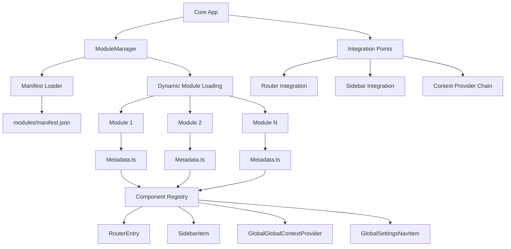

# Core Frontend Architecture

## 1. Principles

- **Architecture Style**: Modular component-based frontend with dynamic module composition
- **Design Principles**: KISS (Keep It Simple, Stupid), clear separation of concerns, dynamic component discovery
- **Quality Attributes**: Modularity for independent development, extensibility through well-defined component contracts, maintainability through standardized module structure

## 2. Technology Stack

- **Programming Language**: TypeScript
- **UI Framework**: React 19+ with React Router
- **UI Components**: Shadcn/ui component library
- **Build Tool**: Vite
- **State Management**: React Context API
- **Module Loading**: Dynamic ESM imports with manifest-driven discovery

## 3. Architecture Overview

The frontend is built as a composable system where modules dynamically contribute components to form the complete user interface. The core application provides the infrastructure for module loading, component registration, and integration points.


```mermaid
flowchart TD
    A[Core App] --> B[ModuleManager]
    A --> C[Integration Points]

    B --> D[Manifest Loader]
    D --> E[modules/manifest.json]

    B --> F[Dynamic Module Loading]
    F --> G[Module 1]
    F --> H[Module 2]
    F --> I[Module N]

    G --> J[Metadata.ts]
    H --> K[Metadata.ts]
    I --> L[Metadata.ts]

    C --> M[Router Integration]
    C --> N[Sidebar Integration]
    C --> O[Context Provider Chain]

    J --> P[Component Registry]
    K --> P
    L --> P

    P --> Q[RouterEntry]
    P --> R[SidebarItem]
    P --> S[GlobalGlobalContextProvider]
    P --> T[GlobalSettingsNavItem]
```

## 4. Module System

### 4.1 Module Organization

The frontend uses a hierarchical module system with clear separation between interfaces and implementations:

- **Module Interfaces**: Located in `src/moduleif/[module-name].ts` - Single file defining contracts and data structures
- **Module Implementations**: Located in `src/modules/[module-name]/` - Concrete implementations of module interfaces
- **Module Manifest**: Global registry at `public/modules/manifest.json`
- **Module Metadata**: Each module contains `Metadata.ts` defining its contract

### 4.2 Module Architecture Pattern

The system follows a strict interface-implementation separation with documentation:

```
src/
├── moduleif/               # Module interfaces and contracts
│   ├── [module-name].ts    # Interface definitions: types, contracts, and hooks
│   ├── [module-name].md    # Documentation for the module interface
│   └── [another-module].ts
│   └── [another-module].md
└── modules/                # Module implementations
    └── [module-name]/
        ├── Metadata.ts     # Required: Module definition and component registry
        ├── [ComponentName].tsx # Module components
        └── ...             # Additional implementation files
```

### 4.3 Interface-Implementation Principles

- **Interface Dependency**: Modules only import from `moduleif/` files, never directly from other `modules/` folders
- **Contract Definition**: All data structures, types, and service contracts are defined in `moduleif/`
- **Implementation Isolation**: Concrete implementations in `modules/` can be swapped without affecting dependent modules
- **Multiple Implementations**: One interface can have multiple implementations (e.g., different chat providers)

**Correct Import Patterns:**

```typescript
// ✅ Import interfaces from moduleif
import { SessionData, SessionService } from "@/moduleif/session";
import { ChatMessage, ChatProvider } from "@/moduleif/chat";

// ✅ Import hooks and utilities from same module
import { useLocalState } from "./hooks";
```

**Incorrect Import Patterns:**

```typescript
// ❌ Never import directly from other modules
import { SessionProvider } from "@/modules/session/SessionProvider";
import { ChatComponent } from "@/modules/chat/ChatComponent";

// ❌ Never import implementation details
import { SQLiteSessionStore } from "@/modules/session/stores/SQLiteSessionStore";
```

### 4.4 Module Structure

Each module interface consists of two files:

```
src/moduleif/[module-name].ts    # Interface definitions containing:
                                 # - Data structures and interfaces
                                 # - Service contracts and abstractions
                                 # - Type definitions and enums
                                 # - Hook declarations
                                 # - Module class name constants

src/moduleif/[module-name].md    # Documentation containing:
                                 # - Module description and purpose
                                 # - Usage examples and integration patterns
                                 # - Implementation requirements
```

Each module implementation must follow this standardized structure:

```
src/modules/[module-name]/
├── Metadata.ts          # Required: Module definition and component registry
├── [ComponentName].tsx  # Module components
└── ...                  # Additional implementation files
```

### 4.5 Import Guidelines

Each module interface **must** be accompanied by a same-named `.md` documentation file that describes the module's purpose, usage, and integration requirements.

#### 4.5.1 Documentation File Structure

```
src/moduleif/[module-name].ts    # TypeScript interface definitions
src/moduleif/[module-name].md    # Documentation for the interface
```

#### 4.5.2 Documentation Template

Every module interface documentation should follow this standardized structure:

````markdown
# [Module Name]

Module Type: [Service | Hook | Service, Hook | Context Provider | Component | ... ]

## Description

[Brief description of what this module provides and its main purpose. For UI modules, also mockups can help]

## Intended Usage

[Describe how the module can be used by other modules]

```jsx
// Practical code example showing how other modules or components
// should use this module's interfaces, hooks, or services
const example = useModuleName();
// ... usage example
```

## Intended Integration

[Description of how this module integrates into the application, including context providers, component registration patterns, or service patterns that implementations should follow]

```jsx
// Example showing integration pattern, such as context providers
<SomeContext value={contextValue}>...</SomeContext>
```

## Sub Module Implementation Detail

[Description of how other modules can extend or integrate with this module, or "This module is not consuming any sub-modules." if not applicable.]
````

### 4.6 Module Metadata Contract

Every module must export a `Metadata` object conforming to the `ModuleMetadata` interface:

```typescript
export interface ModuleMetadata {
  version: string; // Semantic version
  description?: string; // Human-readable description
  author?: string; // Module author
  dependentClasses: string[]; // Array of required module class names
  exports: Record<string, unknown>; // Named exports with class names as keys
}
```

### 4.7 Component Registration

Modules register components using named exports in their metadata, where the key represents the module class name the component is esported for:

```typescript
// Example: user-service/Metadata.ts
import { USER_SERVICE_MODULE_CLASS_NAME } from "@/moduleif/userService";
import { GLOBAL_MODULE_CONTEXT_PROVIDER_CLASS_NAME } from "@/moduleif/moduleContextProvider";
import { UserServiceContextProvider } from "./UserServiceContextProvider";

export const Metadata: ModuleMetadata = {
  version: "1.0.0",
  description:
    "User management module providing user data and related services",
  author: "ModAI Team",
  dependentClasses: [],
  exports: {
    [GLOBAL_MODULE_CONTEXT_PROVIDER_CLASS_NAME]: UserServiceContextProvider,
  },
};
```

## 5. Component Discovery and Usage

### 5.1 The useModules Hook

Modules and the core application access components from other modules using the `useModules()` hook:

```typescript
const modules = useModules();
const components = modules.getAll<React.ComponentType>("SidebarItem");
const singleComponent = modules.getOne<React.ComponentType>("MainContainer");
```

### 5.2 Component Naming Convention

Module class names are critical as they serve as the discovery mechanism. Components with identical class names from different modules are collected together:

- **Exact Match**: Class name must match exactly
- **Cross-Module**: Same-named components from all modules are returned as an array
- **Dynamic Discovery**: New modules can add components without core application changes
- **Class Name Constants**: Module interfaces define class name constants for consistency

## 6. Core Integration Points

The core application defines specific component class names that modules can implement to integrate with the main UI. **Important**: All integration components must be registered in the module's `Metadata.ts` exports using the appropriate class name constant.

```typescript
// Example: Registering integration components in Metadata.ts
export const Metadata: ModuleMetadata = {
  ...
  exports: {
    [SIDEBAR_ITEM_CLASS_NAME]: SidebarItem,
    [SIDEBAR_FOOTER_ITEM_CLASS_NAME]: SidebarFooterItem,
  },
};
```

### 6.1 Router Integration

- **Component Name**: `RouterEntry`
- **Purpose**: Modules can extend the application routing
- **Usage**: Each `RouterEntry` component returns React Router `<Route>` elements
- **Integration**: Core app renders all `RouterEntry` components within the main `<Routes>`
- **When to create**: Create this component and register it in the Metadata if the module needs a new route to be created. This is required for any module that wants to render pages or components at specific URLs.

```typescript
// Example: Module router entry
export function RouterEntry() {
  return <Route path="/module-path" element={<ModulePage />} />;
}
```

### 6.2 Sidebar Integration

- **Component Name**: `SidebarItem`
- **Purpose**: Modules can add items to the main navigation sidebar
- **Usage**: Components return `<SidebarMenuItem>` elements
- **Integration**: Core sidebar renders all `SidebarItem` components
- **When to create**: Create this component and register it in the Metadata if the module needs to add a navigation item to the main sidebar. This is typically used for primary module features that users access frequently.

```typescript
// Example: Module sidebar item
export function SidebarItem() {
  return (
    <SidebarMenuItem>
      <SidebarMenuButton asChild>
        <Link to="/module-path">
          <Icon />
          <span>Module Name</span>
        </Link>
      </SidebarMenuButton>
    </SidebarMenuItem>
  );
}
```

### 6.3 Sidebar Footer Integration

- **Component Name**: `SidebarFooterItem`
- **Purpose**: Modules can add items to the sidebar footer (typically settings/profile)
- **Usage**: Components return footer-appropriate UI elements
- **Integration**: Core sidebar footer renders all `SidebarFooterItem` components
- **When to create**: Create this component and register it in the Metadata if the module needs to add an item to the sidebar footer. This is typically used for settings, user profile actions, or other secondary navigation items that should remain accessible but not clutter the main sidebar.

```typescript
// Example: Module sidebar footer item
export function SidebarFooterItem() {
  return (
    <SidebarMenuItem>
      <SidebarMenuButton asChild>
        <Link to="/settings">
          <Settings />
          <span>Settings</span>
        </Link>
      </SidebarMenuButton>
    </SidebarMenuItem>
  );
}
```

### 6.4 Context Provider Chain

- **Class Name**: `GlobalModuleContextProvider`
- **Purpose**: Modules can provide application-wide state/context
- **Usage**: Components wrap children with their context providers
- **Integration**: Core app chains all `GlobalModuleContextProvider` components around the main app
- **When to create**: Create this component and register it in the Metadata exports if the module needs to make state or services available throughout the entire application. This is essential for modules that provide shared services like authentication, session management, or global configuration that other modules depend on.

#### 6.4.1 Service Provider Pattern

For modules that provide services (like authentication, LLM provider management, etc.), follow this standardized pattern:

**1. Interface Definition**: Define the service contract and context/hook in `src/moduleif/[service-name].ts`

```typescript
// Example: src/moduleif/userService.ts
import { createContext, useContext } from "react";

export const USER_SERVICE_MODULE_CLASS_NAME = "UserService";

export interface UserService {
  fetchCurrentUser(): Promise<User>;
  // ... other methods
}

// Create context for the user service
export const UserServiceContext = createContext<UserService | undefined>(
  undefined
);

/**
 * Hook to access the user service from any component
 *
 * @returns UserService instance
 * @throws Error if used outside of UserServiceProvider
 */
export function useUserService(): UserService {
  const context = useContext(UserServiceContext);
  if (!context) {
    throw new Error("useUserService must be used within a UserServiceProvider");
  }
  return context;
}
```

**2. Service Implementation**: Create the concrete service class in `src/modules/[service-module]/[ServiceName].ts`

```typescript
// Example: src/modules/user-service/UserService.ts
import { User, UserService } from "@/moduleif/userService";

export class UserServiceImpl implements UserService {
  async fetchCurrentUser(): Promise<User> {
    // HTTP API implementation
    const response = await fetch("/api/users/me");
    return response.json();
  }
  // ... other methods
}
```

**3. Context Provider**: Create a React context provider in `src/modules/[service-module]/[ComponentName].tsx`

```typescript
// Example: src/modules/user-service/UserServiceContextProvider.tsx
import React from "react";
import { UserServiceContext } from "@/moduleif/userService";
import { UserServiceImpl } from "./UserService";

export function UserServiceContextProvider({
  children,
}: {
  children: React.ReactNode;
}) {
  const userServiceInstance = new UserServiceImpl();
  return (
    <UserServiceContext value={userServiceInstance}>
      {children}
    </UserServiceContext>
  );
}
```

**4. Module Registration**: Register the context provider in the module's `Metadata.ts` exports

```typescript
// Example: src/modules/user-service/Metadata.ts
import { GLOBAL_MODULE_CONTEXT_PROVIDER_CLASS_NAME } from "@/moduleif/moduleContextProvider";
import { UserServiceContextProvider } from "./UserServiceContextProvider";

export const Metadata: ModuleMetadata = {
  version: "1.0.0",
  description:
    "User management module providing user data and related services",
  author: "ModAI Team",
  dependentClasses: [],
  exports: {
    [GLOBAL_MODULE_CONTEXT_PROVIDER_CLASS_NAME]: UserServiceContextProvider,
  },
};
```

#### 6.4.2 Provider Module

The provider module wants to make some state available throughout the application. The context and hook are defined in the interface, and the implementation only provides the context provider:

```typescript
// Example: src/moduleif/themeService.ts - Interface defines context and hook
import { createContext, useContext } from "react";

export const THEME_SERVICE_MODULE_CLASS_NAME = "ThemeService";

export interface ThemeContextType {
  theme: string;
  setTheme: (theme: string) => void;
  availableThemes: string[];
}

export const ThemeContext = createContext<ThemeContextType | undefined>(
  undefined
);

export function useTheme(): ThemeContextType {
  const context = useContext(ThemeContext);
  if (!context) {
    throw new Error("useTheme must be used within a ThemeProvider");
  }
  return context;
}
```

```typescript
// Example: src/modules/theme-provider/ThemeContextProvider.tsx - Implementation only provides the provider
import React, { useState } from "react";
import { ThemeContext, ThemeContextType } from "@/moduleif/themeService";

export function ThemeContextProvider({
  children,
}: {
  children: React.ReactNode;
}) {
  const [theme, setTheme] = useState<string>("light");
  const availableThemes = ["light", "dark", "system"];

  const contextValue: ThemeContextType = {
    theme,
    setTheme,
    availableThemes,
  };

  return <ThemeContext value={contextValue}>{children}</ThemeContext>;
}
```

#### 6.4.3 Consumer Module

Consumer modules import and use the interfaces and types from the provider module's interface definition, not the implementation. This creates a dependency on the interface, allowing for flexible implementations.

```typescript
// Consuming module imports from moduleif
import { useTheme } from "@/moduleif/themeService";

export function SomeComponent() {
  const { theme, setTheme } = useTheme();

  return (
    <div>
      <p>Current theme: {theme}</p>
      <button onClick={() => setTheme("dark")}>Switch to Dark</button>
    </div>
  );
}
```

**Interface-Based Dependencies**: Consuming modules depend on interface definitions, not implementations:

```typescript
// src/moduleif/session.ts
...
// Hook interface - implementation provided by module
export declare function useSession(): SessionContextType;
```

**Dependency Management**: Consuming modules must declare their dependency on provider modules in their metadata:

```typescript
export const Metadata: ModuleMetadata = {
  version: "1.0.0",
  description: "A module that consumes theme services",
  author: "ModAI Team",
  dependentClasses: [THEME_SERVICE_MODULE_CLASS_NAME], // Must include provider module class
  exports: {
    [SIDEBAR_ITEM_CLASS_NAME]: SidebarItem,
  },
};
```

## 7. Module Hierarchy and Extension Pattern

### 7.1 Extension Modules

The system supports modules that extend other modules. For example, the global settings module provides extension points:

- **Settings Navigation**: Modules register `GlobalSettingsNavItem` components
- **Settings Routes**: Modules register `GlobalSettingsRouterEntry` components
- **Pattern**: Parent module discovers and renders child module components

```typescript
// Chat module extending global settings
export function GlobalSettingsNavItem() {
  return (
    <SidebarMenuButton asChild>
      <Link to="/settings/global/llmproviders">
        <span>LLM Providers</span>
      </Link>
    </SidebarMenuButton>
  );
}

export function GlobalSettingsRouterEntry() {
  return <Route path="llmproviders" element={<LLMProviderManagementPage />} />;
}
```

### 7.2 Hierarchical Component Naming

The naming convention supports hierarchical relationships:

- **Core Integration**: `RouterEntry`, `SidebarItem`, `GlobalContextProvider`
- **Module Extension**: `[ModuleName][ComponentType]` (e.g., `GlobalSettingsNavItem`)
- **Discovery**: Parent modules query for their specific extension pattern

## 8. Module Loading and Lifecycle

### 8.1 Startup Flow

1. **App Start**: React application initialization begins
2. **Manifest Loading**: Fetch and parse `modules/manifest.json`
3. **Module Discovery**: Load enabled modules from manifest
4. **Metadata Import**: Dynamic import of each module's `Metadata.ts`
5. **Component Registration**: Register all module components in ModuleManager
6. **Context Composition**: Chain all `GlobalContextProvider` components
7. **UI Composition**: Render all integration point components

### 8.2 Module Dependencies

Modules can declare dependencies on other module classes:

```typescript
dependentClasses: [
  USER_SERVICE_MODULE_CLASS_NAME,
  THEME_SERVICE_MODULE_CLASS_NAME,
];
```

**Note**: Current implementation loads all enabled modules; dependency resolution is declarative for documentation purposes.

## 9. Example Module Implementations

### 9.1 Interface Definition Example

```typescript
// src/moduleif/chat.ts - Single file containing all chat-related interfaces
export interface ChatMessage {
  id: string;
  content: string;
  timestamp: Date;
  role: "user" | "assistant";
}

export interface ChatSession {
  id: string;
  title: string;
  messages: ChatMessage[];
  createdAt: Date;
}

export interface ChatProvider {
  sendMessage(content: string, sessionId: string): Promise<ChatMessage>;
  createSession(): Promise<ChatSession>;
  getSession(id: string): Promise<ChatSession | null>;
}

export interface ChatContextType {
  currentSession: ChatSession | null;
  sessions: ChatSession[];
  sendMessage: (content: string) => Promise<void>;
  createNewSession: () => Promise<void>;
}

export declare function useChat(): ChatContextType;
```

### 9.2 Simple UI Module Implementation

```typescript
// src/modules/chat/Metadata.ts
import { SidebarItem, RouterEntry } from "./components";

export const Metadata: ModuleMetadata = {
  id: "chat",
  version: "1.0.0",
  description: "AI Chat interface",
  author: "ModAI Team",
  dependentModules: ["session"],
  components: [SidebarItem, RouterEntry],
};

// src/modules/chat/components/SidebarItem.tsx
import { ChatMessage } from "@/moduleif/chat"; // ✅ Import from interface

export function SidebarItem() {
  return (
    <SidebarMenuItem>
      <SidebarMenuButton asChild>
        <Link to="/chat">
          <Plus />
          <span>New Chat</span>
        </Link>
      </SidebarMenuButton>
    </SidebarMenuItem>
  );
}

// src/modules/chat/components/RouterEntry.tsx
export function RouterEntry() {
  return <Route path="/chat" element={<ChatComponent />} />;
}
```

### 9.3 Service-Only Module Implementation

```typescript
// src/moduleif/session.ts - Single interface file
export interface SessionData {
  user: {
    id: string;
    name: string;
    email: string;
  };
  isAuthenticated: boolean;
}

export interface SessionContextType {
  session: SessionData | null;
  isLoading: boolean;
  refreshSession: () => Promise<void>;
  clearSession: () => void;
}

// Create context and hook in the interface file
export const SessionContext = createContext<SessionContextType | undefined>(
  undefined
);

export function useSession(): SessionContextType {
  const context = useContext(SessionContext);
  if (!context) {
    throw new Error("useSession must be used within SessionProvider");
  }
  return context;
}

// src/modules/session/Metadata.ts
export const Metadata: ModuleMetadata = {
  id: "session",
  version: "1.0.0",
  description: "Session management service",
  author: "ModAI Team",
  dependentModules: [],
  components: [GlobalContextProvider],
};

// src/modules/session/GlobalContextProvider.tsx
import React, { useState } from "react";
import { SessionContext, SessionContextType } from "@/moduleif/sessionContext";

export function GlobalContextProvider({
  children,
}: {
  children: React.ReactNode;
}) {
  const [session, setSession] = useState<SessionData | null>(null);
  // Implementation details...

  return <SessionContext value={contextValue}>{children}</SessionContext>;
}
```

### 9.4 Service Module Implementation Example

For modules that primarily provide services (like authentication, LLM provider management, etc.), follow this pattern:

```typescript
// src/moduleif/authenticationService.ts - Interface definition with context and hook
import { createContext, useContext } from "react";

export interface AuthService {
  login(credentials: LoginRequest): Promise<LoginResponse>;
  signup(credentials: SignupRequest): Promise<SignupResponse>;
  logout(): Promise<LoginResponse>;
}

// Create context for the authentication service
export const AuthServiceContext = createContext<AuthService | undefined>(
  undefined
);

/**
 * Hook to access the authentication service from any component
 */
export function useAuthService(): AuthService {
  const context = useContext(AuthServiceContext);
  if (!context) {
    throw new Error(
      "useAuthService must be used within an AuthServiceProvider"
    );
  }
  return context;
}

// src/modules/authentication-service/AuthenticationService.ts - Service class
export class AuthenticationService implements AuthService {
  async login(credentials: LoginRequest): Promise<LoginResponse> {
    // HTTP API implementation
  }
  // ... other methods
}

// src/modules/authentication-service/GlobalContextProvider.tsx - Context provider
import React from "react";
import { AuthServiceContext } from "@/moduleif/authenticationService";
import { AuthenticationService } from "./AuthenticationService";

export function GlobalContextProvider({
  children,
}: {
  children: React.ReactNode;
}) {
  const authServiceInstance = new AuthenticationService();
  return (
    <AuthServiceContext value={authServiceInstance}>
      {children}
    </AuthServiceContext>
  );
}

// src/modules/authentication-service/Metadata.ts - Module registration
export const Metadata: ModuleMetadata = {
  id: "authentication-service",
  version: "1.0.0",
  description:
    "Authentication service providing login, signup, and logout functionality",
  author: "ModAI Team",
  dependentModules: [],
  components: [GlobalContextProvider], // Register the context provider
};
```

### 9.5 Multiple Implementation Example

```typescript
// src/moduleif/chat.ts - Single interface
export interface ChatProvider {
  sendMessage(content: string): Promise<ChatMessage>;
  // ... other methods
}

// src/modules/chat-openai/OpenAIChatProvider.ts - Implementation 1
import { ChatProvider } from "@/moduleif/chat";

export class OpenAIChatProvider implements ChatProvider {
  async sendMessage(content: string): Promise<ChatMessage> {
    // OpenAI implementation
  }
}

// src/modules/chat-anthropic/AnthropicChatProvider.ts - Implementation 2
import { ChatProvider } from "@/moduleif/chat";

export class AnthropicChatProvider implements ChatProvider {
  async sendMessage(content: string): Promise<ChatMessage> {
    // Anthropic implementation
  }
}
```

## 10. Module Manifest Configuration

### 10.1 Overview and Purpose

The module manifest (`public/modules/manifest.json`) is the **central registry** that controls which modules are loaded by the frontend application. This file serves as the authoritative source for module discovery and is **critical for the module system to function**.

**⚠️ CRITICAL REQUIREMENT**: Every module **MUST** be registered in the `manifest.json` file to be loaded by the application. Modules not listed in the manifest will be completely ignored, regardless of their implementation quality or placement in the modules directory.

### 10.2 Manifest File Structure

The manifest follows a strict JSON schema:

```json
{
  "version": "1.0.0",
  "modules": [
    {
      "id": "user-service",
      "path": "@/modules/user-service/Metadata.ts",
      "enabled": true
    },
    {
      "id": "theme",
      "path": "@/modules/theme/MetadataCore.ts",
      "enabled": true
    }
  ]
}
```

### 10.3 Manifest Schema Definition

#### 10.3.1 Root Level Properties

- **`version`** (string, required): Semantic version of the manifest schema itself

  - Used for manifest compatibility checking and deployment management
  - Format: "MAJOR.MINOR.PATCH" (e.g., "1.0.0")

- **`modules`** (array, required): Array of module registration objects
  - Contains all modules that should be considered for loading
  - Order in array may affect loading sequence

#### 10.3.2 Module Registration Properties

Each module entry **must** contain the following properties:

- **`id`** (string, required): Unique module identifier

  - Must match the `id` field in the module's `Metadata.ts` file
  - Used for dependency resolution and module references
  - Convention: kebab-case (e.g., "llm-provider-service")
  - Must be unique across all modules

- **`path`** (string, required): Import path to the module's metadata file

  - Uses TypeScript module resolution with `@/` alias pointing to `src/`
  - Convention: "@/modules/[module-directory-name]/Metadata.ts"
  - Must point to a file containing a valid `ModuleMetadata` export

- **`enabled`** (boolean, required): Whether the module should be loaded
  - `true`: Module will be loaded and its components registered
  - `false`: Module will be ignored during application startup
  - Allows for easy feature toggling without removing module entries

### 10.4 Module Loading Process

The manifest drives the entire module loading lifecycle:

1. **Manifest Parsing**: Application fetches and parses `public/modules/manifest.json`
2. **Filtering**: Only modules with `"enabled": true` are considered for loading
3. **Dynamic Import**: Each enabled module's metadata file is dynamically imported
4. **Metadata Validation**: Verify module class matches expected structure
5. **Component Registration**: Register all exports from module metadata using class names as keys
6. **Context Composition**: Chain all `GlobalModuleContextProvider` components
7. **UI Composition**: Render all integration point components

### 10.5 Manifest Management Best Practices

#### 10.5.1 Adding New Modules

When creating a new module, you **MUST**:

1. **Create the module implementation** in `src/modules/[module-name]/`
2. **Define the module metadata** in `src/modules/[module-name]/Metadata.ts`
3. **Register in manifest** by adding an entry to `public/modules/manifest.json`
4. **Verify the ID match** between manifest entry and metadata export

```json
// Example: Adding a new "notifications" module
{
  "id": "notifications",
  "path": "@/modules/notifications/Metadata.ts",
  "enabled": true
}
```

#### 10.5.2 Module ID Consistency

The module `id` must be consistent across:

- Manifest entry (`manifest.json`)
- Module metadata (`Metadata.ts` class field)
- Directory naming convention (recommended)

```typescript
// src/modules/notifications/Metadata.ts
export const Metadata: ModuleMetadata = {
  version: "1.0.0",
  // ...
};
```

#### 10.5.3 Feature Toggling

Use the `enabled` flag for feature management:

```json
{
  "id": "experimental-feature",
  "path": "@/modules/experimental-feature/Metadata.ts",
  "enabled": false // Disable for production
}
```

### 10.6 Error Handling and Debugging

#### 10.6.1 Common Manifest Issues

- **Module Not Loading**: Check if module is listed in manifest with `"enabled": true`
- **Import Resolution Errors**: Verify the `path` points to correct metadata file with proper TypeScript import syntax
- **Class Name Mismatch**: Ensure module class naming follows established patterns and constants
- **Invalid JSON**: Use a JSON validator to check manifest syntax

### 10.7 Deployment Considerations

#### 10.7.1 Environment-Specific Manifests

Different environments may require different module configurations:

```json
// Development manifest - includes debug modules
{
    "version": "1.0.0",
    "modules": [
        {"id": "debug-tools", "path": "@/modules/debug-tools/Metadata.ts", "enabled": true}
    ]
}

// Production manifest - excludes debug modules
{
    "version": "1.0.0",
    "modules": [
        {"id": "debug-tools", "path": "@/modules/debug-tools/Metadata.ts", "enabled": false}
    ]
}
```

## 11. Design Decisions and Trade-offs

### 11.1 Dynamic Component Discovery

- **Decision**: Use string-based component naming for discovery rather than strong typing
- **Trade-offs**: Flexibility and extensibility vs. compile-time type safety
- **Mitigation**: Clear naming conventions and runtime validation

### 11.2 Manifest-Driven Loading

- **Decision**: External JSON manifest controls module loading vs. code-based registration
- **Trade-offs**: Runtime configuration flexibility vs. bundle optimization
- **Benefits**: Enables/disables modules without code changes, supports A/B testing

## 12. Extension Guidelines

### 12.1 Creating New Modules

1. **Define Module Interface**: Create `src/moduleif/[module-name].ts` with all types, contracts, and declarations
2. **Create Module Documentation**: Create `src/moduleif/[module-name].md` following the documentation template
3. **Create Module Directory**: `src/modules/[module-name]/`
4. **Define Metadata**: Export `ModuleMetadata` object with unique class name and component registry
5. **Implement Components**: Create components for desired integration points, importing only from `moduleif/`
6. **Register in Manifest**: Add module entry to `public/modules/manifest.json`
7. **Test Integration**: Verify components appear in appropriate UI locations

### 12.2 Extending Existing Modules

1. **Study Interface**: Review existing module interfaces in `src/moduleif/[module-name].ts`
2. **Identify Extension Points**: Find module that accepts extension components (e.g., `GlobalSettings*`)
3. **Implement Extension Components**: Create components following parent module's naming pattern
4. **Use Interface Dependencies**: Import only from `moduleif/` files, never from `modules/`
5. **Register Components**: Add extension components to your module's metadata
6. **Verify Integration**: Ensure components appear in parent module's UI

### 12.3 Best Practices

- **Interface First**: Always define interfaces in `moduleif/` before implementing in `modules/`
- **Import Discipline**: Never import directly from other `modules/` folders - use `moduleif/` files only
- **Component Naming**: Use descriptive, consistent names following established patterns
- **Dependency Declaration**: Always declare dependent modules in metadata
- **Type Safety**: Define comprehensive TypeScript interfaces for all data structures
- **Error Handling**: Components should gracefully handle missing dependencies
- **Authentication**: Check session state in components that require authentication
- **Responsive Design**: Follow established UI patterns and responsive design principles
- **Interface Stability**: Keep interfaces stable - breaking changes affect all dependent modules
- **Service Pattern**: For shared services, use the interface-class-context pattern for dependency injection and testability
