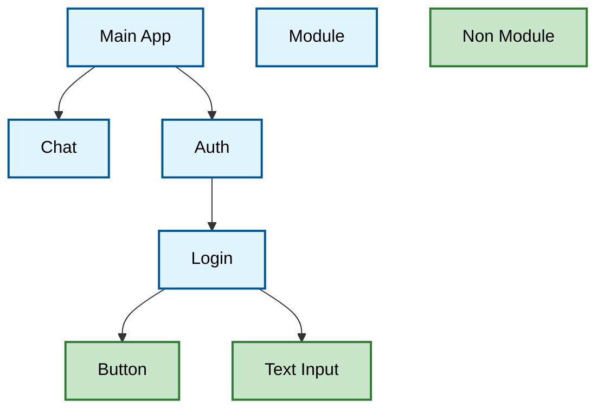

# Core Frontend Architecture

## 1. Principles

- **Architecture Style**: Modular component-based frontend with dynamic module composition
- **Design Principles**: KISS (Keep It Simple, Stupid), clear separation of concerns, dynamic component discovery
- **Quality Attributes**: Modularity for independent development, extensibility through well-defined component contracts, maintainability through standardized module structure

## 2. Technology Stack

- **Programming Language**: TypeScript
- **UI Framework**: React 19+ with React Router
- **UI Components**: Shadcn/ui component library
- **i18n**: react-i18next
- **Build Tool**: Vite
- **State Management**: React Context API

## 3. Architecture Overview

All major components of the user interface are treated as modules. The main idea about modules is that a module can be replaced without touching its parent or child components.

The term "module" in modAI can be a regular React component, but it not limited to it. Modules can be anything including functions, regular components, classes, primitive types, ...

Atomic components like buttons, text input, etc. are not treated as modules and therefore cannot be exchanged at will.



Without any modules, the frontend would be completely empty just containing an empty sidebar and an empty main area.

## 4. Module System

The heart of the frontend is its modular system. It is defined in the `Modules` interface as:

```typescript
getOne<T>(type: string): T | null;
getAll<T>(type: string): T[];
```

### 4.1 Getting the `Modules`

In order to use the functions of the modules, it must be somehow received first. This is done with hooks like this:

```typescript
const modules = useModules();

modules.getAll<SomeComponent>(...)
```

### 4.2 Using the `Modules`

The most important functionality of the module system is to receive other modules by their type. This is needed if a parent module wants to receive its child modules for rendering or if a user component needs to get the user service for backend interaction.

There are two ways to get a module:

- `getOne`: receives a singleton module where only one of its kind should be registered (e.g. like a user service which should only be available once)
- `getAll`: receives all modules registered for the given kind, like all registered sidebar items, or all registered routes.

### 4.3 Module ID vs Module Type

Each registered module has a unique ID and is also registered as a certain type. e.g. each component for the sidebar will have a different ID, but they all have the same type.

The ID of a module is usually defined in the `modules.json` (see next chapter).

The type of a module is also set in the `modules.json` but is usually defined somewhere else: TBD

### 4.4 Registering Modules

To register and acitvate a module, it needs to be added to two places:
* `src/modules/moduleRegistry.ts` to define it for typescript
* `modules*.json` to define the module and its dependencies


#### `src/modules/moduleRegistry.ts`**

Modules needs to be registered in the `src/modules/moduleRegistry.ts` like this:

```typescript
export const moduleRegistry: Record<string, unknown> = {
    "@/modules/chat-layout/ChatSidebarItem": ChatSidebarItem,
    "@/modules/chat-layout/ChatRouterEntry": ChatRouterEntry,
    ...
}
```

#### `modules*.json`

To also activate a module, it needs to be added to the `modules*.json`:

The registration of modules in the Modules is not defined by the `Modules` interface. The default implementation handles module registration with a `modules*.json` file (`modules_with_backend.json` and `modules_browser_only.json`; the two files are used to startup different versions a full and lite version) loaded at startup of the application. The json has the following structure:

```json
{
    "version": "1.0.0",
    "modules": [
        {
            "id": "aiChat",
            "type": "AiChat",
            "path": "@/modules/chat/RouterEntry.tsx",
            "dependencies": [
                "module:session"
            ]
        },
        ...
    ]
}
```

- **id** and **type**: see section _Module ID vs Module Type_
- **path**: the component include path. The component to be used must then be the default component of that file.
- **dependencies**: a list of dependencies required for the module to operate. Dependencies starting with "module:" indicate module dependencies. If a module dependency is not available, the dependent module will not be loaded.

#### Flag Dependencies

Modules can also depend on runtime flags using the "flag:" prefix:

- `"flag:foo"`: Module activates only if flag "foo" is present
- `"flag:!foo"`: Module activates only if flag "foo" is absent
- Multiple flags can be combined: `["flag:foo", "flag:bar"]` requires both flags
- Mixed flags: `["flag:foo", "flag:!bar"]` requires foo present and bar absent

This enables feature toggling and environment-specific module loading.

### 4.5 Exporting a Module

```tsx
export default function AuthSidebarFooterItem({
    className,
}: LogoutButtonProps) {
  ...
}
```

Modules always have to be the default component of a file to be usable for the module system.

## 5. Root Application

The root application itself only defines a main layout looking like this:


No actual components like Login, Chat, Authentication or the like are used in the root application directly. This is all done by modules. Instead, the root application uses the module system to allow other modules very flexible integration within the main layout. The root app supports (via the module system):

- **Routing**: Define module specific routes. Routed components are displayed in the main area.
- **Sidebar**: Integrate into the main application sidebar
- **Context**: Allow other modules to register context providers which will be installed at a global level and therefore making state available throughout the whole application

## 6. Best Practices and Patterns

### 6.1 Module Organization

As "modules" in modAI can be anything including regular compoments, it often happens that several modules belong together, like a sidebar module usually comes together with a router module. In such cases, it is a good practice to group related modules inside a `src/[GROUP]/`.

Module groups should stay lean and should not grow to big. Splitting a module group is up to the author and should be reasonable.

Also sub-groups like `src/[GROUP]/[GROUP]` can be done if needed.

### 6.2 Services

As module group should stay lean (see previous section), it is a good practice to put services into an own module group named after its purpose + `-service` like `src/authenticatoin-service`.

### 6.3 Separete Interface from Implementation (aka `index.ts`)

Some modules are ment to be used by others via a defined interface, like services. In such cases, it is a good practice to put the interface inside the module group in the `index.ts` file. This easens the import handling for dependent modules.

Additionally, the interface should have a good api documentation to make the usage for others easier to understand.

### 6.4 Module Group Documentation

Each module group should have a `README.md` file describing what the module group is about.

Template for the documentation

````markdown
# Authentication Service

Provides authentication backend communication for user management, including login, signup, and logout operations.
No UI components availabe in this module group.

## Intended Usage

[Describes how this module group should be used by other modules. Skip this section if not applicable to the module group]

Example:

Other modules can access authentication functionality through the `useAuthService` hook to perform user authentication operations.

```jsx
import { useAuthService } from "@/modules/authentication-service/AuthContextProvider";

function LoginComponent() {
  const authService = useAuthService();
  ...
  const response = await authService.login({ email, password })
  ...
}
```

## Intended Integration

[Describes how this module is instantiated. Skip this section if not applicable to the module group or if the instantiation is not special and completely done by the module sytem]

Example:

```tsx
<ModuleContextProvider name="GlobalContextProvider">
  // All context providers with type "GlobalContextProvider" are now accessible
</ModuleContextProvider>
```

## Sub-Module Integration

[Describes how other modules can integrate into this module group. This is usually the case if a module loads sub modules via the module system and require them to have a certain structure. Skip this section if not applicable to the module group]]

Example:

### Sidebar Integration

To integrate into the sidebar as top item, modules have to export a component with class name `SidebarItem` of the following structure

```jsx
import { Plus } from "lucide-react";

function MyAwesomeSidebarItem() {
  const location = useLocation();

  return (
    <SidebarMenuButton asChild isActive={location.pathname === "/myroute"}>
      <Link to="/myroute">
        <Plus />
        <span>Awesome</span>
      </Link>
    </SidebarMenuButton>
  );
}
```

This will create a new sidebar top item navigating to the `/myroute` when clicked.
It is important to always have a icon + text in the sidebar item because when the sidebar is collapsed, only the icon will be displayed.
````

### 6.5 Translations

All user-facing text must be internationalized using the i18n system.

**Hook**: `useTranslation("module group name")`

**Usage**: `t("key", { defaultValue: "English Fallback Translation" })`

Example:

```tsx
const { t } = useTranslation("authentication");
return <span>{t("login", { defaultValue: "Login" })}</span>;
```
