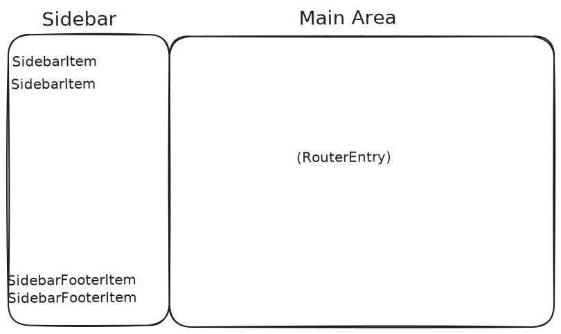

# Main Layout

Provides the core application structure and user interface framework. It includes the main application component, sidebar navigation, error handling, and loading screens. This module gruoop serves as the foundation for the entire frontend application, orchestrating the layout and integrating components from other modules.

This module group is automatically used as the root component of the application. Other modules integrate with it by registering sidebar items, router entries, and footer items that are dynamically discovered and rendered by the main layout.



## Sub-Module Integration

### Router Integration

A module can define new routes by exporting a component with class name `RouterEntry` and the following structure:

```jsx
export function MyAwesomeRoute() {
  return (
    <Route
      key="MyAwesomeModule"
      path="/myroute"
      element={<MyAwesomeMainComponent />}
    />
  );
}
```

What this component will do is, it creates a new root route `/myroute` and when navigated to, the component `MyAwesomeMainComponent` will be rendered to the main area of the main layout.

### Sidebar Integration

To integrate into the sidebar as top item, modules have to export a component with class name `SidebarItem` of the following structure

```jsx
import { Plus } from "lucide-react";

function MyAwesomeSidebarItem() {
  const location = useLocation();

  return (
    <SidebarMenuButton asChild isActive={location.pathname === "/myroute"}>
      <Link to="/myroute">
        <Plus />
        <span>Awesome</span>
      </Link>
    </SidebarMenuButton>
  );
}
```

This will create a new sidebar top item navigating to the `/myroute` when clicked.

To integrate as a sidebar footer item, the component structure is the same but the exported class name must be `SidebarFooterItem`.

It is important to always have a icon + text in the sidebar item because when the sidebar is collapsed, only the icon will be displayed.
